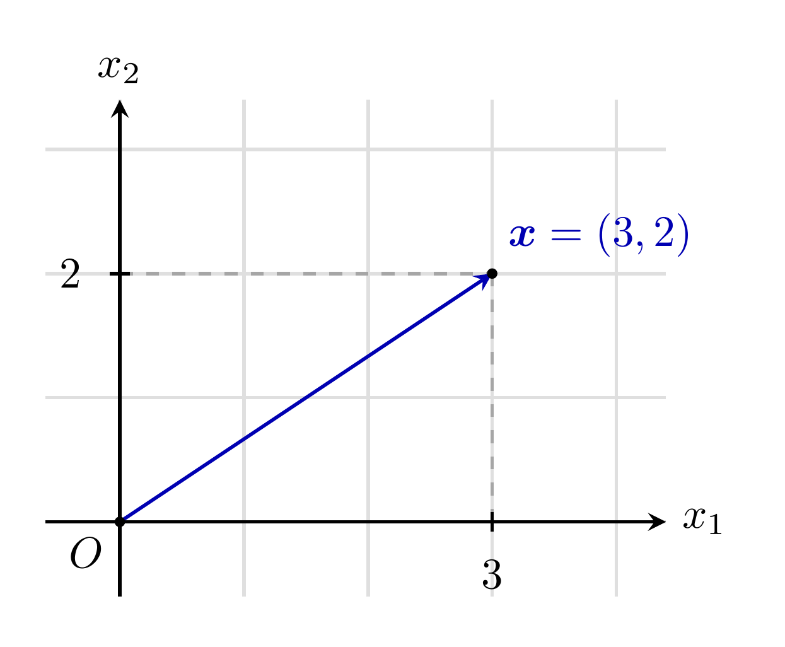
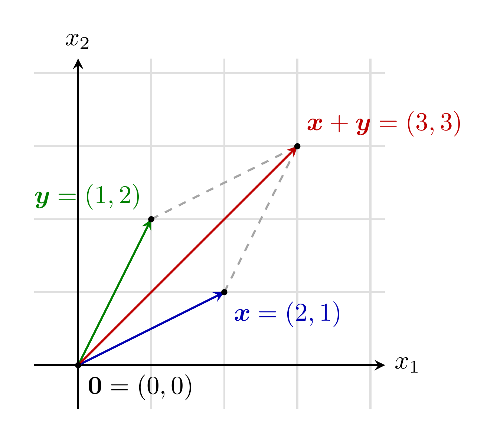
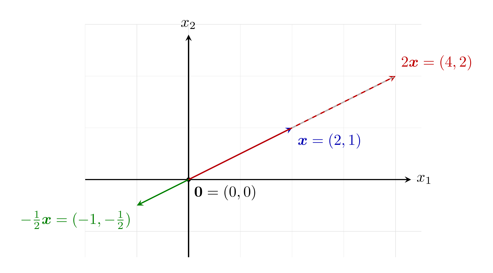
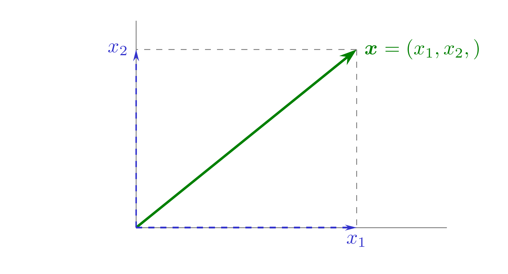

#+title: Código de las figuras de la lección 2
#+author: Marcos Bujosa Brun

#+latex_header: \usepackage{nacal}
#+LATEX_HEADER: \usepackage{polyglossia}
#+LATEX_HEADER: \setmainlanguage{spanish}

\maketitle

* Figuras con fuente tikz

** Vector de $R[2]$

#+BEGIN_SRC  latex :noweb no-export :tangle tex/VectorEnR2.tex :results discard :exports code :eval no
\documentclass[tikz,border=10pt]{standalone}
\usepackage{amsmath}
\begin{document}
\begin{tikzpicture}[scale=1, >=stealth, line width=0.8pt]
  % Cuadrícula
  \draw[gray!25, step=1cm] (-0.6,-0.6) grid (4.4,3.4);
  % Ejes
  \draw[->] (-0.6,0) -- (4.4,0) node[right] {$x_1$};
  \draw[->] (0,-0.6) -- (0,3.4) node[above] {$x_2$};
  % Líneas auxiliares hasta el punto (3,2)
  \draw[dashed, gray!70] (3,0) -- (3,2);
  \draw[dashed, gray!70] (0,2) -- (3,2);
  % Marcas de coordenadas en los ejes
  \draw (3,-0.08) -- (3,0.08);
  \node[below] at (3,-0.18) {$3$};
  \draw (-0.08,2) -- (0.08,2);
  \node[left] at (-0.18,2) {$2$};
  % Vector x
  \draw[->, thick, blue!70!black] (0,0) -- (3,2) node[above right] {$\boldsymbol{x}=(3,2)$};
  % Origen y punto
  \fill (0,0) circle (1.2pt) node[below left] {$O$};
  \fill (3,2) circle (1.2pt);
\end{tikzpicture}
\end{document}
#+END_SRC

#+ATTR_ORG: :width 600
#+ATTR_LATEX: :width .5\textwidth :caption \caption{Ejemplo de vector en \R[2]}

** Suma de vectores de $R[2]$

#+BEGIN_SRC  latex :noweb no-export :tangle tex/SumaVectores.tex :results discard :exports code :eval no
\documentclass[tikz,border=10pt]{standalone}
\usepackage{amsmath}
\begin{document}
\begin{tikzpicture}[scale=1, >=stealth, line width=0.8pt]
  % Cuadrícula
  \draw[gray!25, step=1cm] (-0.6,-0.6) grid (4.2,4.2);

  % Ejes
  \draw[->] (-0.6,0) -- (4.2,0) node[right] {$x_1$};
  \draw[->] (0,-0.6) -- (0,4.2) node[above] {$x_2$};

  % Vectores
  \draw[->, thick, blue!70!black] (0,0) -- (2,1) node[below right] {$\boldsymbol{x}=(2,1)$};
  \draw[->, thick, green!50!black] (0,0) -- (1,2) node[above left] {$\boldsymbol{y}=(1,2)$};

  % Paralelogramo / traslación
  \draw[dashed, gray!70] (2,1) -- (3,3);
  \draw[dashed, gray!70] (1,2) -- (3,3);

  % Vector suma
  \draw[->, thick, red!75!black] (0,0) -- (3,3) node[above right] {$\boldsymbol{x}+\boldsymbol{y}=(3,3)$};

  % Puntos
  \fill (0,0) circle (1.2pt) node[below right] {$\boldsymbol{0}=(0,0)$};
  \fill (2,1) circle (1.2pt);
  \fill (1,2) circle (1.2pt);
  \fill (3,3) circle (1.2pt);
\end{tikzpicture}
\end{document}
#+END_SRC

#+ATTR_ORG: :width 600
#+ATTR_LATEX: :width .5\textwidth :caption \caption{Suma de vectores en \R[2]}

** Producto de un vector por un escalar en $\R[2]$

#+BEGIN_SRC  latex :noweb no-export :tangle tex/ProductoPorEscalar.tex :results discard :exports code :eval no
\documentclass[tikz,border=10pt]{standalone}
\usepackage{amsmath}
\begin{document}
\begin{tikzpicture}[scale=1.2, >=stealth, line width=0.8pt]
  % Cuadrícula
  \draw[step=1, gray!25, very thin] (-2.0,-1.5) grid (4.5,3.0);

  % Ejes alineados con la cuadrícula
  \draw[->] (0,-1.5) -- (0,2.8) node[above] {$x_2$};
  \draw[->] (-2.0,0) -- (4.3,0) node[right] {$x_1$};

  % Origen
  \fill (0,0) circle (1.2pt) node[below right] {$\boldsymbol{0}=(0,0)$};

  % Vector original x = (2,1)
  \draw[->, thick, blue!70!black] (0,0) -- (2,1)
    node[below right] {$\boldsymbol{x}=(2,1)$};

  % 2x = (4,2)
  \draw[->, thick, red!75!black] (0,0) -- (4,2)
    node[above right] {$2\boldsymbol{x}=(4,2)$};

  % -1/2 x = (-1,-1/2)
  \draw[->, thick, green!50!black] (0,0) -- (-1,-0.5)
    node[below left] {$-\tfrac12\boldsymbol{x}=(-1,-\tfrac12)$};

  % Proyección visual
  \draw[dashed, gray!60] (2,1) -- (4,2);
\end{tikzpicture}
\end{document}
#+END_SRC

#+ATTR_ORG: :width 600
#+ATTR_LATEX: :width .5\textwidth :caption \caption{Producto de un vector de \R[2] por dos escalares}

** Longitud de vectores
*** Longitud de un vector en $\R[2]$

#+NAME: LongitudVectorR2
#+BEGIN_SRC  latex :noweb no-export :tangle tex/LongitudVectorR2.tex :results discard :exports code :eval no
<<Preambulo comun>>

\pgfplotsset{width=10cm,height=6cm}

\begin{document}
  <<Colores>>

  \newcommand{\Prho}{.9}%
  \newcommand{\Ptheta}{55}%
  \newcommand{\Pphi}{60}%  
  \tdplotsetmaincoords{90}{90}
  \begin{tikzpicture}
    [scale=6,
     tdplot_main_coords,
     axis/.style={-,gray},
     vector/.style={-{Stealth[length=3mm, width=2mm]},\Verde,very thick},
     guide/.style={dashed,thin, gray},
     vector guide/.style={-{Stealth[length=2mm, width=1mm]},dashed,\AzulClaro,thick}]
     
    %standard tikz coordinate definition using x, y, z coords
    \coordinate (O) at (0,0,0);
    %tikz-3dplot coordinate definition using r, theta, phi coords
    \tdplotsetcoord{P}{\Prho}{\Ptheta}{\Pphi}
    %draw axes
    %\draw[axis] (0,0,0) -- (0.65,0,0); %  node[anchor=north east]{$x$};
    \draw[axis] (0,0,0) -- (0,.9,0); % x1 node[anchor=north west]{$y$};
    \draw[axis] (0,0,0) -- (0,0,.6); % x2 node[anchor=south]{$z$};
    %draw a vector from O to P
    \draw[vector] (O) -- (P) node[right] {$\Vect{x}=(x_1,x_2,)$};
    %draw guide lines to components
    \draw[vector guide] (O) -- (Pxy) node [below] {$x_1$};
    \draw[vector guide] (O) -- (Pz)  node [left]  {$x_2$};
    % Compute x,y,z
    \pgfmathsetmacro{\PxCoord}{\Prho * sin(\Pphi) * cos(\Ptheta)}%
    \pgfmathsetmacro{\PyCoord}{\Prho * sin(\Pphi) * sin(\Ptheta)}%
    %\pgfmathsetmacro{\PzCoord}{\Prho * cos(\Pphi)}%
    \draw[guide] (P) -- (Pz); %{\PxCoord};
    \draw[guide] (P) -- (Pxy);
    %\node[below,black]  at (Pxy) {$(x_1,x_2,)$};                  
  \end{tikzpicture}
\end{document}
#+END_SRC

#+ATTR_ORG: :width 600
#+ATTR_LATEX: :width .5\textwidth :caption \caption{Longitud de un vector en \R[2]}

*** Longitud de un vector en $\R[3]$

#+NAME: LongitudVectorR3
#+BEGIN_SRC  latex :noweb no-export :tangle tex/LongitudVectorR3.tex :results discard :exports code :eval no
<<Preambulo comun>>

\pgfplotsset{width=10cm,height=6cm}

\begin{document}
  <<Colores>>

  \tdplotsetmaincoords{60}{105}
  \newcommand{\Prho}{.8}%
  \newcommand{\Ptheta}{55}%
  \newcommand{\Pphi}{60}%  
  \begin{tikzpicture}
    [scale=6,
     tdplot_main_coords,
     axis/.style={-,gray},
     vector/.style={-{Stealth[length=3mm, width=2mm]},\Verde,very thick},
     guide/.style={dashed, very thin, gray},
     vector guide/.style={-{Stealth[length=2mm, width=1mm]},dashed,\AzulClaro,thick}]
    
    %standard tikz coordinate definition using x, y, z coords
    \coordinate (O) at (0,0,0);
    %tikz-3dplot coordinate definition using r, theta, phi coords
    \tdplotsetcoord{P}{\Prho}{\Ptheta}{\Pphi}
    %draw axes
    \draw[axis] (0,0,0) -- (0.6,0,0);  %  node[anchor=north east]{$x$};
    \draw[axis] (0,0,0) -- (0,1.12,0); %  node[anchor=north west]{$y$};
    \draw[axis] (0,0,0) -- (0,0,.52);  %  node[anchor=south]{$z$};
    %draw a vector from O to P
    \draw[vector] (O) -- (P) node[right] {$\Vect{y}=(y_1,y_2,y_3,)$};
    %draw guide lines to components
    \draw[vector guide] (O) -- (Px) node [left]  {$y_1$};
    \draw[vector guide] (O) -- (Py) node [above] {$y_2$};
    \draw[vector guide] (O) -- (Pz) node [left]  {$y_3$};
    \draw[vector guide,thin] (O) -- (Pxy);   
    % Compute x,y,z
    \pgfmathsetmacro{\PxCoord}{\Prho * sin(\Pphi) * cos(\Ptheta)}%
    \pgfmathsetmacro{\PyCoord}{\Prho * sin(\Pphi) * sin(\Ptheta)}%
    \pgfmathsetmacro{\PzCoord}{\Prho * cos(\Pphi)}%
    \draw[guide] (P) -- (Pxy) node [below] {$(y_1,y_2,0,)$};              ;
    \draw[guide] (Pxy) -- (Px);  %{\PxCoord};
    \draw[guide] (Pxy) -- (Py);  %{\PyCoord};
    \draw[guide] (P)   -- (Pxz); %{\PxCoord};

    \draw[guide] (P)   -- (Pyz); %{\PyCoord};
    \draw[guide] (P)   -- (Pz);  %{\PzCoord};
  \end{tikzpicture}
\end{document}
#+END_SRC

#+ATTR_ORG: :width 600
#+ATTR_LATEX: :width .5\textwidth :caption \caption{Longitud de un vector en \R[3]}
[[file:./LongitudVectorR3.png]]

*** Ajuste de las figuras

#+BEGIN_SRC bash :build yes
convert LongitudVectorR[2-3].png +append LongitudVector_filab.png
#+END_SRC

#+BEGIN_SRC bash :build yes
ALTURA=$(convert LongitudVectorR2.png LongitudVectorR3.png -gravity center +append -format "%h" info:)
convert LongitudVectorR2.png LongitudVectorR3.png -gravity center +append -background white -extent 3500x${ALTURA} LongitudVector_fila_ancho.png
#+END_SRC

* Trozos de código 

Preámbulo común. Usa la notación de ~nacal~ y puede generar figuras en 3d con tikz (con
proyecciones ortogonales usando la librería [[http://www.bakoma-tex.com/doc/latex/tikz-3dplot/tikz-3dplot_documentation.pdf][tikz-3dplot]].
#+NAME: Preambulo comun
#+BEGIN_SRC tex :noweb no-export :results discard :export code :eval no
\documentclass[border=10pt]{standalone} 
\usepackage[utf8]{inputenc}
\usepackage{nacal}
\usepackage{pgfplots}
\usepackage{tikz-3dplot}
\usepackage{tikz} 
\usetikzlibrary{matrix,decorations.pathreplacing}
\usetikzlibrary{calc,angles,positioning,intersections,quotes,decorations.markings}
\usepackage{tkz-euclide}
#+END_SRC

Código para la normalización de colores en las figuras
#+NAME: Colores
#+BEGIN_SRC tex :noweb no-export :results discard :export code :eval no
\def\Rojo{red!50!black}
\def\RojoOscuro{red!20!black}
\def\RojoClaro{red!90!black}
\def\Verde{green!50!black}
\def\VerdeOscuro{green!30!black}
\def\VerdeClaro{green!50!gray}
\def\Azul{blue!50!black}
\def\AzulOscuro{blue!35!black}
\def\AzulClaro{blue!60!gray}
#+END_SRC

