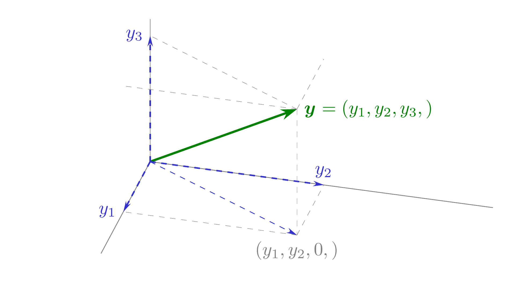
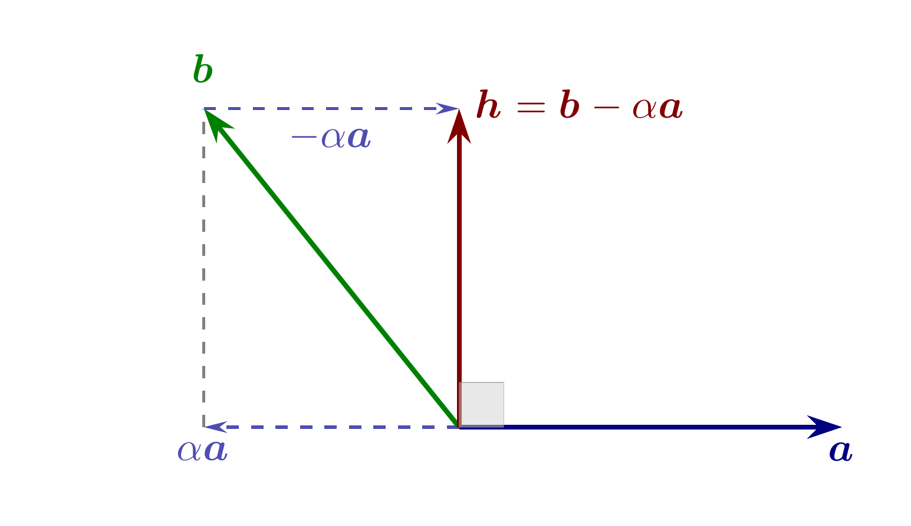
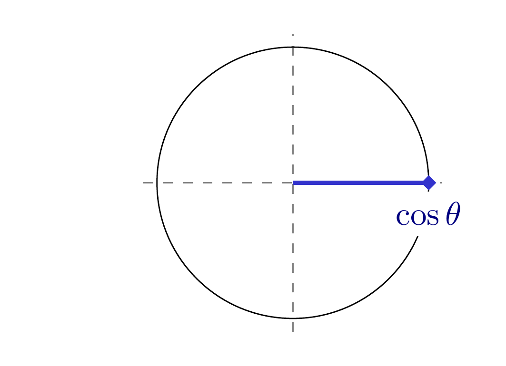
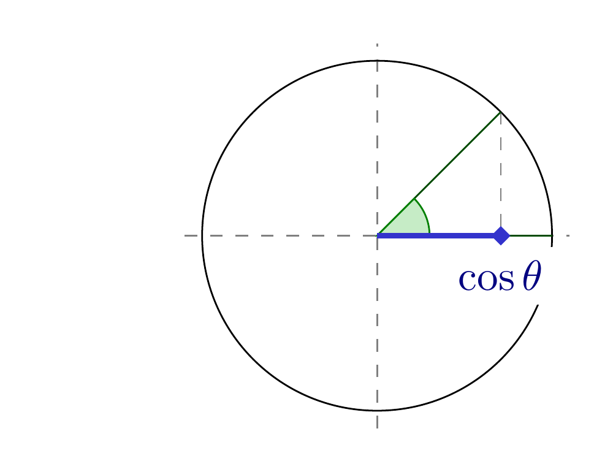
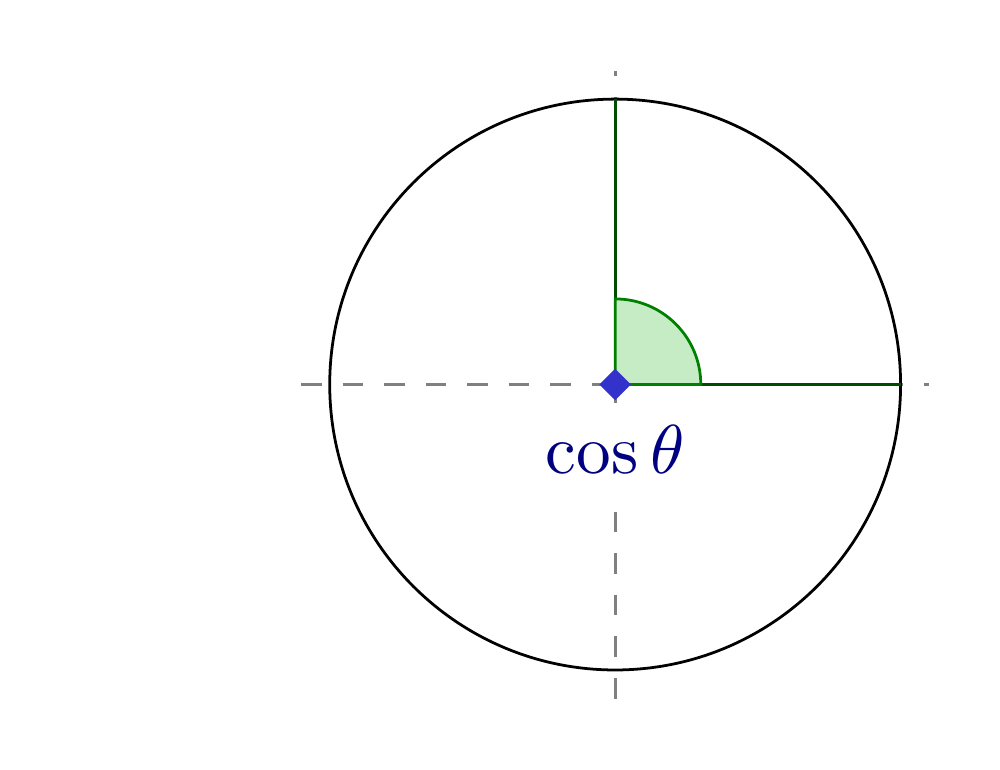
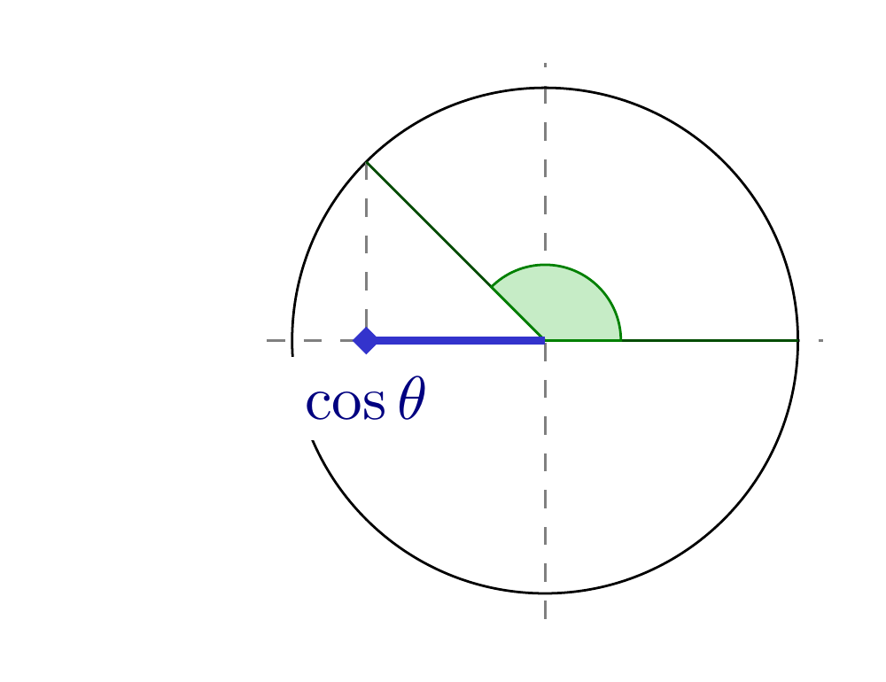
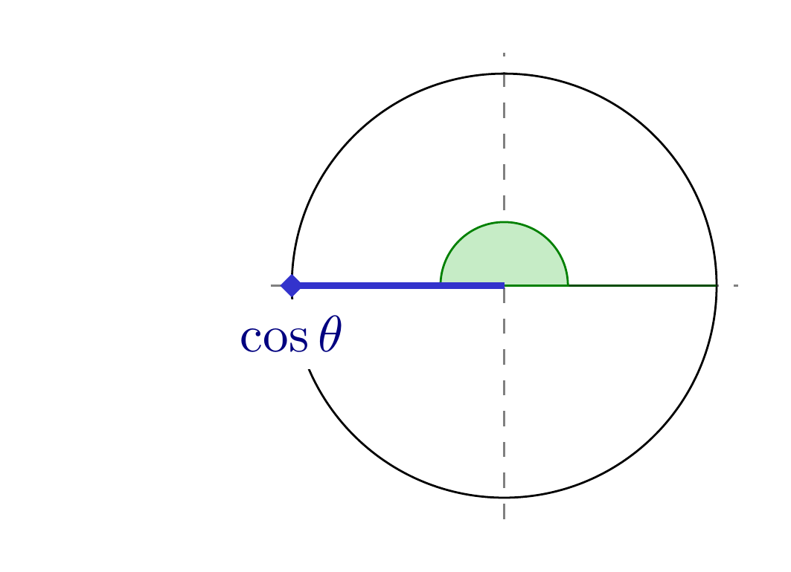
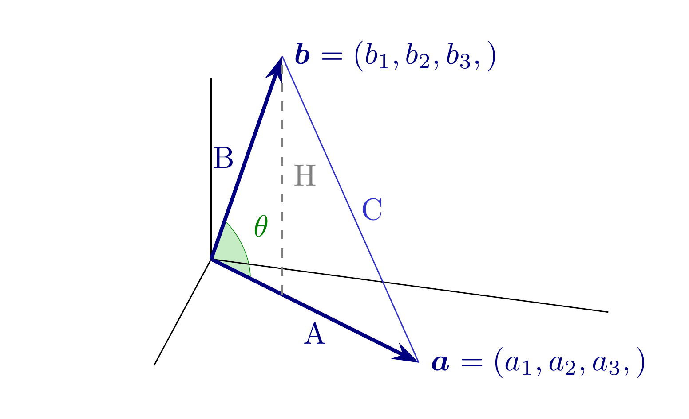
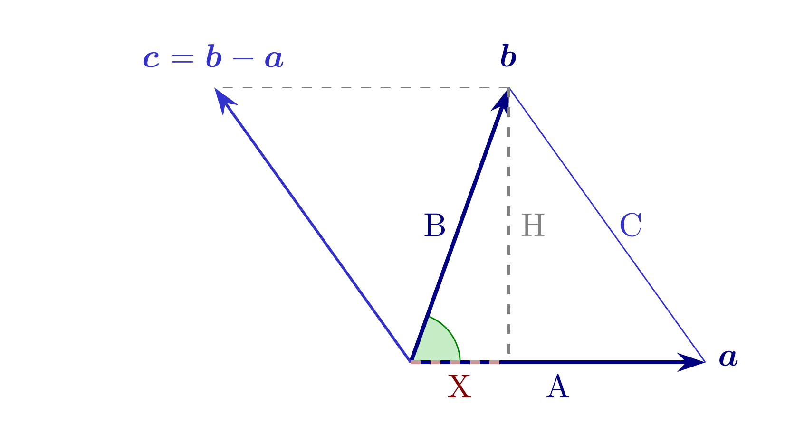

#+title: Código de las figuras de la lección 3
#+author: Marcos Bujosa Brun

#+latex_header: \usepackage{nacal}
#+LATEX_HEADER: \usepackage{polyglossia}
#+LATEX_HEADER: \setmainlanguage{spanish}

\maketitle

* Figuras con fuente tikz

** Longitud de vectores
*** Longitud de un vector en $\R[2]$

#+NAME: LongitudVectorR2
#+BEGIN_SRC  latex :noweb no-export :tangle tex/LongitudVectorR2.tex :results discard :exports code :eval no
<<Preambulo comun>>

\pgfplotsset{width=10cm,height=6cm}

\begin{document}
  <<Colores>>

  \newcommand{\Prho}{.9}%
  \newcommand{\Ptheta}{55}%
  \newcommand{\Pphi}{60}%  
  \tdplotsetmaincoords{90}{90}
  \begin{tikzpicture}
    [scale=6,
     tdplot_main_coords,
     axis/.style={-,gray},
     vector/.style={-{Stealth[length=3mm, width=2mm]},\Verde,very thick},
     guide/.style={dashed,thin, gray},
     vector guide/.style={-{Stealth[length=2mm, width=1mm]},dashed,\AzulClaro,thick}]
     
    %standard tikz coordinate definition using x, y, z coords
    \coordinate (O) at (0,0,0);
    %tikz-3dplot coordinate definition using r, theta, phi coords
    \tdplotsetcoord{P}{\Prho}{\Ptheta}{\Pphi}
    %draw axes
    %\draw[axis] (0,0,0) -- (0.65,0,0); %  node[anchor=north east]{$x$};
    \draw[axis] (0,0,0) -- (0,.9,0); % x1 node[anchor=north west]{$y$};
    \draw[axis] (0,0,0) -- (0,0,.6); % x2 node[anchor=south]{$z$};
    %draw a vector from O to P
    \draw[vector] (O) -- (P) node[right] {$\Vect{x}=(x_1,x_2,)$};
    %draw guide lines to components
    \draw[vector guide] (O) -- (Pxy) node [below] {$x_1$};
    \draw[vector guide] (O) -- (Pz)  node [left]  {$x_2$};
    % Compute x,y,z
    \pgfmathsetmacro{\PxCoord}{\Prho * sin(\Pphi) * cos(\Ptheta)}%
    \pgfmathsetmacro{\PyCoord}{\Prho * sin(\Pphi) * sin(\Ptheta)}%
    %\pgfmathsetmacro{\PzCoord}{\Prho * cos(\Pphi)}%
    \draw[guide] (P) -- (Pz); %{\PxCoord};
    \draw[guide] (P) -- (Pxy);
    %\node[below,black]  at (Pxy) {$(x_1,x_2,)$};                  
  \end{tikzpicture}
\end{document}
#+END_SRC

#+ATTR_ORG: :width 600
#+ATTR_LATEX: :width .5\textwidth :caption \caption{Longitud de un vector en \R[2]}
[[file:./LongitudVectorR2.png]]

*** Longitud de un vector en $\R[3]$

#+NAME: LongitudVectorR3
#+BEGIN_SRC  latex :noweb no-export :tangle tex/LongitudVectorR3.tex :results discard :exports code :eval no
<<Preambulo comun>>

\pgfplotsset{width=10cm,height=6cm}

\begin{document}
  <<Colores>>

  \tdplotsetmaincoords{60}{105}
  \newcommand{\Prho}{.8}%
  \newcommand{\Ptheta}{55}%
  \newcommand{\Pphi}{60}%  
  \begin{tikzpicture}
    [scale=6,
     tdplot_main_coords,
     axis/.style={-,gray},
     vector/.style={-{Stealth[length=3mm, width=2mm]},\Verde,very thick},
     guide/.style={dashed, very thin, gray},
     vector guide/.style={-{Stealth[length=2mm, width=1mm]},dashed,\AzulClaro,thick}]
    
    %standard tikz coordinate definition using x, y, z coords
    \coordinate (O) at (0,0,0);
    %tikz-3dplot coordinate definition using r, theta, phi coords
    \tdplotsetcoord{P}{\Prho}{\Ptheta}{\Pphi}
    %draw axes
    \draw[axis] (0,0,0) -- (0.6,0,0);  %  node[anchor=north east]{$x$};
    \draw[axis] (0,0,0) -- (0,1.12,0); %  node[anchor=north west]{$y$};
    \draw[axis] (0,0,0) -- (0,0,.52);  %  node[anchor=south]{$z$};
    %draw a vector from O to P
    \draw[vector] (O) -- (P) node[right] {$\Vect{y}=(y_1,y_2,y_3,)$};
    %draw guide lines to components
    \draw[vector guide] (O) -- (Px) node [left]  {$y_1$};
    \draw[vector guide] (O) -- (Py) node [above] {$y_2$};
    \draw[vector guide] (O) -- (Pz) node [left]  {$y_3$};
    \draw[vector guide,thin] (O) -- (Pxy);   
    % Compute x,y,z
    \pgfmathsetmacro{\PxCoord}{\Prho * sin(\Pphi) * cos(\Ptheta)}%
    \pgfmathsetmacro{\PyCoord}{\Prho * sin(\Pphi) * sin(\Ptheta)}%
    \pgfmathsetmacro{\PzCoord}{\Prho * cos(\Pphi)}%
    \draw[guide] (P) -- (Pxy) node [below] {$(y_1,y_2,0,)$};              ;
    \draw[guide] (Pxy) -- (Px);  %{\PxCoord};
    \draw[guide] (Pxy) -- (Py);  %{\PyCoord};
    \draw[guide] (P)   -- (Pxz); %{\PxCoord};

    \draw[guide] (P)   -- (Pyz); %{\PyCoord};
    \draw[guide] (P)   -- (Pz);  %{\PzCoord};
  \end{tikzpicture}
\end{document}
#+END_SRC

#+ATTR_ORG: :width 600
#+ATTR_LATEX: :width .5\textwidth :caption \caption{Longitud de un vector en \R[3]}

*** Ajuste de las figuras

#+BEGIN_SRC bash :build yes
convert LongitudVectorR[2-3].png +append LongitudVector_fila.png
#+END_SRC

# #+BEGIN_SRC bash
# convert LongitudVectorR2.png LongitudVectorR3.png -gravity center +append -background white -gravity center -extent 5000x${ALTURA} LongitudVector_fila_ancho.png
# #+END_SRC

** Proyección ortogonal 

#+NAME: ProyeccionOrtogonal
#+BEGIN_SRC  latex :noweb no-export :tangle tex/ProyeccionOrtogonal1.tex :results discard :exports code :eval no
<<Preambulo comun>>

\pgfplotsset{width=10cm,height=6cm}

\begin{document}
  <<Colores>>

  \begin{tikzpicture}
    [scale=1.1,
    guide/.style={dashed, thick, gray},
    vector/.style={-{Stealth[length=3mm, width=2mm]},very thick},
    vector aux/.style={-{Stealth[length=2mm, width=1mm]},dashed,thick}]
    % vértices del triángulo
    \coordinate (v1) at ( 0, 0  );
    \coordinate (v2) at ( 3, 0  );
    \coordinate (v3) at (-2, 0  );
    \coordinate (v4) at (-2, 2.5);
    \coordinate (v5) at ( 0, 2.5);  
    
    % múltiplo de a
    \draw[vector aux, \AzulClaro!65!gray] (v1) -- (v3) node [below]  {$\alpha\Vect{a}$};
    % \draw[-,gray,dashed,very thick]  (v1) -- (v3);
    
    % triangulo
    \draw[vector,\Azul]  (v1) -- (v2) node [below]  {$\Vect{a}$};
    \draw[vector,\Verde] (v1) -- (v4) node [above]  {$\Vect{b}$};

    % La longiitud de C es la longitud de \Vect{b}-\Vect{a}
    \draw[guide] (v3) -- (v4);
    \draw[vector aux, \AzulClaro!65!gray,thick,dashed] (v4) -- node [below] {$-\alpha\Vect{a}$} (v5);    
    \draw[vector,\Rojo] (v1) -- (v5) node [right] {$\Vect{h}=\Vect{b}-\alpha\Vect{a}$};
    % \draw pic[<->,draw=black,angle radius=15,angle eccentricity=1.4,green!50!black,thick] {angle = v2--v1--v5};
    \tkzMarkRightAngle[size=.35,gray,very thin,fill=lightgray!70,opacity=0.5](v5,v1,v2)M
  \end{tikzpicture}
\end{document}
#+END_SRC

#+ATTR_ORG: :width 600
#+ATTR_LATEX: :width .5\textwidth :caption \caption{Proyección ortogonal de un vector sobre la envolvente lineal de otro vector (es decir, sobre una recta)}.

*** Ajustes de la figura

#+BEGIN_SRC bash :build yes
convert ProyeccionOrtogonal1.png -gravity center -background white -extent 2400x ProyeccionOrtogonal1_ancho.png
#+END_SRC

#+BEGIN_SRC bash :build yes
convert ProyeccionOrtogonal1.png -gravity center -background white -extent 4000x ProyeccionOrtogonal1_muy_ancho.png
#+END_SRC

** Cosenos de distintos ángulos

#+NAME: Preámbulo figuras cosenos
#+BEGIN_SRC tex :noweb no-export :results discard :export code :eval no
\documentclass[border=10pt]{standalone} 
\usepackage[utf8]{inputenc}
\usepackage{nacal}
\RenewDocumentCommand\sesp{O{}}{\ensuremath{\Ridx{\mathbb{E}}{{#1\!}}}\xspace}
\usepackage{pgfplots}
\usepackage{tikz-3dplot}

\pgfplotsset{compat=newest}
\usepackage{tikz} 
\usetikzlibrary{matrix,decorations.pathreplacing}
\usetikzlibrary{calc,angles,positioning,intersections,quotes,decorations.markings}
\usepackage{tkz-euclide}
#+END_SRC

#+NAME: Código figuras cosenos
#+BEGIN_SRC tex :noweb no-export :results discard :export code :eval no
  \begin{tikzpicture}[scale=1.45]
    \draw[-,gray,thin,dashed] (-1.1,0) -- (1.1,0) coordinate (x axis); 
    \draw[-,gray,thin,dashed] (0,-1.1) -- (0,1.1) coordinate (y axis); 
    \draw (0,0) circle (1cm); 
    \draw[\VerdeOscuro] (0,0) -- (1,0);
    \draw[dashed,gray] (\angulo:1cm) -- (\angulo:1cm |- x axis); 
    \draw[\VerdeOscuro] (0,0) -- (\angulo:1cm);
    \filldraw[fill=\VerdeClaro!30,draw=\Verde] (0,0) -- (3mm,0mm) arc (0:\angulo:3mm) -- cycle; 
    \draw[-{Turned Square[length=1.6mm]}, shorten >=-0.8mm,\AzulClaro,very thick]
    (0,0) -- (\angulo:1cm |- x axis) node[below=2pt,\Azul,fill=white] {$\cos \theta$}; 
  \end{tikzpicture}
#+END_SRC

*** Coseno Circulo Radio Unidad 1

#+NAME: CosenoCirculoRadioUnidad1
#+BEGIN_SRC  latex :noweb no-export :tangle tex/CosenoCirculoRadioUnidad1.tex :results discard :exports code :eval no
<<Preámbulo figuras cosenos>>
\begin{document}
  \def\angulo{0}
  <<Colores>>
  <<Código figuras cosenos>>
\end{document}
#+END_SRC

#+ATTR_ORG: :width 600
#+ATTR_LATEX: :width .5\textwidth :caption \caption{Coseno angulo 0 en círculo de radio 1}

*** Coseno Circulo Radio Unidad 2

#+NAME: CosenoCirculoRadioUnidad2
#+BEGIN_SRC  latex :noweb no-export :tangle tex/CosenoCirculoRadioUnidad2.tex :results discard :exports code :eval no
<<Preámbulo figuras cosenos>>
\begin{document}
  \def\angulo{45}
  <<Colores>>
  <<Código figuras cosenos>>
\end{document}
#+END_SRC

#+ATTR_ORG: :width 600
#+ATTR_LATEX: :width .5\textwidth :caption \caption{Coseno angulo pi/4 en círculo de radio 1}

*** Coseno Circulo Radio Unidad 3

#+NAME: CosenoCirculoRadioUnidad3
#+BEGIN_SRC  latex :noweb no-export :tangle tex/CosenoCirculoRadioUnidad3.tex :results discard :exports code :eval no
<<Preámbulo figuras cosenos>>
\begin{document}
  \def\angulo{90}
  <<Colores>>
  <<Código figuras cosenos>>
\end{document}
#+END_SRC

#+ATTR_ORG: :width 600
#+ATTR_LATEX: :width .5\textwidth :caption \caption{Coseno angulo pi/2 en círculo de radio 1}

*** Coseno Circulo Radio Unidad 4

#+NAME: CosenoCirculoRadioUnidad4
#+BEGIN_SRC  latex :noweb no-export :tangle tex/CosenoCirculoRadioUnidad4.tex :results discard :exports code :eval no
<<Preámbulo figuras cosenos>>
\begin{document}
  \def\angulo{135}
  <<Colores>>
  <<Código figuras cosenos>>
\end{document}
#+END_SRC

#+ATTR_ORG: :width 600
#+ATTR_LATEX: :width .5\textwidth :caption \caption{Coseno angulo 3*pi/4 en círculo de radio 1}

*** Coseno Circulo Radio Unidad 5

#+NAME: CosenoCirculoRadioUnidad5
#+BEGIN_SRC  latex :noweb no-export :tangle tex/CosenoCirculoRadioUnidad5.tex :results discard :exports code :eval no
<<Preámbulo figuras cosenos>>
\begin{document}
  \def\angulo{180}
  <<Colores>>
  <<Código figuras cosenos>>
\end{document}
#+END_SRC

#+ATTR_ORG: :width 600
#+ATTR_LATEX: :width .5\textwidth :caption \caption{Coseno angulo pi/2 en círculo de radio 1}

*** Ajuste de las figuras

#+BEGIN_SRC bash :build yes
convert CosenoCirculoRadioUnidad[0-9].png -gravity center +append -background white -gravity center -extent 5200x${ALTURA} CosenoCirculoRadioUnidad_fila.png
#+END_SRC

*

** Cálculo del coseno del ángulo formado por dos vectores unitarios
*** Figura 3D

#+NAME: Triangulo1
#+BEGIN_SRC  latex :noweb no-export :tangle tex/Triangulo1.tex :results discard :exports code :eval no
<<Preambulo comun>>
\begin{document}
  <<Colores>>

  \tdplotsetmaincoords{60}{105}
  \newcommand{\Prho}{.8}%
  \newcommand{\Ptheta}{20}%
  \newcommand{\Pphi}{60}%  
  \newcommand{\Qtheta}{90}%  
  \begin{tikzpicture}
    [scale=4.2,
      tdplot_main_coords,
      axis/.style={-},
      vector/.style={-{Stealth[length=3mm, width=2mm]},\Azul,very thick},]    
    %standard tikz coordinate definition using x, y, z coords
    \coordinate (O) at (0,0,0);
    %tikz-3dplot coordinate definition using r, theta, phi coords
    \tdplotsetcoord{P}{\Prho}{\Ptheta}{\Pphi}
    \tdplotsetcoord{Q}{\Prho}{\Qtheta}{\Pphi}
    
    %draw theta arc and label, using rotated coordinate system
    \tdplotsetthetaplanecoords{\Pphi}   
    \tdplotdrawarc[-,tdplot_rotated_coords,\Verde]
    {(0,0,0)}{0.15}{\Ptheta}{90}{anchor=south west}{$\theta$}
    \path[fill=\VerdeClaro!30] (0,0,0) -- plot[variable=\t,domain=70:0]
(xyz spherical cs:radius=.15,longitude=30,latitude=\t); 

    % draw axes
    \draw[axis] (0,0,0) -- (0.6,0,0); %  node[anchor=north east]{$x$};
    \draw[axis] (0,0,0) -- (0,1.12,0); %  node[anchor=north west]{$y$};
    \draw[axis] (0,0,0) -- (0,0,.57); %  node[anchor=south]{$z$};
    %draw a vectors from O to P
    \draw[vector] (O) -- node[below] {A} (Q) node[right] {$\Vect{a}=(a_1,a_2,a_3,)$};
    \draw[vector] (O) -- node[left]  {B} (P) node[right] {$\Vect{b}=(b_1,b_2,b_3,)$};
    \draw[-,\AzulClaro]      (P)   -- node[right] {C} (Q);
    \draw[dashed,gray,thick] (Pxy) -- node[right] {H} (P);

  \end{tikzpicture}
\end{document}
#+END_SRC

#+ATTR_ORG: :width 600
#+ATTR_LATEX: :width .5\textwidth :caption \caption{Cálculo del coseno del ángulo formado por dos vectores unitarios en \R[3]}

*** Misma figura pero vista perpendicularmente (como si fuera 2D) y con más información

#+NAME: Triangulo2
#+BEGIN_SRC  latex :noweb no-export :tangle tex/Triangulo2.tex :results discard :exports code :eval no
<<Preambulo comun>>
\begin{document}
  <<Colores>>

  \begin{tikzpicture}
    [scale=1.05,
     vector/.style={-{Stealth[length=3mm, width=2mm]},very thick,\Azul},]    
    ]
    % vértices del triángulo
    \coordinate (v1) at ( 0 , 0);
    \coordinate (v2) at ( 3 , 0);
    \coordinate (v3) at ( 1 , 2.8);
    \coordinate (v4) at ( 1 , 0  ); % punto intermedio del segmento A
    \coordinate (v5) at (-2 , 2.8); % diferencia de vectores  
    \coordinate (v6) at (0.5, 0 );  % etiqueta X
    
    %\pic [draw,'$\theta$',angle radius=12,angle eccentricity=1.4] {angle = v2--v1--v3};
    \draw pic[-,draw=black,angle radius=15,angle eccentricity=1.4,\Verde,fill=\VerdeClaro!30] {angle = v2--v1--v3};

    \draw[vector] (v1) -- node[below] {A} (v2) node [right]  {$\Vect{a}$};
    \draw[vector] (v1) -- node[left]  {B} (v3) node [above]  {$\Vect{b}$};
    \draw[vector,thick,\AzulClaro] (v1) -- (v5) node [above]  {$\Vect{c}=\Vect{b}-\Vect{a}$};
    % La longitud de C es la longitud de \Vect{b}-\Vect{a}
    \draw[-,\AzulClaro]  (v2) -- node[right] {C} (v3);
    \draw[-,dashed,very thin,gray]  (v3) --  (v5);
    
    % division del triangulo
    \draw[-,gray,dashed,thick]  (v3) -- node[right] {H} (v4);
    % division del segmento A
    \draw[-,dashed,very thick,\Rojo!40]  (v1) -- node[below,\Rojo] {X} (v4);

  \end{tikzpicture}
\end{document}
#+END_SRC

#+ATTR_ORG: :width 600
#+ATTR_LATEX: :width .5\textwidth :caption \caption{Cálculo del coseno del ángulo formado por dos vectores unitarios (vista perpendicular)}

*** Ajuste de las figuras

#+BEGIN_SRC bash :build yes
convert Triangulo[1-2].png +append Triangulo_fila.png
#+END_SRC

* Trozos de código 

Preámbulo común. Usa la notación de ~nacal~ y puede generar figuras en 3d con tikz (con
proyecciones ortogonales usando la librería [[http://www.bakoma-tex.com/doc/latex/tikz-3dplot/tikz-3dplot_documentation.pdf][tikz-3dplot]].
#+NAME: Preambulo comun
#+BEGIN_SRC tex :noweb no-export :results discard :export code :eval no
\documentclass[border=10pt]{standalone} 
\usepackage[utf8]{inputenc}
\usepackage{nacal}
\usepackage{pgfplots}
\usepackage{tikz-3dplot}
\usepackage{tikz} 
\usetikzlibrary{matrix,decorations.pathreplacing}
\usetikzlibrary{calc,angles,positioning,intersections,quotes,decorations.markings}
\usepackage{tkz-euclide}
#+END_SRC

Código para la normalización de colores en las figuras
#+NAME: Colores
#+BEGIN_SRC tex :noweb no-export :results discard :export code :eval no
\def\Rojo{red!50!black}
\def\RojoOscuro{red!20!black}
\def\RojoClaro{red!90!black}
\def\Verde{green!50!black}
\def\VerdeOscuro{green!30!black}
\def\VerdeClaro{green!50!gray}
\def\Azul{blue!50!black}
\def\AzulOscuro{blue!35!black}
\def\AzulClaro{blue!60!gray}
#+END_SRC

