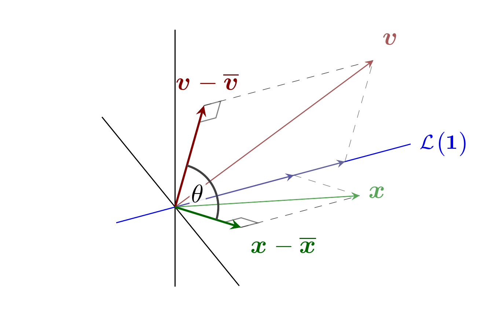
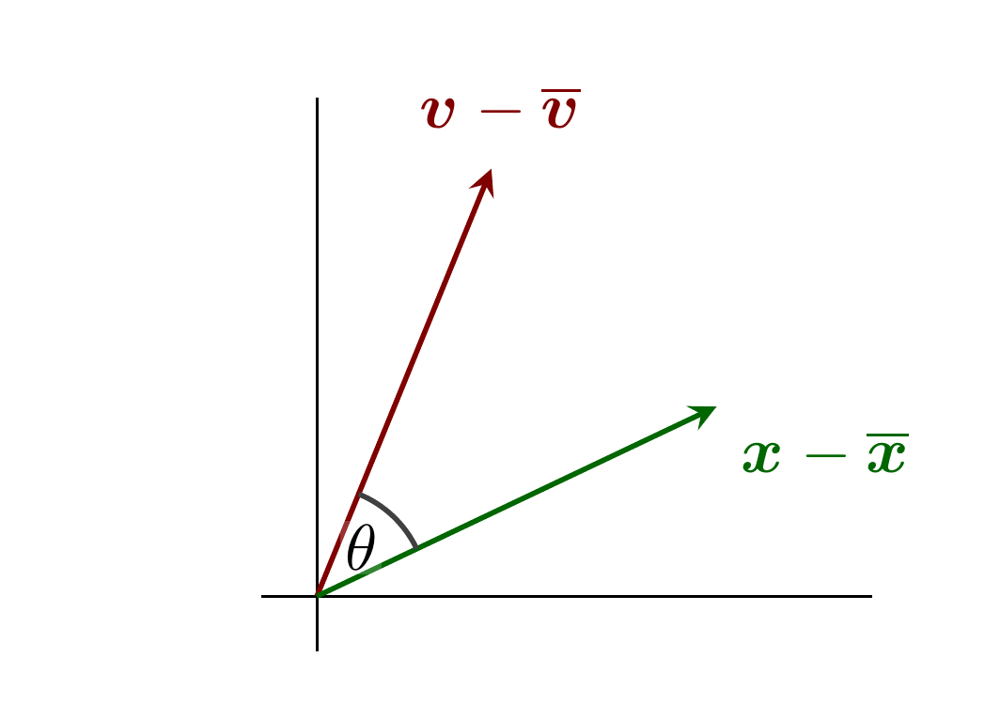
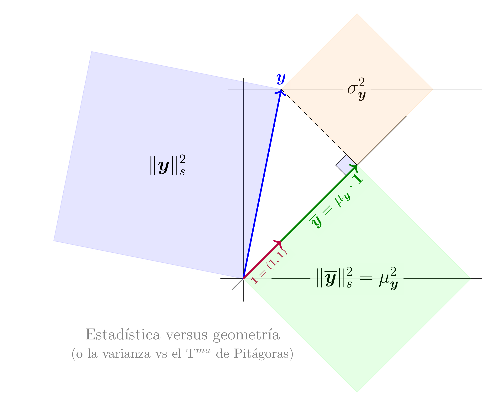

#+title: Código de las figuras de la lección 5
#+author: Marcos Bujosa Brun

#+latex_header: \usepackage{nacal}

\maketitle

\newpage

# +call: makePNGs()

* Figuras con fuente tikz

** Correlación

#+NAME: Correlacion
#+BEGIN_SRC latex :noweb no-export :tangle tex/Correlacion.tex :results discard :exports code :eval no
\documentclass[border=10pt]{standalone} 
\usepackage[utf8]{inputenc}
\usepackage{nacal}
\usepackage{pgfplots}
\usepackage{tikz-3dplot}

\pgfplotsset{compat=newest}
\usepackage{tikz} 
\usetikzlibrary{matrix,decorations.pathreplacing}
% Añadimos arrows.meta para dar soporte a los estilos de vectores con flechas stealth
\usetikzlibrary{calc,angles,positioning,intersections,quotes,decorations.markings,arrows.meta}
\usepackage{tkz-euclide}

\pgfplotsset{width=10cm,height=6cm}

% 1. DEFINIMOS LA VISTA 3D (Ángulos de rotación para los ejes)
\tdplotsetmaincoords{55}{65}

\begin{document}
  <<Colores>>

  \begin{tikzpicture} [scale=3,
    tdplot_main_coords,
    axis/.style={-,black, thin},
    vector/.style={-stealth},
    vector guide/.style={dashed,gray,very thin}]
    
    % standard tikz coordinate definition using x, y, z coords
    \tdplotsetcoord{P}{1.2}{50}{70}
    \tdplotsetcoord{Q}{1}{-70}{-140}
    \tdplotsetcoord{C}{1.9}{45}{40}
    \tdplotsetcoord{O}{0}{0}{0}
    
    \tdplotsetrotatedcoords{0}{0}{-45}
    
    \tdplotsetcoord{X}{.7}{90}{0}   
    \tdplotsetcoord{XX}{.8}{-90}{0}   
    \tdplotsetcoord{Y}{1.2}{90}{90}    % vectores constantes
    \tdplotsetcoord{YY}{.3}{90}{-90}
    \tdplotsetcoord{Z}{1.0}{0}{0}
    \tdplotsetcoord{ZZ}{-.45}{0}{0}     % vertical
    \tdplotsetcoord{H}{1}{-90}{-60}
  
    % draw axes
    \draw[axis]  (XX) -- (X); 
    \draw[axis,color=blue!95!black,thin]  (YY) -- (Y) node[color=blue!90!black, anchor=west,font=\footnotesize]{$\Span{\Vect{1}}$};
    \draw[axis]  (ZZ) -- (Z); 
  
    \coordinate (Ymedia) at (0,0.865,0);
    \coordinate (Yhat)   at (Pxy);

    \coordinate (Xmedia) at (0,0.605,0);

    \tkzMarkRightAngle[size=.08,gray](O,Pxz,P) 
    \tkzMarkRightAngle[size=.08,gray](O,Qxz,Q) 
 
    \draw[vector guide,gray!50!black]         (Pxz) -- (P);
    \draw[vector guide]         (Ymedia) -- (P);
  
    \draw[vector guide,gray!50!black]         (Qxz) -- (Q);
    \draw[vector guide]         (Xmedia) -- (Q);
    
    % draw a vector from O to P
    \draw[vector, red!30!gray] (O) -- (P) node[anchor=south west]{$\Vect{v}$};
    \draw[vector, color=blue!20!gray]  (O) -- (Ymedia) node[anchor=south west]{}; %${\Vect{\Media{v}}}$};
    \draw[vector, red!50!black,thick]  (O) --  (Pxz)node[anchor=south, xshift=0.55mm]{$\Vect{v}-\Vect{\Media{v}}$};

    \draw[vector, green!30!gray] (O) -- (Q) node[anchor=west]{$\Vect{x}$};
    \draw[vector, color=blue!30!gray]  (O) -- (Xmedia) node[anchor=south]{}; %${\Vect{\Media{x}}}$};
    \draw[vector, green!40!black,thick]  (O) --  (Qxz)node[anchor=north west]{$\Vect{X}-\Vect{\Media{x}}$};

    \draw pic[draw=black,angle radius=17,angle eccentricity=1.4,gray!50!black,thick] {angle = Qxz--O--Pxz} node[anchor=south west, xshift=1.9mm, yshift=0.3mm, inner sep=0.7pt,  fill=white, opacity=.9, text opacity=1]{$\theta$};
    
  \end{tikzpicture}
\end{document}
#+END_SRC

#+ATTR_ORG: :width 600
#+ATTR_LATEX: :width .5\textwidth :caption \caption{Interpretación geométrica de la correlación como coseno de un ángulo}

# +call: makePNGs()

** Correlación 2

#+NAME: Correlacion2
#+BEGIN_SRC latex :noweb no-export :tangle tex/Correlacion2.tex :results discard :exports code :eval no
\documentclass[border=10pt]{standalone} 
\usepackage[utf8]{inputenc}
\usepackage{nacal}
\usepackage{pgfplots}
\usepackage{tikz-3dplot}

\pgfplotsset{compat=newest}
\usepackage{tikz} 
\usetikzlibrary{matrix,decorations.pathreplacing}
% Añadimos arrows.meta para dar soporte a los estilos de vectores con flechas stealth
\usetikzlibrary{calc,angles,positioning,intersections,quotes,decorations.markings,arrows.meta}
\usepackage{tkz-euclide}

\pgfplotsset{width=10cm,height=6cm}

% 1. DEFINIMOS LA VISTA 3D (Ángulos de rotación para los ejes)
\tdplotsetmaincoords{90}{0}

\begin{document}
  <<Colores>>

  \begin{tikzpicture} [scale=3,
    tdplot_main_coords,
    axis/.style={-,black, thin},
    vector/.style={-stealth},
    vector guide/.style={dashed,gray,very thin}]
    
    % standard tikz coordinate definition using x, y, z coords
    \tdplotsetcoord{P}{1.2}{50}{70}
    \tdplotsetcoord{Q}{1}{-70}{-140}
    \tdplotsetcoord{C}{1.9}{45}{40}
    \tdplotsetcoord{O}{0}{0}{0}
    
    \tdplotsetrotatedcoords{0}{0}{-45}
    
    \tdplotsetcoord{X}{1.0}{90}{0}   
    \tdplotsetcoord{XX}{.1}{-90}{0}   
    \tdplotsetcoord{Y}{1.2}{90}{90}    % vectores constantes
    \tdplotsetcoord{YY}{.3}{90}{-90}
    \tdplotsetcoord{Z}{0.9}{0}{0}
    \tdplotsetcoord{ZZ}{-.1}{0}{0}     % vertical
    \tdplotsetcoord{H}{1}{-90}{-60}
  
    % draw axes
    \draw[axis]  (XX) -- (X); 
    \draw[axis]  (ZZ) -- (Z); 
  
    \coordinate (Ymedia) at (0,0.865,0);
    \coordinate (Yhat)   at (Pxy);

    \coordinate (Xmedia) at (0,0.605,0);
  
    \draw[vector guide,gray!50!black]         (Pxz) -- (P);
    \draw[vector guide]         (Ymedia) -- (P);
  
    \draw[vector guide,gray!50!black]         (Qxz) -- (Q);
    \draw[vector guide]         (Xmedia) -- (Q);
    
    \draw[vector, red!50!black,thick]  (O) --  (Pxz)node[anchor=south, xshift=0.55mm]{$\Vect{v}-\Vect{\Media{v}}$};

    \draw[vector, green!40!black,thick]  (O) --  (Qxz)node[anchor=north west]{$\Vect{X}-\Vect{\Media{x}}$};

    \draw pic[draw=black,angle radius=17,angle eccentricity=1.4,gray!50!black,thick] {angle = Qxz--O--Pxz} node[anchor=south west, xshift=1.2mm, yshift=1.1mm, inner sep=0.7pt,  fill=white, opacity=.2, text opacity=1]{$\theta$};
    
  \end{tikzpicture}
\end{document}
#+END_SRC

#+ATTR_ORG: :width 600
#+ATTR_LATEX: :width .5\textwidth :caption \caption{Interpretación geométrica de la correlación como coseno de un ángulo}

# +call: makePNGs()

** Varianza

#+BEGIN_SRC latex :noweb no-export :tangle tex/Varianza.tex :results discard :exports code :eval no
\documentclass[border=10pt]{standalone} 
\usepackage[utf8]{inputenc}
\usepackage{nacal}
\usepackage{pgfplots}
\usepackage{tikz-3dplot}

\usepackage{tikz} 
\usetikzlibrary{matrix,decorations.pathreplacing}
% Añadida explícitamente arrows.meta para asegurar que Stealth funcione siempre
\usetikzlibrary{calc,angles,positioning,intersections,quotes,decorations.markings,arrows.meta}
\usepackage{tkz-euclide}

\pgfplotsset{width=10cm,height=6cm}

\begin{document}
  <<Colores>>
  
  \begin{tikzpicture}
    
    % Definir los vectores
    \coordinate (O) at (0,0);            % Origen
    \coordinate (U) at (1,1);            % Vector Uno
    \coordinate (X) at (1,5);            % Vector de Datos
    % \coordinate (X) at (2,5);            % Vector de Datos
    
    % El código ($(O)!(X)!(U)$) significa: el punto de la recta que une (O) y (U) que está más cerca de (X)
    
    \coordinate (M) at ($(O)!(X)!(U)$);  % Vector mu * Uno.
    
    %%%%%%%%%%%%%%%%%%%%%%%%%%%%%%%%%%%%%%%%%%%%%%%%%%%% 
    %%%% Elementos por detrás de la figura principal %%%
    %%%%%%%%%%%%%%%%%%%%%%%%%%%%%%%%%%%%%%%%%%%%%%%%%%%% 
    
    % Dibujar cuadrícula 
    \draw[step=1cm,lightgray,very thin] (-.4,-.4) grid (6.3,5.8);
    % Dibujar ejes 
    \draw[-] (-.6,0) -- (6.3,0);   % eje x
    \draw[-] (0,-.6) -- (  0,5.3); % eje y
    
    % Etiquetas de los vectores x y mu*Uno
    \node[blue, right, fill=white,opacity=.9,text opacity=1] at (X) [above]{\large$\boldsymbol{y}$};
    \node[green!50!black,rotate=45,below left, fill=white,opacity=.9,text opacity=1] at (M) {\large$\boldsymbol{\mathop{\overline{y}}}=\mu_{\boldsymbol{y}}\cdot\boldsymbol{1}$};
    \node[purple,rotate=45,below,fill=white,opacity=.9,text opacity=1]  at ($(O)!0.5!(U)$) {\footnotesize$\boldsymbol{1}=(1,1)$};
    
    \node[gray]  at (-1.6,-1.5) {\large Estadística versus geometría};
    \node[gray]  at (-1.6,-2) {(o la varianza vs el T$^{ma}$ de Pitágoras)};
    
    
    % Dibujar la recta generada por el vector (1,1)
    \draw[-,thick,gray] (-.3,-.3) -- (4.3,4.3) node[right]{};
    
    % Marca de ángulo recto
    \tkzMarkRightAngle[fill=blue!10,size=.4](O,M,X)
    
    %%%%%%%%%%%%%%%%%%%%%%%%%%%%%%%%%%%%%%%%%%%%%%%%%%%% 
    %%%% Cuadrados de las longitudes %%%%%%%%%%%%%%%%%%%
    %%%%%%%%%%%%%%%%%%%%%%%%%%%%%%%%%%%%%%%%%%%%%%%%%%%% 
    
    % Varianza
    \tkzDefSquare(X,M); 
    \path (X) -- (tkzFirstPointResult) node[midway,fill=white,opacity=.7,text opacity=1] {\Large$\sigma_{\boldsymbol{y}}^2$};
    \tkzDrawPolygon[thin, orange, fill=orange,opacity=.1](X, M, tkzFirstPointResult, tkzSecondPointResult)
    % \path (tkzSecondPointResult) -- (tkzFirstPointResult) node[midway,sloped,purple,above] {\slshape $\boldsymbol{\lambda}$aura};
    
    % Cuadrado de la longitud de x
    \tkzDefSquare(O,X); \tkzDrawPolygon[thin, blue, fill=blue,opacity=.1](O, X, tkzFirstPointResult, tkzSecondPointResult)
    \path (O) -- (tkzFirstPointResult) node[midway,text opacity=1] {\Large$\|\boldsymbol{y}\|_s^2$};
    % \path (tkzSecondPointResult) -- (O)  node[midway,sloped,green!50!black,below] {\slshape $\boldsymbol{\beta}$ujos$\alpha$};
    
    % Cuadrado de la longitud de mu*Uno
    \tkzDefSquare(M,O);
    \path (M) -- (tkzFirstPointResult) node[midway,fill=white,opacity=.95,text opacity=1] {\Large$\|\boldsymbol{\mathop{\overline{y}}}\|_s^2=\mu_{\boldsymbol{y}}^2$};
    \tkzDrawPolygon[thin, green, fill=green,opacity=.1](M, O, tkzFirstPointResult, tkzSecondPointResult)
    % \path (tkzSecondPointResult) -- (tkzFirstPointResult) node[midway,sloped,blue,below] {\slshape $\delta$el Río};
    
    % DIBUJAR LOS VECTORES
    % Dibujar el vector X
    \draw[->,very thick, blue] (O) -- (X); % node[above,fill=white,opacity=.9,text opacity=1]{$\boldsymbol{y}$};
    
    % Dibujar el vector mu * Uno
    \draw[->,very thick,green!50!black] (O) -- (M); % node[right, fill=white,opacity=.9,text opacity=1]{$\mu\boldsymbol{1}$};
    
    % Dibujar la línea punteada entre X y mu*Uno
    \draw[dashed] (X) -- (M);
    
    % Dibujar el vector Uno
    \draw[->,very thick, purple] (O) -- (U); % node[sloped,midway,below,fill=white,opacity=.5,text opacity=1]{$\boldsymbol{1}=(1,1)$};
    
  \end{tikzpicture}
\end{document}
#+END_SRC

#+ATTR_ORG: :width 600
#+ATTR_LATEX: :width .5\textwidth :caption \caption{Interpretación geométrica de la varianza mediante el teorema de Pitágoras}

# +call: makePNGs()

* Trozos de código 

Preámbulo para generar un fichero con únicamente una figura, y que use
la notación de ~nacal~
#+NAME: Preambulo para figura sola
#+BEGIN_SRC tex :noweb no-export :results discard :export code  :eval no
\documentclass[border=10pt]{standalone} 
\usepackage[utf8]{inputenc}
\usepackage{nacal}
#+END_SRC

Contenido del preámbulo para generar figuras en 3d con tikz (con
proyecciones ortogonales usando la librería [[http://www.bakoma-tex.com/doc/latex/tikz-3dplot/tikz-3dplot_documentation.pdf][tikz-3dplot]].
#+NAME: Librerías de tikz para figuras 3d
#+BEGIN_SRC tex :noweb no-export :results discard :export code  :eval no
\usepackage{pgfplots}
\usepackage{tikz-3dplot}

%\pgfplotsset{compat=newest}
\usepackage{tikz} 
\usetikzlibrary{matrix,decorations.pathreplacing}
\usetikzlibrary{calc,angles,positioning,intersections,quotes,decorations.markings}
\usepackage{tkz-euclide}
#+END_SRC

Contenido del preámbulo para normalizar la proporción alto ancho de la
figura
#+NAME: Tamaño de las figuras
#+BEGIN_SRC tex :noweb no-export :results discard :export code :eval no
%\pgfplotsset{width=10cm,height=6cm,compat=1.8}
\pgfplotsset{width=10cm,height=6cm}
#+END_SRC

Código para la normalización de colores en las figuras
#+NAME: Colores
#+BEGIN_SRC tex :noweb no-export :results discard :export code :eval no
\def\Rojo{red!50!black}
\def\RojoOscuro{red!20!black}
\def\RojoClaro{red!90!black}
\def\Verde{green!50!black}
\def\VerdeOscuro{green!30!black}
\def\VerdeClaro{green!50!gray}
\def\Azul{blue!50!black}
\def\AzulOscuro{blue!35!black}
\def\AzulClaro{blue!60!gray}
#+END_SRC

# +call: makePNGs()

* Compilación

| Para obtener los ficheros en emacs hay que teclear ~C-c C-v t~ |

# #+BEGIN_SRC emacs-lisp :results silent :exports none
# (org-babel-do-load-languages
#  'org-babel-load-languages
#  '((makefile . t)))
# #+END_SRC

La conversión de pdf a png se realiza con ~poppler-utils~
(especificamente con =pdftoppm=). Así que hay que instalar el programa
con ~aptitude~ (o programa similar).

#+NAME: makefile
#+BEGIN_SRC makefile :dir tex :noweb no-export :results silent :exports code :tangle tex/makefile  :eval no
%.pdf : %.tex
	pdflatex $<
	rm $(basename $<).aux
	rm $(basename $<).log

%.png : %.pdf
	pdftoppm -r 500 $< $@ -png
	mv $@-1.png ../$(basename $@).png
	#mv $@-1.png ../png/$(basename $@).png

tex_FILES := $(wildcard *.tex)
png_FILES := $(tex_FILES:.tex=.png)

pngs: $(png_FILES)

pdfs:
	latexmk -pdf
	latexmk -c
#+END_SRC

Para generar los pngs teclear dentro del directorio ~tex~
#+NAME: makePNGs :eval no
#+BEGIN_SRC bash :dir tex :results silent :exports code
make pngs
#+END_SRC

Si además se quiere generar los pdf en la carpeta =tex= (aunque no es
necesario) se puede teclear ~make pdfs~

#+BEGIN_SRC bash :dir tex :results silent :exports code  :eval no
make pdfs
#+END_SRC

* Ajustes de las figuras

# +call: makePNGs()

#+BEGIN_SRC bash  :build yes
convert Correlacion.png Correlacion2.png -gravity center +append -background white -gravity center -extent 2500x${ALTURA} Correlacion_fila_ancho.png
#+END_SRC

#+RESULTS:

#+BEGIN_SRC bash  :build yes
convert Varianza.png -gravity center -background white -extent 4500x Varianza_ancho.png
#+END_SRC

#+RESULTS:
