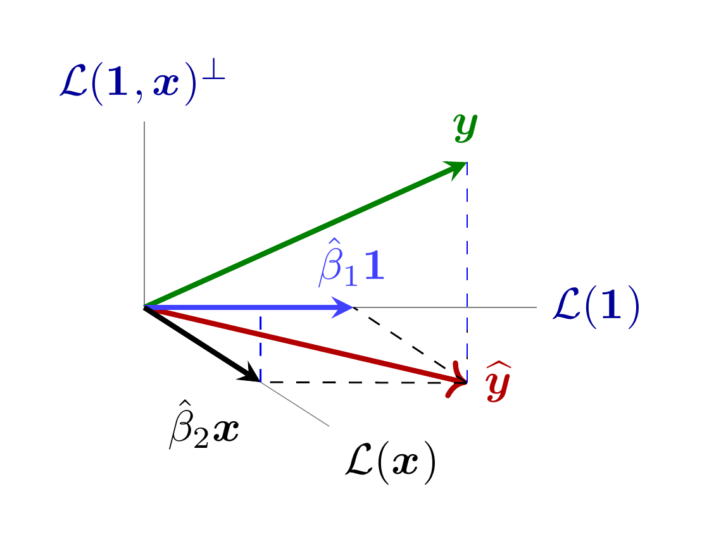
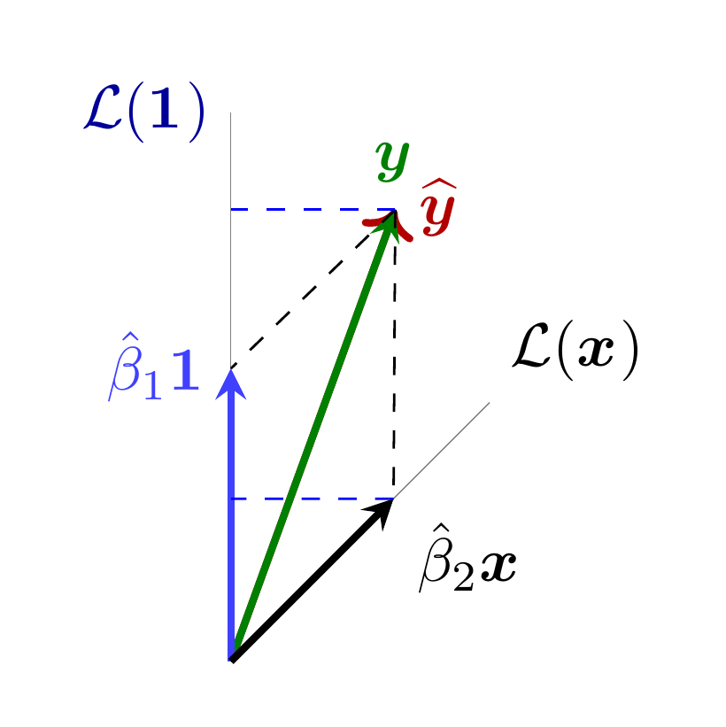
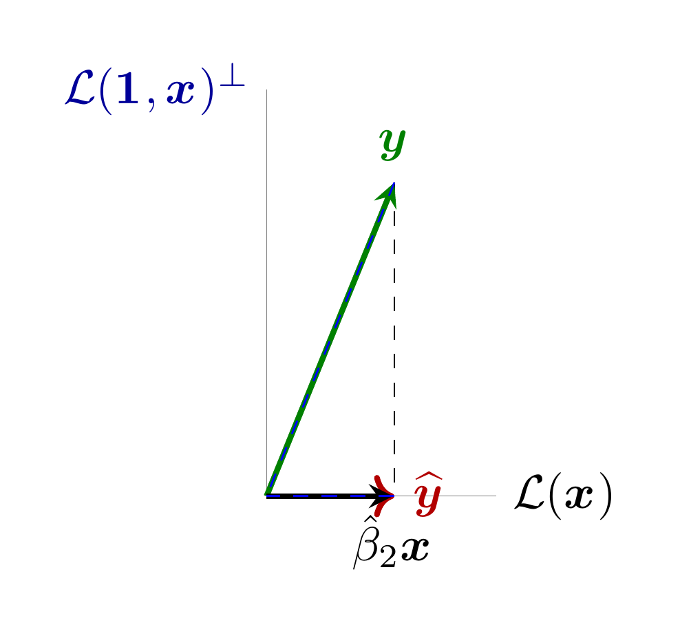
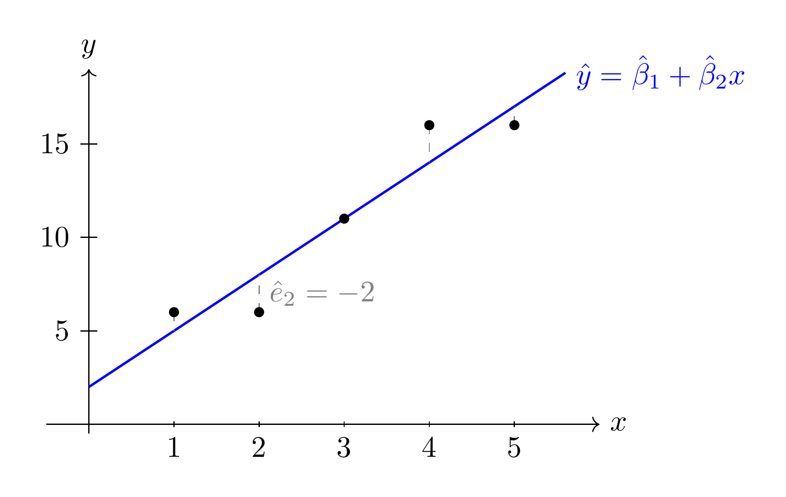

#+title: Código de las figuras de la lección 7
#+author: Marcos Bujosa Brun

#+latex_header: \usepackage{nacal}

\maketitle

\newpage

# +call: makePNGs()

* Figuras con fuente tikz

** Ajuste MCO de un modelo lineal simple

*** Vista de frente al plano formado por los ejes L(1) y L(1,x)^\perp

#+NAME: OLS-regresoresNoPerpEconMedias
#+BEGIN_SRC latex :noweb no-export :tangle tex/OLS-regresoresNoPerpEconMedias.tex :results discard :exports code :eval no
  \documentclass[border=10pt]{standalone} 
  \usepackage[utf8]{inputenc}
  \usepackage{nacal}
  \usepackage{pgfplots}
  \usepackage{tikz-3dplot}

  \pgfplotsset{compat=newest}
  \usepackage{tikz} 
  \usetikzlibrary{matrix,decorations.pathreplacing}
  % Añadimos arrows.meta para dar soporte a los estilos de vectores con flechas stealth
  \usetikzlibrary{calc,angles,positioning,intersections,quotes,decorations.markings,arrows.meta}
  \usepackage{tkz-euclide}

  \pgfplotsset{width=10cm,height=6cm}

  % 1. DEFINIMOS LA VISTA 3D (Ángulos de rotación para los ejes)
  \tdplotsetmaincoords{50}{90} % de frente al plano formado por los ejes L(1) y L(1,x)^\perp
  %\tdplotsetmaincoords{90}{0} % en la dirección de 1

  \begin{document}
    \begin{tikzpicture} [scale=3, tdplot_main_coords, axis/.style={-,gray,very thin},
      vector/.style={-stealth,black,very thick},
      vector guide/.style={dashed,black,thin}]
      
      % standard tikz coordinate definition using x, y, z coords
      \tdplotsetcoord{P}{1.2}{50}{70}
      \tdplotsetcoord{K}{1.7}{70}{55}
      \tdplotsetcoord{O}{0}{0}{0}
      
      \tdplotsetrotatedcoords{0}{0}{-45}
      
      \tdplotsetcoord{X}{0.7}{90}{45}
      \tdplotsetcoord{Y}{1.05}{90}{90}
      \tdplotsetcoord{Z}{0.65}{00}{0}
      
      \tdplotsetcoord{bx}{0.44}{90}{45} % Múltiplo de \Vect{x}
      \coordinate (a1) at (0,.56,0); % Múltiplo de \Vect{1}

      % --- Nueva proyección ortogonal de bx sobre L(1) ---
      \pgfmathsetmacro{\projy}{0.44*cos(45)}
      \coordinate (footbx) at (0,\projy,0);

      
      % draw axes
      \draw[axis]  (O) -- (X) node[color=black, anchor=north west]{$\mathcal{L}(\Vect{x})$};
      \draw[axis]  (O) -- (Y) node[color=blue!60!black, anchor=west]{$\mathcal{L}(\Vect{1})$};
      \draw[axis]  (O) -- (Z) node[color=blue!60!black, anchor=south]{$\mathcal{L}(\Vect{1},\Vect{x})^\perp$}; 
      
      % Proyección sobre 1 y x
      \draw[vector guide]         (O) -- (Pxy);
      \draw[vector guide]         (P) -- (Pxy);
    
      \draw[very thick,color=red!70!black,->]  (O) -- (Pxy) node[anchor=west]{$\Estmc{\Vect{y}}$};
      % \draw[thick,color=blue,->]  (O) -- (Pz)  node[anchor=east]{$\Estmc{\Vect{e}}$};
      
      % draw a vector from O to P
      \draw[vector, green!50!black] (O) -- (P) node[anchor=south]{$\Vect{{y}}$};
      
      \draw[vector guide]                       (Pxy) -- (a1);
      \draw[vector guide,tdplot_rotated_coords] (Pxy) -- (bx);

      \draw[vector, blue!75!white]                                 (O) -- (a1) node[anchor=south]{${\hat\beta_1\Vect{1}}$};
      \draw[very thick,color=black,tdplot_rotated_coords,-stealth] (O) -- (bx) node[anchor=north east]{${\hat\beta_2\Vect{x}}$};

      % Visualización de las medias de Y y de Y ajustado por MCO
      \draw[vector guide, color=blue]         (P) -- (Py);
      \draw[vector guide, color=blue]         (Pxy) -- (Py);

      \draw[vector guide, color=blue] (bx) -- (footbx);
      
    \end{tikzpicture}
  \end{document}
#+END_SRC

#+ATTR_ORG: :width 600
#+ATTR_LATEX: :width .5\textwidth :caption \caption{Ajuste del modelo lineal simple con regresor no constante de media positiva (visión cenital)}

*** Vista cenital

#+NAME: OLS-regresoresNoPerpFconMedias
#+BEGIN_SRC latex :noweb no-export :tangle tex/OLS-regresoresNoPerpFconMedias.tex :results discard :exports code :eval no
  \documentclass[border=10pt]{standalone} 
  \usepackage[utf8]{inputenc}
  \usepackage{nacal}
  \usepackage{pgfplots}
  \usepackage{tikz-3dplot}

  \pgfplotsset{compat=newest}
  \usepackage{tikz} 
  \usetikzlibrary{matrix,decorations.pathreplacing}
  % Añadimos arrows.meta para dar soporte a los estilos de vectores con flechas stealth
  \usetikzlibrary{calc,angles,positioning,intersections,quotes,decorations.markings,arrows.meta}
  \usepackage{tkz-euclide}

  \pgfplotsset{width=10cm,height=6cm}

  % 1. DEFINIMOS LA VISTA 3D (Ángulos de rotación para los ejes)
  \tdplotsetmaincoords{0}{0} % vista desde arriba

  \begin{document}
    \begin{tikzpicture} [scale=3, tdplot_main_coords, axis/.style={-,gray,very thin},
      vector/.style={-stealth,black,very thick},
      vector guide/.style={dashed,black,thin}]
      
      % standard tikz coordinate definition using x, y, z coords
      \tdplotsetcoord{P}{1.2}{50}{70}
      \tdplotsetcoord{K}{1.7}{70}{55}
      \tdplotsetcoord{O}{0}{0}{0}
      
      \tdplotsetrotatedcoords{0}{0}{-45}
      
      \tdplotsetcoord{X}{0.7}{90}{45}
      \tdplotsetcoord{Y}{1.05}{90}{90}
      \tdplotsetcoord{Z}{1}{00}{0}
      \tdplotsetcoord{bx}{0.44}{90}{45} % Múltiplo de \Vect{x}
      \coordinate (a1) at (0,.56,0); % Múltiplo de \Vect{1}

      % --- Nueva proyección ortogonal de bx sobre L(1) ---
      \pgfmathsetmacro{\projy}{0.44*cos(45)}
      \coordinate (footbx) at (0,\projy,0);

      
      % draw axes
      \draw[axis]  (O) -- (X) node[color=black, anchor=south west]{$\mathcal{L}(\Vect{x})$};
      \draw[axis]  (O) -- (Y) node[color=blue!60!black, anchor=east]{$\mathcal{L}(\Vect{1})$};
      \draw[axis]  (O) -- (Z); % node[anchor=north east]{$z$};
      
      % Proyección sobre 1 y x
      \draw[vector guide]         (O) -- (Pxy);
      \draw[vector guide]         (P) -- (Pxy);
    
      \draw[very thick,color=red!70!black,->]  (O) -- (Pxy) node[anchor=west]{$\Estmc{\Vect{y}}$};
      % \draw[thick,color=blue,->]  (O) -- (Pz)  node[anchor=east]{$\Estmc{\Vect{e}}$};
      
      % draw a vector from O to P
      \draw[vector, green!50!black] (O) -- (P) node[anchor=south]{$\Vect{{y}}$};
      
      \draw[vector guide]                       (Pxy) -- (a1);
      \draw[vector guide,tdplot_rotated_coords] (Pxy) -- (bx);

      \draw[vector, blue!75!white]                                 (O) -- (a1) node[anchor=east]{${\hat\beta_1\Vect{1}}$};
      \draw[very thick,color=black,tdplot_rotated_coords,-stealth] (O) -- (bx) node[anchor=north west]{${\hat\beta_2\Vect{x}}$};

      % Visualización de las medias de Y y de Y ajustado por MCO
      \draw[vector guide, color=blue]         (P) -- (Py);
      \draw[vector guide, color=blue]         (Pxy) -- (Py);

      \draw[vector guide, color=blue] (bx) -- (footbx);
      
    \end{tikzpicture}
  \end{document}
#+END_SRC

#+ATTR_ORG: :width 600
#+ATTR_LATEX: :width .5\textwidth :caption \caption{Ajuste del modelo lineal simple con regresor no constante de media positiva (visión cenital)}

*** Vista paralela al ejes L(1)

#+NAME: OLS-regresoresNoPerpGconMedias
#+BEGIN_SRC latex :noweb no-export :tangle tex/OLS-regresoresNoPerpGconMedias.tex :results discard :exports code :eval no
  \documentclass[border=10pt]{standalone} 
  \usepackage[utf8]{inputenc}
  \usepackage{nacal}
  \usepackage{pgfplots}
  \usepackage{tikz-3dplot}

  \pgfplotsset{compat=newest}
  \usepackage{tikz} 
  \usetikzlibrary{matrix,decorations.pathreplacing}
  % Añadimos arrows.meta para dar soporte a los estilos de vectores con flechas stealth
  \usetikzlibrary{calc,angles,positioning,intersections,quotes,decorations.markings,arrows.meta}
  \usepackage{tkz-euclide}

  \pgfplotsset{width=10cm,height=6cm}

  % 1. DEFINIMOS LA VISTA 3D (Ángulos de rotación para los ejes)
  \tdplotsetmaincoords{90}{0} % en la dirección de 1

  \begin{document}
    \begin{tikzpicture} [scale=3, tdplot_main_coords, axis/.style={-,gray,very thin},
      vector/.style={-stealth,black,very thick},
      vector guide/.style={dashed,black,thin}]
      
      % standard tikz coordinate definition using x, y, z coords
      \tdplotsetcoord{P}{1.2}{50}{70}
      \tdplotsetcoord{K}{1.7}{70}{55}
      \tdplotsetcoord{O}{0}{0}{0}
      
      \tdplotsetrotatedcoords{0}{0}{-45}
      
      \tdplotsetcoord{X}{0.8}{90}{45}
      \tdplotsetcoord{Y}{0.85}{90}{90}
      \tdplotsetcoord{Z}{1}{00}{0}
      \tdplotsetcoord{bx}{0.44}{90}{45} % Múltiplo de \Vect{x}
      \coordinate (a1) at (0,.56,0); % Múltiplo de \Vect{1}

      % --- Nueva proyección ortogonal de bx sobre L(1) ---
      \pgfmathsetmacro{\projy}{0.44*cos(45)}
      \coordinate (footbx) at (0,\projy,0);

      
      % draw axes
      \draw[axis]  (O) -- (X) node[color=black, anchor= west]{$\mathcal{L}(\Vect{x})$};
      %\draw[axis]  (O) -- (Y) node[color=blue!60!black, anchor=south]{$\mathcal{L}(\Vect{1})$};
      \draw[axis]  (O) -- (Z) node[color=blue!60!black, anchor=east]{$\mathcal{L}(\Vect{1},\Vect{x})^\perp$}; 
      
      % Proyección sobre 1 y x
      \draw[vector guide]         (O) -- (Pxy);
      \draw[vector guide]         (P) -- (Pxy);
    
      \draw[very thick,color=red!70!black,->]  (O) -- (Pxy) node[anchor=west]{$\Estmc{\Vect{y}}$};
      % \draw[thick,color=blue,->]  (O) -- (Pz)  node[anchor=east]{$\Estmc{\Vect{e}}$};
      
      % draw a vector from O to P
      \draw[vector, green!50!black] (O) -- (P) node[anchor=south]{$\Vect{{y}}$};
      
      \draw[vector guide]                       (Pxy) -- (a1);
      \draw[vector guide,tdplot_rotated_coords] (Pxy) -- (bx);

      %\draw[vector, blue!75!white]                                 (O) -- (a1) node[anchor=east]{${\hat\beta_1\Vect{1}}$};
      \draw[very thick,color=black,tdplot_rotated_coords,-stealth] (O) -- (bx) node[anchor=north]{${\hat\beta_2\Vect{x}}$};

      % Visualización de las medias de Y y de Y ajustado por MCO
      \draw[vector guide, color=blue]         (P) -- (Py);
      \draw[vector guide, color=blue]         (Pxy) -- (Py);

      \draw[vector guide, color=blue] (bx) -- (footbx);
      
    \end{tikzpicture}
  \end{document}
#+END_SRC

#+ATTR_ORG: :width 600
#+ATTR_LATEX: :width .5\textwidth :caption \caption{Ajuste del modelo lineal simple con regresor no constante de media positiva (visión cenital)}

** Ejemplo de recta de regresión

#+NAME: RegresionAjuste-ejemplo-n5
#+BEGIN_SRC latex :noweb no-export :tangle tex/RegresionAjuste-ejemplo-n5.tex :results discard :exports code :eval no
  \documentclass[border=10pt]{standalone} 
  \usepackage[utf8]{inputenc}
  \usepackage{nacal}
  \usepackage{pgfplots}
  \usepackage{tikz-3dplot}

  \pgfplotsset{compat=newest}
  \usepackage{tikz} 
  \usetikzlibrary{matrix,decorations.pathreplacing}
  % Añadimos arrows.meta para dar soporte a los estilos de vectores con flechas stealth
  \usetikzlibrary{calc,angles,positioning,intersections,quotes,decorations.markings,arrows.meta}
  \usepackage{tkz-euclide}

  \pgfplotsset{width=10cm,height=6cm}

  % 1. DEFINIMOS LA VISTA 3D (Ángulos de rotación para los ejes)
  \tdplotsetmaincoords{55}{70}
  %\tdplotsetmaincoords{0}{0} % arriba

  \begin{document}

  \begin{tikzpicture}[xscale=1, yscale=0.22]
    % Ejes
    \draw[->] (-0.5,0) -- (6,0) node[right] {$x$};
    \draw[->] (0,-0.5) -- (0,19) node[above] {$y$};

    % Marcas
    \foreach \x in {1,2,3,4,5}
      \draw (\x,0.15) -- (\x,-0.15) node[below] {$\x$};
    \foreach \y in {5,10,15}
      \draw (0.1,\y) -- (-0.1,\y) node[left] {$\y$};

    % Recta ajustada: yhat = 2 + 3x
    \draw[thick,blue,domain=0:5.6] plot (\x,{2+3*\x});
    \node[blue,right] at (5.6,{2+3*5.6}) {$\hat y=\hat\beta_1+\hat\beta_2 x$};

    % Segmentos de residuo (líneas discontinuas verticales, del punto a la recta)
    \draw[dashed,gray] (1,6)  -- (1,5);
    \draw[dashed,gray] (2,6)  -- (2,8);
    \draw[dashed,gray] (4,16) -- (4,14);
    \draw[dashed,gray] (5,16) -- (5,17);

    % Puntos de datos (y_i)
    \foreach \x/\y in {1/6,2/6,3/11,4/16,5/16}
      \node[circle,fill=black,inner sep=1.2pt] at (\x,\y) {};

    % Etiqueta de un residuo concreto (el mayor en valor absoluto)
    \node[gray,right] at (2,7) {$\hat e_2=-2$};
  \end{tikzpicture}
  \end{document}
#+END_SRC

#+ATTR_ORG: :width 600
#+ATTR_LATEX: :width .5\textwidth :caption \caption{Ejemplo de recta de regersión para cinco datos}

# +call: makePNGs()

* Ajustes de las figuras

#+BEGIN_SRC bash  :build yes 
convert RegresionAjuste-ejemplo-n5.png -gravity center -background white -extent 3000x RegresionAjuste-ejemplo-n5_ancho.png
#+END_SRC

#+RESULTS:

#+BEGIN_SRC bash  :build yes 
convert OLS-regresoresNoPerpEconMedias.png OLS-regresoresNoPerpFconMedias.png OLS-regresoresNoPerpGconMedias.png -gravity center +append -background white -gravity center -extent 2900 OLS-regresoresNoPerpconMedias_fila_ancho.png
#+END_SRC

