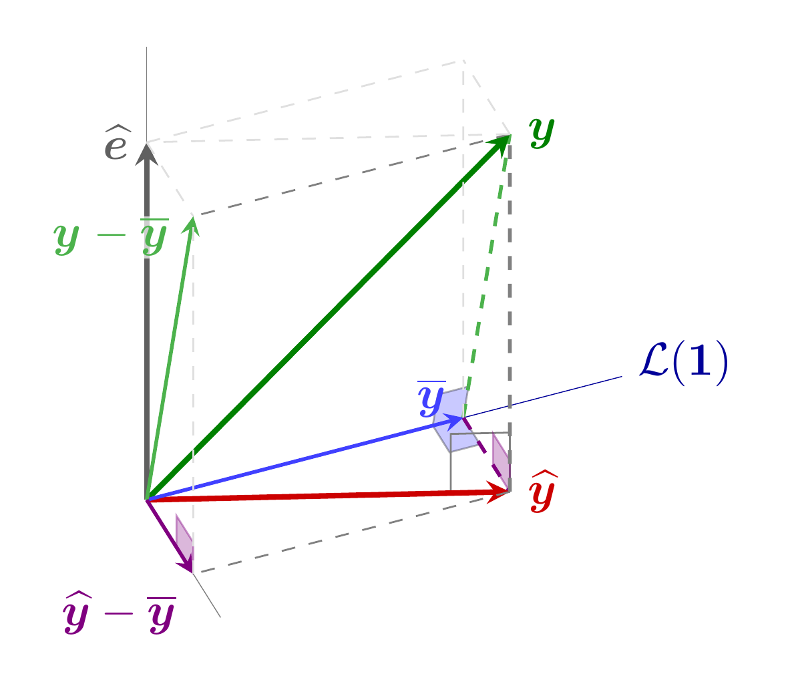
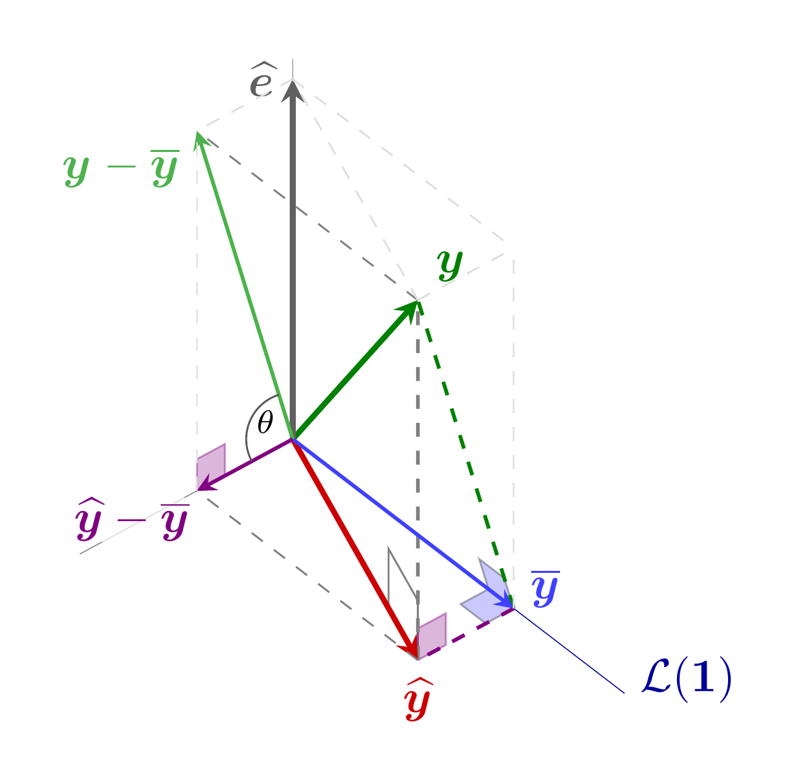
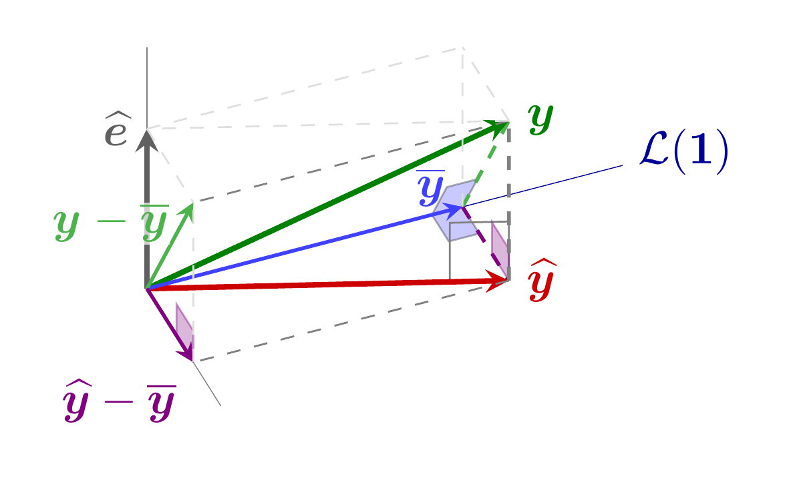
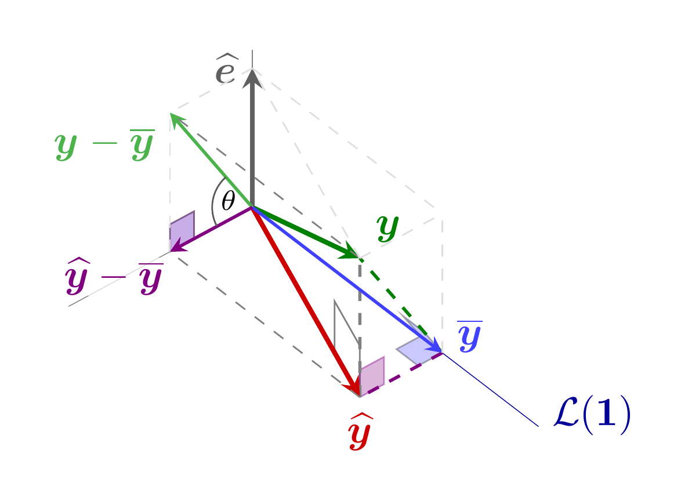

#+title: Código de las figuras de la lección 8
#+author: Marcos Bujosa Brun

#+latex_header: \usepackage{nacal}

\maketitle

\newpage

# +call: makePNGs()

* Figuras con fuente tikz

** Ajuste MCO
*** Vista A

#+NAME: OLS-A
#+BEGIN_SRC latex :noweb no-export :tangle tex/OLS-A.tex :results discard :exports code :eval no
  \documentclass[border=10pt]{standalone} 
  \usepackage[utf8]{inputenc}
  \usepackage{nacal}
  \usepackage{pgfplots}
  \usepackage{tikz-3dplot}

  \pgfplotsset{compat=newest}
  \usepackage{tikz} 
  \usetikzlibrary{matrix,decorations.pathreplacing}
  % Añadimos arrows.meta para dar soporte a los estilos de vectores con flechas stealth
  \usetikzlibrary{calc,angles,positioning,intersections,quotes,decorations.markings,arrows.meta}
  \usepackage{tkz-euclide}

  \pgfplotsset{width=10cm,height=6cm}

  % 1. DEFINIMOS LA VISTA 3D (Ángulos de rotación para los ejes)
  \tdplotsetmaincoords{50}{60} % A
  \tdplotsetmaincoords{50}{68} % A
  %\tdplotsetmaincoords{50}{45} % A
  %\tdplotsetmaincoords{50}{90} % de frente al plano formado por los ejes L(1) y L(1,x)^\perp
  %\tdplotsetmaincoords{90}{0} % en la dirección de 1
  %\tdplotsetmaincoords{0}{0} % vista desde arriba

  \begin{document}
  \begin{tikzpicture} [scale=3, tdplot_main_coords, axis/.style={-,gray,very thin},
    vector/.style={-stealth,black,very thick},
    vector guide/.style={dashed,black,thin}]
    
    % standard tikz coordinate definition using x, y, z coords
    \tdplotsetcoord{P}{1.5}{37.9}{70}
    \tdplotsetcoord{C}{1.8}{45}{60}
    \tdplotsetcoord{O}{0}{0}{0}
    
    \tdplotsetrotatedcoords{0}{0}{-45}
    
    \tdplotsetcoord{X}{0.5}{90}{0}
    \tdplotsetcoord{Y}{1.3}{90}{90}
    \tdplotsetcoord{Z}{1.5}{00}{0}
    
    % draw axes
    \draw[axis]  (O) -- (X) node[color=black, anchor=south east]{};
    \draw[-,very thin,color=blue!60!black]  (O) -- (Y) node[anchor=west,yshift=1.0mm]{$\mathcal{L}(\boldsymbol{1})$};
    \draw[axis]  (O) -- (Z); % node[anchor=north east]{$z$};
    
    %\node at (Cxy) {$\mathcal{C}(\Mat{X})$};
    
    \coordinate (Ymedia)   at (Py);
    \coordinate (Yhat)     at (Pxy);
    %\coordinate (Yhatdesv) at (Px);
    %\coordinate (Ydesv)    at (Pxz);
    
    \tkzMarkRightAngle[size=.08,fill=blue!70, opacity=0.3](O,Ymedia,P) 
    %\node[fill=white,inner sep=1pt,font=\scriptsize] at ($(Ymedia)!0!(O)!0!(Ymedia)!0!(P)$) {2};
    \tkzMarkRightAngle[size=.08,fill=blue!70, opacity=0.3](Yhat,Ymedia,O)
    %\node[fill=white,inner sep=1pt,font=\scriptsize] at ($(Ymedia)!0!(Yhat)!0!(Ymedia)!0!(O)$) {4};

    \tkzMarkRightAngle[size=.15, gray](O,Yhat,P)
    %\node[fill=white,inner sep=1pt,font=\scriptsize] at ($(Yhat)!0!(O)!0!(Yhat)!0!(P)$) {3};

    \tkzMarkRightAngle[size=.08,blue!50!red,fill=blue!50!red!70, opacity=0.4](Ymedia,Yhat,P)
    %\node[fill=white,inner sep=1pt,font=\scriptsize] at ($(Yhat)!0.!(Ymedia)!0.!(Yhat)!0.13!(P)$) {1};
    \tkzMarkRightAngle[size=.08,blue!50!red,fill=blue!50!red!70, opacity=0.4](Pxz,Px,O)

     
    % draw a vector guides from (Ymedia)
    \draw[vector guide, thick, green!40!gray]  (Ymedia) -- (P);
    \draw[vector guide, thick, blue!50!red] (Ymedia) -- (Yhat); %orange, dashed, very thick

    % draw a vector guides from (Yhat)
    \draw[vector guide, thick, gray] (Yhat) -- (P);
    
    % draw a vector from O 
    \draw[vector, green!50!black](O) -- (P) node[anchor=west]{$\boldsymbol{y}$};
    \draw[vector, black!25!gray] (O) -- (Pz) node[anchor=east]{$\boldsymbol{\mathop{\widehat{e}}}$};
    \draw[vector, color=red!80!black]  (O) -- (Yhat)  node[anchor=west]{$\boldsymbol{\mathop{\widehat{y}}}$};

    \draw[vector, thick, color=blue!75!white] (O) -- (Ymedia) node[anchor=east,yshift=1.5mm]{$\boldsymbol{\mathop{\overline{y}}}$};

    \draw[vector, thick, green!40!gray] (O) -- (Pxz) node[anchor=north east,yshift=0mm, xshift=-1.8mm, outer sep=0pt, inner sep=0.1pt, fill=white,opacity=.7,text opacity=1]{$\Vect{y}-\boldsymbol{\mathop{\overline{y}}}$};
    \draw[vector, thick, blue!50!red] (O) -- (Px) node[anchor=north east] {$\boldsymbol{\mathop{\widehat{y}}}-\boldsymbol{\mathop{\overline{y}}}$};
            
    \draw[vector guide, gray]         (Yhat) -- (Px);
    \draw[vector guide, gray]         (P) -- (Pxz);
    
    \draw[vector guide, gray!25!white]         (P) -- (Pyz);
    \draw[vector guide, gray!25!white]         (Pz) -- (Pxz);
    \draw[vector guide, gray!25!white]         (Pz) -- (Pyz);
    \draw[vector guide, gray!25!white]         (Px) -- (Pxz);
    \draw[vector guide, gray!25!white]         (Ymedia) -- (Pyz);
    \draw[vector guide, gray!25!white]         (P) -- (Pz);
    
    
    %\draw pic[draw=black,angle radius=9,angle eccentricity=1.4,gray!70!black] {angle = Px--O--Pxz} node[anchor=north west,yshift=1.8mm,xshift=.4mm, fill opacity=0.2,text opacity=1]{$\scriptstyle\theta$};

  \end{tikzpicture}
  \end{document}
#+END_SRC

#+ATTR_ORG: :width 600
#+ATTR_LATEX: :width .5\textwidth :caption \caption{Ajuste MCO}

*** Vista B

#+NAME: OLS-B
#+BEGIN_SRC latex :noweb no-export :tangle tex/OLS-B.tex :results discard :exports code :eval no
  \documentclass[border=10pt]{standalone} 
  \usepackage[utf8]{inputenc}
  \usepackage{nacal}
  \usepackage{pgfplots}
  \usepackage{tikz-3dplot}

  \pgfplotsset{compat=newest}
  \usepackage{tikz} 
  \usetikzlibrary{matrix,decorations.pathreplacing}
  % Añadimos arrows.meta para dar soporte a los estilos de vectores con flechas stealth
  \usetikzlibrary{calc,angles,positioning,intersections,quotes,decorations.markings,arrows.meta}
  \usepackage{tkz-euclide}

  \pgfplotsset{width=10cm,height=6cm}

  % 1. DEFINIMOS LA VISTA 3D (Ángulos de rotación para los ejes)
  \tdplotsetmaincoords{50}{60} % A
  \tdplotsetmaincoords{50}{140} % 9

  \begin{document}
  \begin{tikzpicture} [scale=3, tdplot_main_coords, axis/.style={-,gray,very thin},
    vector/.style={-stealth,black,very thick},
    vector guide/.style={dashed,black,thin}]
    
    % standard tikz coordinate definition using x, y, z coords
    \tdplotsetcoord{P}{1.5}{37.9}{70}
    \tdplotsetcoord{C}{1.8}{45}{60}
    \tdplotsetcoord{O}{0}{0}{0}
    
    \tdplotsetrotatedcoords{0}{0}{-45}
    
    \tdplotsetcoord{X}{0.7}{90}{0}
    \tdplotsetcoord{Y}{1.3}{90}{90}
    \tdplotsetcoord{Z}{1.25}{00}{0}
    
    % draw axes
    \draw[axis]  (O) -- (X) node[color=black, anchor=south east]{};
    \draw[-,very thin,color=blue!60!black]  (O) -- (Y) node[anchor=west,yshift=1.0mm]{$\mathcal{L}(\boldsymbol{1})$};
    \draw[axis]  (O) -- (Z); % node[anchor=north east]{$z$};
    
    %\node at (Cxy) {$\mathcal{C}(\Mat{X})$};
    
    \coordinate (Ymedia) at (Py);
    \coordinate (Yhat)   at (Pxy);
    
    \tkzMarkRightAngle[size=.08,fill=blue!70, opacity=0.3](O,Ymedia,P) 
    %\node[fill=white,inner sep=1pt,font=\scriptsize] at ($(Ymedia)!0!(O)!0!(Ymedia)!0!(P)$) {2};
    \tkzMarkRightAngle[size=.08,fill=blue!70, opacity=0.3](Yhat,Ymedia,O)
    %\node[fill=white,inner sep=1pt,font=\scriptsize] at ($(Ymedia)!0!(Yhat)!0!(Ymedia)!0!(O)$) {4};

    \tkzMarkRightAngle[size=.15, gray](O,Yhat,P)
    %\node[fill=white,inner sep=1pt,font=\scriptsize] at ($(Yhat)!0!(O)!0!(Yhat)!0!(P)$) {3};

    \tkzMarkRightAngle[size=.08,blue!50!red,fill=blue!50!red!70, opacity=0.4](Ymedia,Yhat,P)
    %\node[fill=white,inner sep=1pt,font=\scriptsize] at ($(Yhat)!0.!(Ymedia)!0.!(Yhat)!0.13!(P)$) {1};
    \tkzMarkRightAngle[size=.08,blue!50!red,fill=blue!50!red!70, opacity=0.4](Pxz,Px,O)
    
    % draw a vector guides from (Ymedia)
    \draw[vector guide, thick, green!50!black]  (Ymedia) -- (P);
    \draw[vector guide, thick, blue!50!red] (Ymedia) -- (Yhat); %orange, dashed, very thick

    % draw a vector guides from (Yhat)
    \draw[vector guide, thick, gray] (Yhat) -- (P);
    
    % draw a vector from O 
    \draw[vector, green!50!black](O) -- (P) node[anchor=south west]{$\boldsymbol{y}$};
    \draw[vector, black!25!gray] (O) -- (Pz) node[anchor=east]{$\boldsymbol{\mathop{\widehat{e}}}$};
    \draw[vector, color=red!80!black]  (O) -- (Yhat)  node[anchor=north]{$\boldsymbol{\mathop{\widehat{y}}}$};

    \draw[vector, thick, color=blue!75!white] (O) -- (Ymedia) node[anchor=west,yshift=1.5mm]{$\boldsymbol{\mathop{\overline{y}}}$};

    \draw[vector, thick, green!40!gray] (O) -- (Pxz)node[anchor=north east]{$\Vect{y}-\boldsymbol{\mathop{\overline{y}}}$};
    \draw[vector, thick, blue!50!red] (O) -- (Px) node[anchor=north east, yshift=-0.5mm, xshift=-0.5mm, outer sep=0pt, inner sep=0.1pt, fill=white,opacity=.7,text opacity=1] {$\boldsymbol{\mathop{\widehat{y}}}-\boldsymbol{\mathop{\overline{y}}}$};
        
    
    %\draw[vector guide, gray]         (Yhat) -- (Ymedia);
    \draw[vector guide, gray]         (Yhat) -- (Px);
    \draw[vector guide, gray]         (P) -- (Pxz);
    
    \draw[vector guide, gray!25!white]         (P) -- (Pyz);
    \draw[vector guide, gray!25!white]         (Pz) -- (Pxz);
    \draw[vector guide, gray!25!white]         (Pz) -- (Pyz);
    \draw[vector guide, gray!25!white]         (Px) -- (Pxz);
    \draw[vector guide, gray!25!white]         (Ymedia) -- (Pyz);
    \draw[vector guide, gray!25!white]         (P) -- (Pz);
    
    
    \draw pic[draw=black,angle radius=10,angle eccentricity=1.4,gray!70!black] {angle = Pxz--O--Px} node[anchor=south east, yshift=-.8mm, xshift=-0.1mm, fill opacity=0.2,text opacity=1]{$\scriptstyle\theta$};
    
  \end{tikzpicture}
  \end{document}
#+END_SRC

#+ATTR_ORG: :width 600
#+ATTR_LATEX: :width .5\textwidth :caption \caption{Ajuste MCO}

** Comparación de dos ajustes MCO
**** Cómo ajustar el punto para menor altura

En el paquete =tikz-3dplot=, la sintaxis de =\tdplotsetcoord{P}{r}{\theta}{\phi}= usa *coordenadas esféricas*:

1. *=r= (1.5):* Distancia del punto al origen.
2. *=\theta= (37.9):* Ángulo polar respecto al eje $Z$ (en grados). $0^\circ$ es en el eje $Z$ y $90^\circ$ está en el plano $XY$.
3. *=\phi= (70):* Ángulo azimutal en el plano $XY$ respecto al eje $X$.

Para mantener la *misma proyección* ($r_{xy} = r \sin\theta$) pero reducir la *altura* ($z = r \cos\theta$):
- Debes *aumentar $\theta$* (acercándolo a $90^\circ$).
- Debes *reducir $r$* para que el radio proyectado no cambie ($r' = \frac{r \sin\theta_{original}}{\sin\theta_{nuevo}}$).
- Debes *mantener $\phi = 70$* constante.

***** Solución propuesta

Para mantener la sombra exacta y bajar el vector a aproximadamente la mitad de su altura original (cambiando $\theta$ de $37.9^\circ$ a $60^\circ$):

#+begin_src latex
\tdplotsetcoord{P}{1.06}{60}{70}
#+end_src

Si prefieres una altura ligeramente menor pero no tan baja (p. ej. $\theta = 50^\circ$):

#+begin_src latex
\tdplotsetcoord{P}{1.20}{50}{70}
#+end_src

La función =sin()= en Octave trabaja por defecto en *radianes*, no en grados.

Para trabajar en grados en Octave debes usar *=sind()=* (con /d/ de /degrees/):

#+begin_src octave
(1.5 * sind(37.9)) / sind(55)
#+end_src

#+RESULTS:
: 1.1252

El resultado correcto es *=1.1252=* (o =1.13= redondeado). 

El comando para TikZ quedaría así:
#+begin_src latex
\tdplotsetcoord{P}{1.125}{55}{70}
#+end_src

*** Vista A (con mejor ajuste)

#+NAME: OLS-A-ma
#+BEGIN_SRC latex :noweb no-export :tangle tex/OLS-A-ma.tex :results discard :exports code :eval no
    \documentclass[border=10pt]{standalone} 
    \usepackage[utf8]{inputenc}
    \usepackage{nacal}
    \usepackage{pgfplots}
    \usepackage{tikz-3dplot}

    \pgfplotsset{compat=newest}
    \usepackage{tikz} 
    \usetikzlibrary{matrix,decorations.pathreplacing}
    % Añadimos arrows.meta para dar soporte a los estilos de vectores con flechas stealth
    \usetikzlibrary{calc,angles,positioning,intersections,quotes,decorations.markings,arrows.meta}
    \usepackage{tkz-euclide}

    \pgfplotsset{width=10cm,height=6cm}

    % 1. DEFINIMOS LA VISTA 3D (Ángulos de rotación para los ejes)
    \tdplotsetmaincoords{50}{60} % A
    \tdplotsetmaincoords{50}{68} % A
    %\tdplotsetmaincoords{50}{45} % A
    %\tdplotsetmaincoords{50}{90} % de frente al plano formado por los ejes L(1) y L(1,x)^\perp
    %\tdplotsetmaincoords{90}{0} % en la dirección de 1
    %\tdplotsetmaincoords{0}{0} % vista desde arriba

    \begin{document}
    \begin{tikzpicture} [scale=3, tdplot_main_coords, axis/.style={-,gray,very thin},
      vector/.style={-stealth,black,very thick},
      vector guide/.style={dashed,black,thin}]
      
      % standard tikz coordinate definition using x, y, z coords
      %\tdplotsetcoord{P}{1.5}{37.9}{70} % punto alto
      \tdplotsetcoord{P}{1.06}{60}{70} % punto bajo
      \tdplotsetcoord{C}{1.8}{45}{60}
      \tdplotsetcoord{O}{0}{0}{0}
      
      \tdplotsetrotatedcoords{0}{0}{-45}
      
      \tdplotsetcoord{X}{0.5}{90}{0}
      \tdplotsetcoord{Y}{1.3}{90}{90}
      \tdplotsetcoord{Z}{0.8}{00}{0}
      
      % draw axes
      \draw[axis]  (O) -- (X) node[color=black, anchor=south east]{};
      \draw[-,very thin,color=blue!60!black]  (O) -- (Y) node[anchor=west,yshift=1.0mm]{$\mathcal{L}(\boldsymbol{1})$};
      \draw[axis]  (O) -- (Z); % node[anchor=north east]{$z$};
      
      %\node at (Cxy) {$\mathcal{C}(\Mat{X})$};
      
      \coordinate (Ymedia)   at (Py);
      \coordinate (Yhat)     at (Pxy);
      %\coordinate (Yhatdesv) at (Px);
      %\coordinate (Ydesv)    at (Pxz);
      
      \tkzMarkRightAngle[size=.08,fill=blue!70, opacity=0.3](O,Ymedia,P) 
      % \node[fill=white,inner sep=1pt,font=\scriptsize] at ($(Ymedia)!0!(O)!0!(Ymedia)!0!(P)$) {2};
      \tkzMarkRightAngle[size=.08,fill=blue!70, opacity=0.3](Yhat,Ymedia,O)
      % \node[fill=white,inner sep=1pt,font=\scriptsize] at ($(Ymedia)!0!(Yhat)!0!(Ymedia)!0!(O)$) {4};
      
      \tkzMarkRightAngle[size=.15, gray](O,Yhat,P)
      % \node[fill=white,inner sep=1pt,font=\scriptsize] at ($(Yhat)!0!(O)!0!(Yhat)!0!(P)$) {3};
      
      \tkzMarkRightAngle[size=.08,blue!50!red,fill=blue!50!red!70, opacity=0.4](Ymedia,Yhat,P)
      % \node[fill=white,inner sep=1pt,font=\scriptsize] at ($(Yhat)!0.!(Ymedia)!0.!(Yhat)!0.13!(P)$) {1};
      \tkzMarkRightAngle[size=.08,blue!50!red,fill=blue!50!red!70, opacity=0.4](Pxz,Px,O)

      % \tkzMarkRightAngle[size=.08,fill=blue!40, opacity=0.5](Ymedia,Yhat,P)
      % \tkzMarkRightAngle[size=.08,fill=blue!40, opacity=0.3](O,Ymedia,P) 
      % \tkzMarkRightAngle[size=.08,fill=blue!40, opacity=0.3](O,Yhat,P)
      % \tkzMarkRightAngle[size=.08,fill=blue!40, opacity=0.3](Yhat,Ymedia,O)
       
      % draw a vector guides from (Ymedia)
      \draw[vector guide, thick, green!40!gray]  (Ymedia) -- (P);
      \draw[vector guide, thick, blue!50!red] (Ymedia) -- (Yhat); %orange, dashed, very thick

      % draw a vector guides from (Yhat)
      \draw[vector guide, thick, gray] (Yhat) -- (P);
      
      % draw a vector from O 
      \draw[vector, green!50!black](O) -- (P) node[anchor=west]{$\boldsymbol{y}$};
      \draw[vector, black!25!gray] (O) -- (Pz) node[anchor=east]{$\boldsymbol{\mathop{\widehat{e}}}$};
      \draw[vector, color=red!80!black]  (O) -- (Yhat)  node[anchor=west]{$\boldsymbol{\mathop{\widehat{y}}}$};

      \draw[vector, thick, color=blue!75!white] (O) -- (Ymedia) node[anchor=east,yshift=1.5mm]{$\boldsymbol{\mathop{\overline{y}}}$};

      \draw[vector, thick, green!40!gray] (O) -- (Pxz) node[anchor=north east,yshift=0mm, xshift=-1.8mm, outer sep=0pt, inner sep=0.1pt, fill=white,opacity=.7,text opacity=1]{$\Vect{y}-\boldsymbol{\mathop{\overline{y}}}$};
      \draw[vector, thick, blue!50!red] (O) -- (Px) node[anchor=north east] {$\boldsymbol{\mathop{\widehat{y}}}-\boldsymbol{\mathop{\overline{y}}}$};
              
      \draw[vector guide, gray]         (Yhat) -- (Px);
      \draw[vector guide, gray]         (P) -- (Pxz);
      
      \draw[vector guide, gray!25!white]         (P) -- (Pyz);
      \draw[vector guide, gray!25!white]         (Pz) -- (Pxz);
      \draw[vector guide, gray!25!white]         (Pz) -- (Pyz);
      \draw[vector guide, gray!25!white]         (Px) -- (Pxz);
      \draw[vector guide, gray!25!white]         (Ymedia) -- (Pyz);
      \draw[vector guide, gray!25!white]         (P) -- (Pz);
      
      
      % \draw pic[draw=black,angle radius=10,angle eccentricity=1.4,gray!70!black] {angle = Px--O--Pxz} node[anchor=north west,yshift=1.5mm,xshift=2.5mm, fill opacity=0.2,text opacity=1]{$\scriptstyle\theta$};
      
    \end{tikzpicture}
  \end{document}
#+END_SRC

#+ATTR_ORG: :width 600
#+ATTR_LATEX: :width .5\textwidth :caption \caption{Ajuste MCO}

*** Vista B (con mejor ajuste)

#+NAME: OLS-B-ma
#+BEGIN_SRC latex :noweb no-export :tangle tex/OLS-B-ma.tex :results discard :exports code :eval no
  \documentclass[border=10pt]{standalone} 
  \usepackage[utf8]{inputenc}
  \usepackage{nacal}
  \usepackage{pgfplots}
  \usepackage{tikz-3dplot}

  \pgfplotsset{compat=newest}
  \usepackage{tikz} 
  \usetikzlibrary{matrix,decorations.pathreplacing}
  % Añadimos arrows.meta para dar soporte a los estilos de vectores con flechas stealth
  \usetikzlibrary{calc,angles,positioning,intersections,quotes,decorations.markings,arrows.meta}
  \usepackage{tkz-euclide}

  \pgfplotsset{width=10cm,height=6cm}

  % 1. DEFINIMOS LA VISTA 3D (Ángulos de rotación para los ejes)
  \tdplotsetmaincoords{50}{60} % A
  \tdplotsetmaincoords{50}{140} % 9

  \begin{document}
  \begin{tikzpicture} [scale=3, tdplot_main_coords, axis/.style={-,gray,very thin},
    vector/.style={-stealth,black,very thick},
    vector guide/.style={dashed,black,thin}]
    
    % standard tikz coordinate definition using x, y, z coords
    % \tdplotsetcoord{P}{1.5}{37.9}{70} % punto alto
    \tdplotsetcoord{P}{1.06}{60}{70} % punto bajo
    \tdplotsetcoord{C}{1.8}{45}{60}
    \tdplotsetcoord{O}{0}{0}{0}
    
    \tdplotsetrotatedcoords{0}{0}{-45}
    
    \tdplotsetcoord{X}{0.7}{90}{0}
    \tdplotsetcoord{Y}{1.3}{90}{90}
    \tdplotsetcoord{Z}{0.6}{00}{0}
    
    % draw axes
    \draw[axis]  (O) -- (X) node[color=black, anchor=south east]{};
    \draw[-,very thin,color=blue!60!black]  (O) -- (Y) node[anchor=west,yshift=1.0mm]{$\mathcal{L}(\boldsymbol{1})$};
    \draw[axis]  (O) -- (Z); % node[anchor=north east]{$z$};
    
    % \node at (Cxy) {$\mathcal{C}(\Mat{X})$};
    
    \coordinate (Ymedia) at (Py);
    \coordinate (Yhat)   at (Pxy);
    
      \tkzMarkRightAngle[size=.08,fill=blue!70, opacity=0.3](O,Ymedia,P) 
      % \node[fill=white,inner sep=1pt,font=\scriptsize] at ($(Ymedia)!0!(O)!0!(Ymedia)!0!(P)$) {2};
      \tkzMarkRightAngle[size=.08,fill=blue!70, opacity=0.3](Yhat,Ymedia,O)
      % \node[fill=white,inner sep=1pt,font=\scriptsize] at ($(Ymedia)!0!(Yhat)!0!(Ymedia)!0!(O)$) {4};
      
      \tkzMarkRightAngle[size=.15, gray](O,Yhat,P)
      % \node[fill=white,inner sep=1pt,font=\scriptsize] at ($(Yhat)!0!(O)!0!(Yhat)!0!(P)$) {3};
      
      \tkzMarkRightAngle[size=.08,blue!50!red,fill=blue!50!red!70, opacity=0.4](Ymedia,Yhat,P)
      % \node[fill=white,inner sep=1pt,font=\scriptsize] at ($(Yhat)!0.!(Ymedia)!0.!(Yhat)!0.13!(P)$) {1};
      \tkzMarkRightAngle[size=.08,blue!50!red,fill=blue!50!red!70, opacity=0.4](Pxz,Px,O)
      
    % \tkzMarkRightAngle[size=.08,fill=blue!40, opacity=0.5](Ymedia,Yhat,P)
    % \tkzMarkRightAngle[size=.08,fill=blue!40, opacity=0.3](O,Ymedia,P) 
    % \tkzMarkRightAngle[size=.08,fill=blue!40, opacity=0.3](O,Yhat,P)
    % \tkzMarkRightAngle[size=.08,fill=blue!40, opacity=0.3](Yhat,Ymedia,O)
    
    \tkzMarkRightAngle[size=.08,fill=blue!40, opacity=0.3](Pxz,Px,O)
    
    % draw a vector guides from (Ymedia)
    \draw[vector guide, thick, green!50!black]  (Ymedia) -- (P);
    \draw[vector guide, thick, blue!50!red] (Ymedia) -- (Yhat); %orange, dashed, very thick

    % draw a vector guides from (Yhat)
    \draw[vector guide, thick, gray] (Yhat) -- (P);
    
    % draw a vector from O 
    \draw[vector, green!50!black](O) -- (P) node[anchor=south west]{$\boldsymbol{y}$};
    \draw[vector, black!25!gray] (O) -- (Pz) node[anchor=east]{$\boldsymbol{\mathop{\widehat{e}}}$};
    \draw[vector, color=red!80!black]  (O) -- (Yhat)  node[anchor=north]{$\boldsymbol{\mathop{\widehat{y}}}$};

    \draw[vector, thick, color=blue!75!white] (O) -- (Ymedia) node[anchor=west,yshift=1.5mm]{$\boldsymbol{\mathop{\overline{y}}}$};

    \draw[vector, thick, green!40!gray] (O) -- (Pxz)node[anchor=north east]{$\Vect{y}-\boldsymbol{\mathop{\overline{y}}}$};
    \draw[vector, thick, blue!50!red] (O) -- (Px) node[anchor=north east, yshift=-0.5mm, xshift=-0.5mm, outer sep=0pt, inner sep=0.1pt, fill=white,opacity=.7,text opacity=1] {$\boldsymbol{\mathop{\widehat{y}}}-\boldsymbol{\mathop{\overline{y}}}$};
    
    
    % \draw[vector guide, gray]         (Yhat) -- (Ymedia);
    \draw[vector guide, gray]         (Yhat) -- (Px);
    \draw[vector guide, gray]         (P) -- (Pxz);
    
    \draw[vector guide, gray!25!white]         (P) -- (Pyz);
    \draw[vector guide, gray!25!white]         (Pz) -- (Pxz);
    \draw[vector guide, gray!25!white]         (Pz) -- (Pyz);
    \draw[vector guide, gray!25!white]         (Px) -- (Pxz);
    \draw[vector guide, gray!25!white]         (Ymedia) -- (Pyz);
    \draw[vector guide, gray!25!white]         (P) -- (Pz);
    
    
    \draw pic[draw=black,angle radius=10,angle eccentricity=1.4,gray!70!black] {angle = Pxz--O--Px} node[anchor=south east, yshift=-1.5mm, xshift=-0.1mm, fill opacity=0.2,text opacity=1]{$\scriptstyle\theta$};
    
  \end{tikzpicture}
  \end{document}
#+END_SRC

#+ATTR_ORG: :width 600
#+ATTR_LATEX: :width .5\textwidth :caption \caption{Ajuste MCO}

** Suma de cuadrados

#+begin_src octave :eval yes
  randn ("seed", 123.456)
  n = 10;
  x = 42+5*[1:n]';
  y = 0.6*[1:n]'+130+randn(n,1);
  ybar = mean(y)*ones(n,1);

  X = [ones(n,1),x];
  beta = X\y;
  yhat = X*beta;

  ehat = y-yhat;     # para SRC
  ebar = y-ybar;     # para STC
  eSEC = yhat-ybar;  # para SEC

  data = [x,y,yhat,ehat,ybar,ebar,eSEC];

  # plot(x,[y,yhat,ybar])

  format bank

  data

  csvwrite('SumasCuadradros.csv',data)
  dlmwrite('SumasCuadradros.txt',data,'delimiter','\t','precision',5)

  fileID=fopen('SumasCuadradros.dat','w');
  fprintf(fileID,'%s\t %s\t %s\t %s\t %s\t %s\t %s\n','x','y','yhat','ehat','ybar','ebar','eSEC');
  fprintf(fileID,'%3.2f\t %3.2f\t %3.2f\t %3.2f\t %3.2f\t %3.2f\t %3.2f\t\n',data');
  fclose(fileID);  
#+end_src

#+RESULTS:
: 0

*** Suma Total de Cuadrados

#+begin_src  latex :noweb no-export :tangle tex/STCmodeloLS.tex :results discard :exports code :eval no
  \documentclass[border=10pt]{standalone} 

  \usepackage{tikz}
  \usepackage{pgfplots}
  \usepackage{pgfplotstable}

  \usetikzlibrary{calc}

  \pgfplotstableread{../SumasCuadradros.dat}\loadedtable

  \begin{document}

  \begin{tikzpicture}
    \begin{axis}[
      xlabel=$x$, %Weight (kg), % label x axis
      ylabel=$y$, %Height (cm), % label y axis
      axis lines=left, %set the position of the axes
      xmin=44, xmax=95, % set the min and max values of the x-axis
      ymin=129, ymax=137, % set the min and max values of the y-axis
      clip=false
      ]
      
      \addplot [only marks, mark=*, mark size=1.4, green!30!black] table [y=y, x=x] {\loadedtable};
      \addplot [no markers, green!50!black, draw=green!40!black, fill opacity=0.2,%thick, red,
      error bars/.cd,
      y dir=plus,
      y explicit,
      draw error bar/.code 2 args={
        \edef\expression{($##1!1.414!45:##2$)}
        \fill ##1 rectangle \expression;
      }
      ] table [y=ybar, y error expr=\thisrow{ebar}] {\loadedtable};
      \addplot [no markers, very thick, blue!50!black] table [y=ybar, x=x] {\loadedtable};
      \addplot [only marks, mark=*, mark size=1.2, blue!80] table [y=ybar, x=x] {\loadedtable};
    \end{axis}
  \end{tikzpicture}
  \end{document}
#+end_src

Al compilar esta figura de tikz falla porque no encuentra SumasCuadradros.dat. 

*** Suma de Residuos al Cuadrado

#+begin_src  latex :noweb no-export :tangle tex/SRCmodeloLS.tex :results discard :exports code :eval no
  \documentclass[border=10pt]{standalone} 

  \usepackage{tikz}
  \usepackage{pgfplots}
  \usepackage{pgfplotstable}

  \usetikzlibrary{calc}

  \pgfplotstableread{../SumasCuadradros.dat}\loadedtable

  \begin{document}

  \begin{tikzpicture}
    \begin{axis}[
      xlabel=$x$, %Weight (kg), % label x axis
      ylabel=$y$, %Height (cm), % label y axis
      axis lines=left, %set the position of the axes
      xmin=44, xmax=95, % set the min and max values of the x-axis
      ymin=129, ymax=137, % set the min and max values of the y-axis
      clip=false
      ]
      
      \addplot [only marks, mark=*, mark size=1.4, green!30!black] table [y=y, x=x] {\loadedtable};
      \addplot [no markers, gray!50, , draw=green!40!black, fill opacity=0.5,%thick, red,
      error bars/.cd,
      y dir=plus,
      y explicit,
      draw error bar/.code 2 args={
        \edef\expression{($##1!1.414!45:##2$)}
        \fill ##1 rectangle \expression;
      }
      ] table [y=yhat, y error expr=\thisrow{ehat}] {\loadedtable};
      \addplot [no markers, very thick, red!70!gray] table [y=yhat, x=x] {\loadedtable};
      \addplot [only marks, mark=*, mark size=1.3, red!60!black] table [y=yhat, x=x] {\loadedtable};
    \end{axis}
  \end{tikzpicture}
  \end{document}
#+end_src

*** Suma Explicada de Cuadrados

#+begin_src  latex :noweb no-export :tangle tex/SECmodeloLS.tex :results discard :exports code :eval no
    \documentclass[border=10pt]{standalone} 

    \usepackage{tikz}
    \usepackage{pgfplots}
    \usepackage{pgfplotstable}

    \usetikzlibrary{calc}

    \pgfplotstableread{../SumasCuadradros.dat}\loadedtable

    \begin{document}

      \begin{tikzpicture}
        \begin{axis}[
          xlabel=$x$, %Weight (kg), % label x axis
          ylabel=$y$, %Height (cm), % label y axis
          axis lines=left, %set the position of the axes
          xmin=45, xmax=95, % set the min and max values of the x-axis
          ymin=129, ymax=137, % set the min and max values of the y-axis
          clip=false
          ]
          
          \addplot [only marks, mark=*, mark size=1.3, red!60!black] table [y=yhat, x=x] {\loadedtable};
          \addplot [no markers, purple!80!blue, , draw=red!40!black, fill opacity=0.2,%thick, red,
          error bars/.cd,
          y dir=plus,
          y explicit,
          draw error bar/.code 2 args={
            \edef\expression{($##1!1.414!45:##2$)}
            \fill ##1 rectangle \expression;
          }
          ] table [y=ybar, y error expr=\thisrow{eSEC}] {\loadedtable};
          \addplot [no markers, very thick, blue!50!black] table [y=ybar, x=x] {\loadedtable};
          \addplot [only marks, mark=*, mark size=1.2, blue!80] table [y=ybar, x=x] {\loadedtable};
        \end{axis}
      \end{tikzpicture}
      \end{document}
#+end_src

#+begin_src bash :build yes
  convert STCmodeloLS.png SRCmodeloLS.png SECmodeloLS.png -gravity center +append -background white -gravity center -extent 5500 SumaCuadradosModeloLinealSimple.png
#+end_src

#+RESULTS:

* COMMENT Ajustes de las figuras

#+BEGIN_SRC bash :build yes 
  convert RegresionAjuste-ejemplo-n5.png -gravity center -background white -extent 3000x RegresionAjuste-ejemplo-n5_ancho.png
#+END_SRC

#+RESULTS:

#+BEGIN_SRC bash :build yes 
  convert OLS-A.png OLS-B.png -gravity center +append -background white -gravity center -extent 2900 OLS_fila_ancho.png
#+END_SRC

#+RESULTS:

#+begin_src bash :build yes 
  montage OLS-A.png OLS-B.png OLS-A-ma.png OLS-B-ma.png -tile 2x2 -geometry +0+0 ComparacionAjustes.png
#+end_src

#+RESULTS:

#+begin_src bash :build yes
  convert ComparacionAjustes.png -gravity center -background white -extent 3200x ComparacionAjustes_ancho.png
#+end_src

#+RESULTS:

#+begin_src bash :build yes
  convert ComparacionAjustes.png -gravity center -background white -extent 4000x ComparacionAjustes_muy_ancho.png
#+end_src

#+RESULTS:
