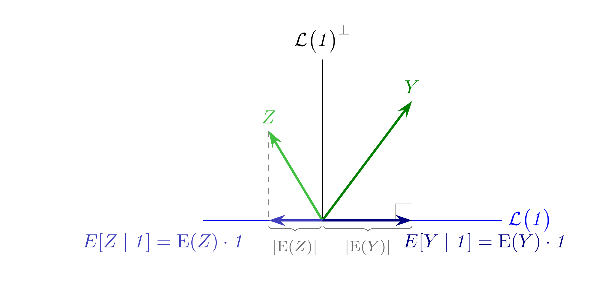
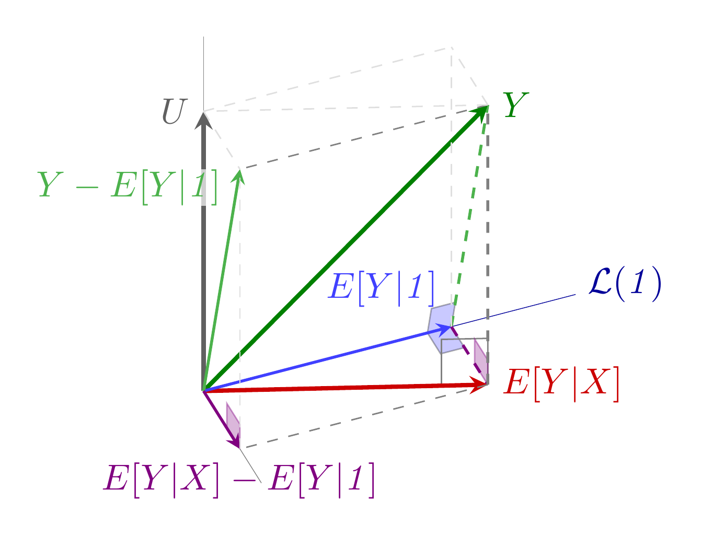
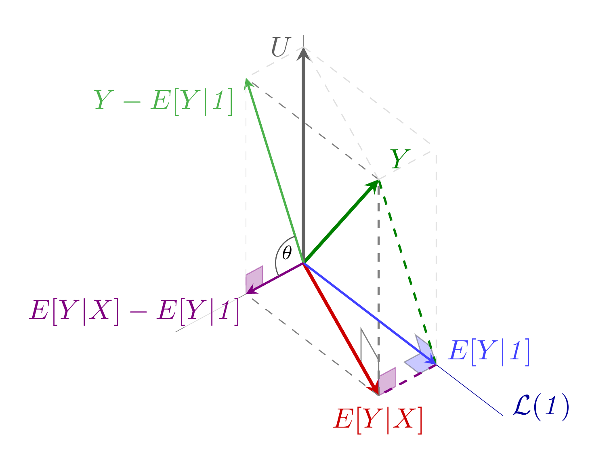

#+title: Código de las figuras de la lección 9
#+author: Marcos Bujosa Brun

#+latex_header: \usepackage{nacal}
#+LATEX_HEADER: \usepackage{polyglossia}
#+LATEX_HEADER: \setmainlanguage{spanish}

\maketitle

* Figuras con fuente tikz

** Esperanza matemática y esperanza condicional

#+NAME: EsperanzaMatyCond
#+BEGIN_SRC  latex :noweb no-export :tangle tex/EspMatematicayCondicional.tex :results discard :exports code :eval no
<<Preambulo comun>>

\pgfplotsset{width=10cm,height=6cm}

\begin{document}
  <<Colores>>

  \begin{tikzpicture}[scale=1.1]
    % vértices del triángulo
    \coordinate (v1) at (0,0);
    \coordinate (v2) at (3,0); % punta eje horizontal
    \coordinate (v3) at (1.5,2);
    \coordinate (v4) at (1.5,0);  
    
    \coordinate (v6) at (0,2); % vector e
    \coordinate (v7) at (0,2.7); % punta eje vertical

    \coordinate (v8) at (-0.9, 1.5);
    \coordinate (v9) at (-0.9, 0);
    \coordinate (v10) at (  0, 1.5);
    \coordinate (v11) at (-2, 0);

    % Ángulo recto usando tkz-euclide sin fallos
    \tkzMarkRightAngle[size=.28,gray,very thin](v1,v4,v3) 
    
    % division del triangulo
    \draw[-,gray,dashed,very thin]  (v3) -- (v4);
        
    % lineas y vectores
    \draw[color=blue!95!black,very thin]  (v11) -- (v2) node [right]  {$\Span{\mathit{1}}$};
    \draw[very thin]  (v1) -- (v7) node [above]  {$\Span{\mathit{1}}^\perp$};
    
    \draw[-{Stealth[length=3mm, width=2mm]},very thick,green!50!black] (v1) -- (v3) node [above]  {$Y$};
    \draw[-{Stealth[length=3mm, width=2mm]},very thick,blue!50!black] (v1) -- (v4) node [anchor=north west,yshift=-1mm,xshift=-3mm]  {$E[Y\mid\mathit{1}]=\mathrm{E}(Y)\cdot\mathit{1}$};
    \draw[decorate, decoration={brace,mirror},gray!85!black] (0.02,-0.1) -- (1.5,-0.1) node [midway, anchor=north, yshift=-1mm, outer sep=1pt,font=\footnotesize]{$\modulus{\mathrm{E}(Y)}$};

    \draw[-{Stealth[length=3mm, width=2mm]},very thick,green!50!gray] (v1) -- (v8) node [above]  {$Z$};
    \draw[-,gray,dashed,very thin]  (v8) -- (v9);
    \draw[-{Stealth[length=3mm, width=2mm]},very thick,blue!50!gray] (v1) -- (v9) node [anchor=north east,yshift=-1mm,xshift=-3mm]  {$E[Z\mid\mathit{1}]=\mathrm{E}(Z)\cdot\mathit{1}$};
    \draw[decorate, decoration={brace,mirror},gray!85!black] (-.9,-0.1) -- (-0.02,-0.1) node [midway, anchor=north, yshift=-1mm, outer sep=1pt,font=\footnotesize]{$\modulus{\mathrm{E}(Z)}$};
  \end{tikzpicture} 
\end{document}
#+END_SRC

#+ATTR_ORG: :width 600
#+ATTR_LATEX: :width .5\textwidth :caption \caption{Interpretación geométrica de la esperanza matemática y la esperanza condiconal de una variable aleatoria}

**** Ajustes

#+BEGIN_SRC bash :build yes
convert EspMatematicayCondicional.png -gravity center -background white -extent 3200x EspMatematicayCondicional_ancho.png
#+END_SRC

#+RESULTS:

** Esperanza condicional
*** Vista A

#+NAME: ECond-A
#+BEGIN_SRC latex :noweb no-export :tangle tex/ECond-A.tex :results discard :exports code :eval no
  \documentclass[border=10pt]{standalone} 
  \usepackage[utf8]{inputenc}
  \usepackage{nacal}
  \usepackage{pgfplots}
  \usepackage{tikz-3dplot}

  \pgfplotsset{compat=newest}
  \usepackage{tikz} 
  \usetikzlibrary{matrix,decorations.pathreplacing}
  % Añadimos arrows.meta para dar soporte a los estilos de vectores con flechas stealth
  \usetikzlibrary{calc,angles,positioning,intersections,quotes,decorations.markings,arrows.meta}
  \usepackage{tkz-euclide}

  \pgfplotsset{width=10cm,height=6cm}

  % 1. DEFINIMOS LA VISTA 3D (Ángulos de rotación para los ejes)
  \tdplotsetmaincoords{50}{60} % A
  \tdplotsetmaincoords{50}{68} % A
  %\tdplotsetmaincoords{50}{45} % A
  %\tdplotsetmaincoords{50}{90} % de frente al plano formado por los ejes L(1) y L(1,x)^\perp
  %\tdplotsetmaincoords{90}{0} % en la dirección de 1
  %\tdplotsetmaincoords{0}{0} % vista desde arriba

  \begin{document}
  \begin{tikzpicture} [scale=3, tdplot_main_coords, axis/.style={-,gray,very thin},
    vector/.style={-stealth,black,very thick},
    vector guide/.style={dashed,black,thin}]
    
    % standard tikz coordinate definition using x, y, z coords
    \tdplotsetcoord{P}{1.5}{37.9}{70}
    \tdplotsetcoord{C}{1.8}{45}{60}
    \tdplotsetcoord{O}{0}{0}{0}
    
    \tdplotsetrotatedcoords{0}{0}{-45}
    
    \tdplotsetcoord{X}{0.5}{90}{0}
    \tdplotsetcoord{Y}{1.3}{90}{90}
    \tdplotsetcoord{Z}{1.5}{00}{0}
    
    % draw axes
    \draw[axis]  (O) -- (X) node[color=black, anchor=south east]{};
    \draw[-,very thin,color=blue!60!black]  (O) -- (Y) node[anchor=west,yshift=1.0mm]{$\mathcal{L}(\mathit{1})$};
    \draw[axis]  (O) -- (Z); % node[anchor=north east]{$z$};
    
    %\node at (Cxy) {$\mathcal{C}(\Mat{X})$};
    
    \coordinate (Ymedia)   at (Py);
    \coordinate (Yhat)     at (Pxy);
    %\coordinate (Yhatdesv) at (Px);
    %\coordinate (Ydesv)    at (Pxz);
    
    \tkzMarkRightAngle[size=.08,fill=blue!70, opacity=0.3](O,Ymedia,P) 
    %\node[fill=white,inner sep=1pt,font=\scriptsize] at ($(Ymedia)!0!(O)!0!(Ymedia)!0!(P)$) {2};
    \tkzMarkRightAngle[size=.08,fill=blue!70, opacity=0.3](Yhat,Ymedia,O)
    %\node[fill=white,inner sep=1pt,font=\scriptsize] at ($(Ymedia)!0!(Yhat)!0!(Ymedia)!0!(O)$) {4};

    \tkzMarkRightAngle[size=.15, gray](O,Yhat,P)
    %\node[fill=white,inner sep=1pt,font=\scriptsize] at ($(Yhat)!0!(O)!0!(Yhat)!0!(P)$) {3};

    \tkzMarkRightAngle[size=.08,blue!50!red,fill=blue!50!red!70, opacity=0.4](Ymedia,Yhat,P)
    %\node[fill=white,inner sep=1pt,font=\scriptsize] at ($(Yhat)!0.!(Ymedia)!0.!(Yhat)!0.13!(P)$) {1};
    \tkzMarkRightAngle[size=.08,blue!50!red,fill=blue!50!red!70, opacity=0.4](Pxz,Px,O)

     
    % draw a vector guides from (Ymedia)
    \draw[vector guide, thick, green!40!gray]  (Ymedia) -- (P);
    \draw[vector guide, thick, blue!50!red] (Ymedia) -- (Yhat); %orange, dashed, very thick

    % draw a vector guides from (Yhat)
    \draw[vector guide, thick, gray] (Yhat) -- (P);
    
    % draw a vector from O 
    \draw[vector, green!50!black](O) -- (P) node[anchor=west]{$Y$};
    \draw[vector, black!25!gray] (O) -- (Pz) node[anchor=east]{$U$};
    \draw[vector, color=red!80!black]  (O) -- (Yhat)  node[anchor=west]{$E[Y|X]$};

    \draw[vector, thick, color=blue!75!white] (O) -- (Ymedia) node[anchor=south east,yshift=0.6mm]{$E[Y|\mathit{1}]$};

    \draw[vector, thick, green!40!gray] (O) -- (Pxz) node[anchor=north east,yshift=0mm, xshift=-1.8mm, outer sep=0pt, inner sep=0.1pt, fill=white,opacity=.7,text opacity=1]{$Y-E[Y|\mathit{1}]$};
    \draw[vector, thick, blue!50!red] (O) -- (Px) node[anchor=north] {$E[Y|X]-E[Y|\mathit{1}]$};
            
    \draw[vector guide, gray]         (Yhat) -- (Px);
    \draw[vector guide, gray]         (P) -- (Pxz);
    
    \draw[vector guide, gray!25!white]         (P) -- (Pyz);
    \draw[vector guide, gray!25!white]         (Pz) -- (Pxz);
    \draw[vector guide, gray!25!white]         (Pz) -- (Pyz);
    \draw[vector guide, gray!25!white]         (Px) -- (Pxz);
    \draw[vector guide, gray!25!white]         (Ymedia) -- (Pyz);
    \draw[vector guide, gray!25!white]         (P) -- (Pz);
    
    
    %\draw pic[draw=black,angle radius=9,angle eccentricity=1.4,gray!70!black] {angle = Px--O--Pxz} node[anchor=north west,yshift=1.8mm,xshift=.4mm, fill opacity=0.2,text opacity=1]{$\scriptstyle\theta$};

  \end{tikzpicture}
  \end{document}
#+END_SRC

#+ATTR_ORG: :width 600
#+ATTR_LATEX: :width .5\textwidth :caption \caption{Ajuste MCO}

*** Vista B

#+NAME: ECond-B
#+BEGIN_SRC latex :noweb no-export :tangle tex/ECond-B.tex :results discard :exports code :eval no
  \documentclass[border=10pt]{standalone} 
  \usepackage[utf8]{inputenc}
  \usepackage{nacal}
  \usepackage{pgfplots}
  \usepackage{tikz-3dplot}

  \pgfplotsset{compat=newest}
  \usepackage{tikz} 
  \usetikzlibrary{matrix,decorations.pathreplacing}
  % Añadimos arrows.meta para dar soporte a los estilos de vectores con flechas stealth
  \usetikzlibrary{calc,angles,positioning,intersections,quotes,decorations.markings,arrows.meta}
  \usepackage{tkz-euclide}

  \pgfplotsset{width=10cm,height=6cm}

  % 1. DEFINIMOS LA VISTA 3D (Ángulos de rotación para los ejes)
  \tdplotsetmaincoords{50}{60} % A
  \tdplotsetmaincoords{50}{140} % 9

  \begin{document}
  \begin{tikzpicture} [scale=3, tdplot_main_coords, axis/.style={-,gray,very thin},
    vector/.style={-stealth,black,very thick},
    vector guide/.style={dashed,black,thin}]
    
    % standard tikz coordinate definition using x, y, z coords
    \tdplotsetcoord{P}{1.5}{37.9}{70}
    \tdplotsetcoord{C}{1.8}{45}{60}
    \tdplotsetcoord{O}{0}{0}{0}
    
    \tdplotsetrotatedcoords{0}{0}{-45}
    
    \tdplotsetcoord{X}{0.7}{90}{0}
    \tdplotsetcoord{Y}{1.3}{90}{90}
    \tdplotsetcoord{Z}{1.25}{00}{0}
    
    % draw axes
    \draw[axis]  (O) -- (X) node[color=black, anchor=south east]{};
    \draw[-,very thin,color=blue!60!black]  (O) -- (Y) node[anchor=west,yshift=1.0mm]{$\mathcal{L}(\mathit{1})$};
    \draw[axis]  (O) -- (Z); % node[anchor=north east]{$z$};
    
    %\node at (Cxy) {$\mathcal{C}(\Mat{X})$};
    
    \coordinate (Ymedia) at (Py);
    \coordinate (Yhat)   at (Pxy);
    
    \tkzMarkRightAngle[size=.08,fill=blue!70, opacity=0.3](O,Ymedia,P) 
    %\node[fill=white,inner sep=1pt,font=\scriptsize] at ($(Ymedia)!0!(O)!0!(Ymedia)!0!(P)$) {2};
    \tkzMarkRightAngle[size=.08,fill=blue!70, opacity=0.3](Yhat,Ymedia,O)
    %\node[fill=white,inner sep=1pt,font=\scriptsize] at ($(Ymedia)!0!(Yhat)!0!(Ymedia)!0!(O)$) {4};

    \tkzMarkRightAngle[size=.15, gray](O,Yhat,P)
    %\node[fill=white,inner sep=1pt,font=\scriptsize] at ($(Yhat)!0!(O)!0!(Yhat)!0!(P)$) {3};

    \tkzMarkRightAngle[size=.08,blue!50!red,fill=blue!50!red!70, opacity=0.4](Ymedia,Yhat,P)
    %\node[fill=white,inner sep=1pt,font=\scriptsize] at ($(Yhat)!0.!(Ymedia)!0.!(Yhat)!0.13!(P)$) {1};
    \tkzMarkRightAngle[size=.08,blue!50!red,fill=blue!50!red!70, opacity=0.4](Pxz,Px,O)
    
    % draw a vector guides from (Ymedia)
    \draw[vector guide, thick, green!50!black]  (Ymedia) -- (P);
    \draw[vector guide, thick, blue!50!red] (Ymedia) -- (Yhat); %orange, dashed, very thick

    % draw a vector guides from (Yhat)
    \draw[vector guide, thick, gray] (Yhat) -- (P);
    
    % draw a vector from O 
    \draw[vector, green!50!black](O) -- (P) node[anchor=south west]{$Y$};
    \draw[vector, black!25!gray] (O) -- (Pz) node[anchor=east]{$U$};
    \draw[vector, color=red!80!black]  (O) -- (Yhat)  node[anchor=north]{$E[Y|X]$};

    \draw[vector, thick, color=blue!75!white] (O) -- (Ymedia) node[anchor=west,yshift=1.5mm]{$E[Y|\mathit{1}]$};

    \draw[vector, thick, green!40!gray] (O) -- (Pxz)node[anchor=north east]{$Y-E[Y|\mathit{1}]$};
    \draw[vector, thick, blue!50!red] (O) -- (Px) node[anchor=north east, yshift=-0.5mm, xshift=-0.5mm, outer sep=0pt, inner sep=0.1pt, fill=white,opacity=.7,text opacity=1] {$E[Y|X]-E[Y|\mathit{1}]$};
        
    
    %\draw[vector guide, gray]         (Yhat) -- (Ymedia);
    \draw[vector guide, gray]         (Yhat) -- (Px);
    \draw[vector guide, gray]         (P) -- (Pxz);
    
    \draw[vector guide, gray!25!white]         (P) -- (Pyz);
    \draw[vector guide, gray!25!white]         (Pz) -- (Pxz);
    \draw[vector guide, gray!25!white]         (Pz) -- (Pyz);
    \draw[vector guide, gray!25!white]         (Px) -- (Pxz);
    \draw[vector guide, gray!25!white]         (Ymedia) -- (Pyz);
    \draw[vector guide, gray!25!white]         (P) -- (Pz);
    
    
    \draw pic[draw=black,angle radius=10,angle eccentricity=1.4,gray!70!black] {angle = Pxz--O--Px} node[anchor=south east, yshift=-.8mm, xshift=-0.1mm, fill opacity=0.2,text opacity=1]{$\scriptstyle\theta$};
    
  \end{tikzpicture}
  \end{document}
#+END_SRC

#+ATTR_ORG: :width 600
#+ATTR_LATEX: :width .5\textwidth :caption \caption{Ajuste MCO}

**** Ajustes

#+BEGIN_SRC bash :build yes 
  convert ECond-A.png ECond-B.png -gravity center +append -background white -gravity center -extent 2900 ECond_fila_ancho.png
#+END_SRC

* Trozos de código 

Preámbulo común. Usa la notación de ~nacal~ y puede generar figuras en 3d con tikz (con
proyecciones ortogonales usando la librería [[http://www.bakoma-tex.com/doc/latex/tikz-3dplot/tikz-3dplot_documentation.pdf][tikz-3dplot]].
#+NAME: Preambulo comun
#+BEGIN_SRC tex :noweb no-export :results discard :export code :eval no
\documentclass[border=10pt]{standalone} 
\usepackage[utf8]{inputenc}
\usepackage{nacal}
\usepackage{pgfplots}
\usepackage{tikz-3dplot}
\usepackage{tikz} 
\usetikzlibrary{matrix,decorations.pathreplacing}
\usetikzlibrary{calc,angles,positioning,intersections,quotes,decorations.markings}
\usepackage{tkz-euclide}
#+END_SRC

Código para la normalización de colores en las figuras
#+NAME: Colores
#+BEGIN_SRC tex :noweb no-export :results discard :export code :eval no
\def\Rojo{red!50!black}
\def\RojoOscuro{red!20!black}
\def\RojoClaro{red!90!black}
\def\Verde{green!50!black}
\def\VerdeOscuro{green!30!black}
\def\VerdeClaro{green!50!gray}
\def\Azul{blue!50!black}
\def\AzulOscuro{blue!35!black}
\def\AzulClaro{blue!60!gray}
#+END_SRC

