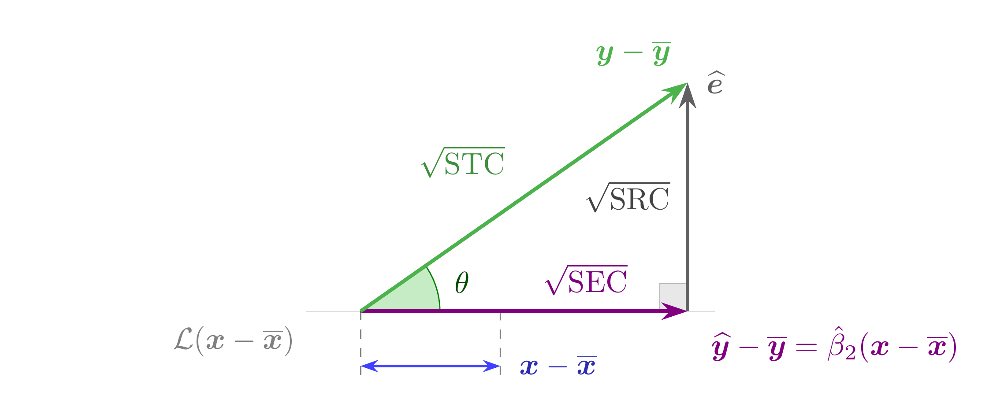
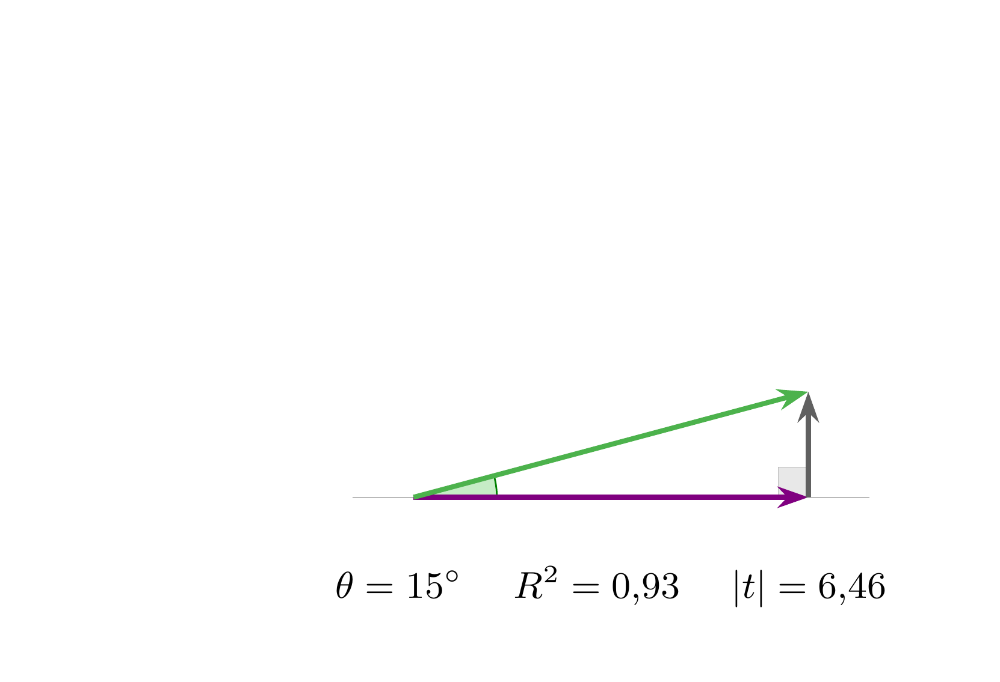
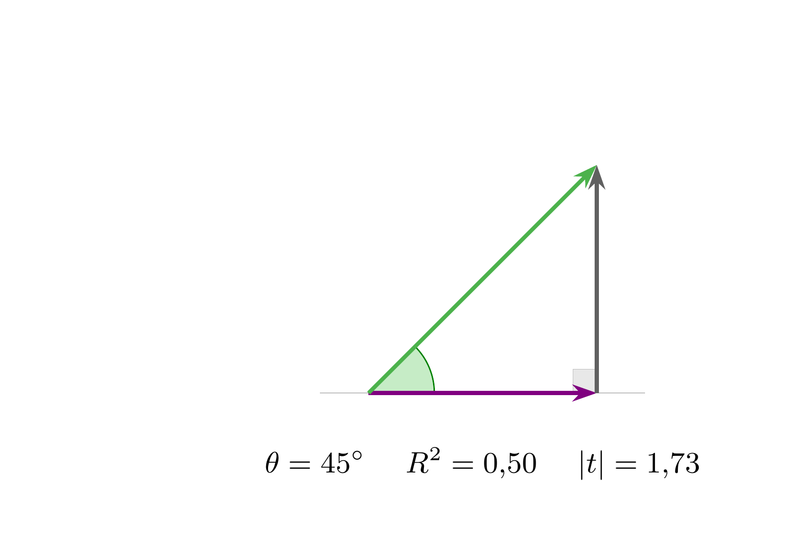
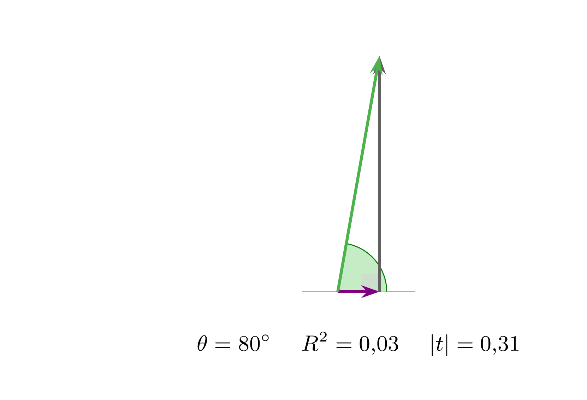
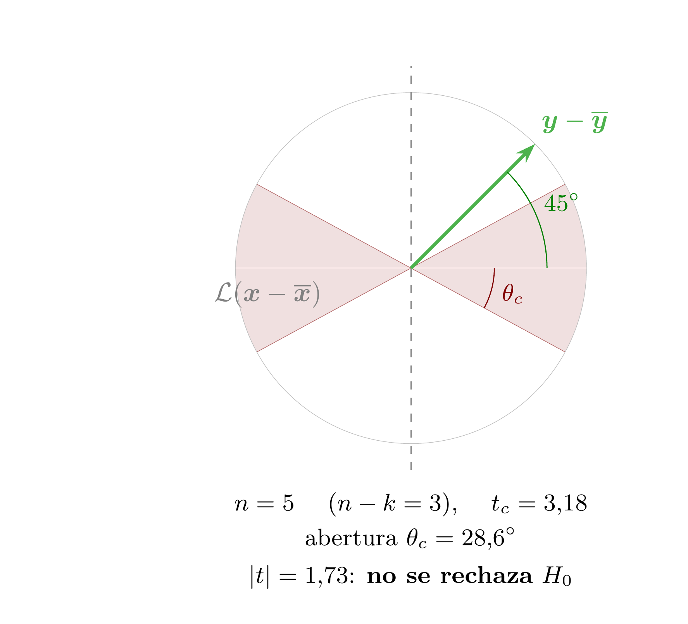
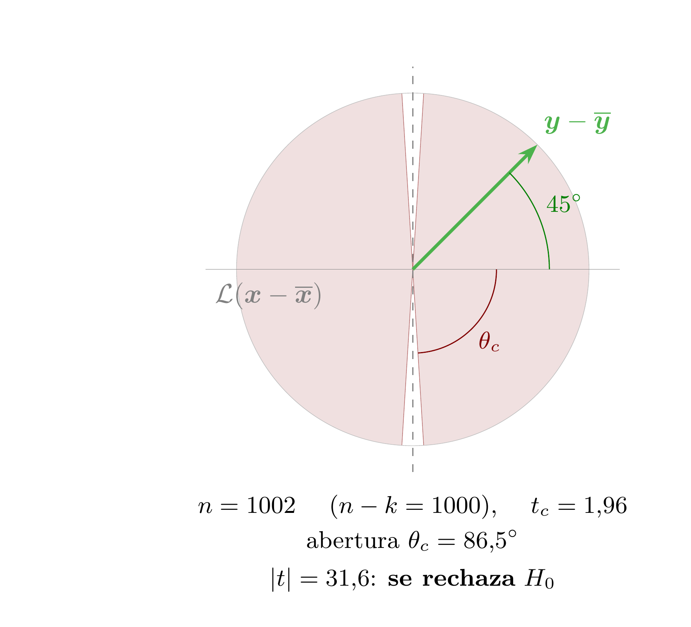
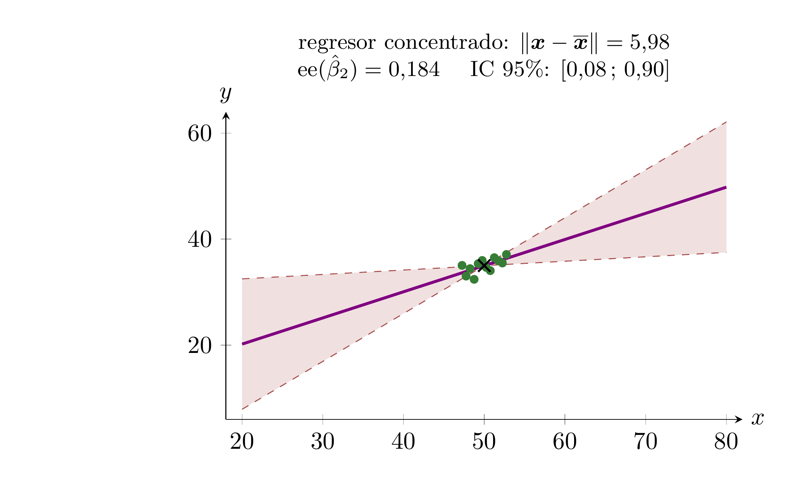
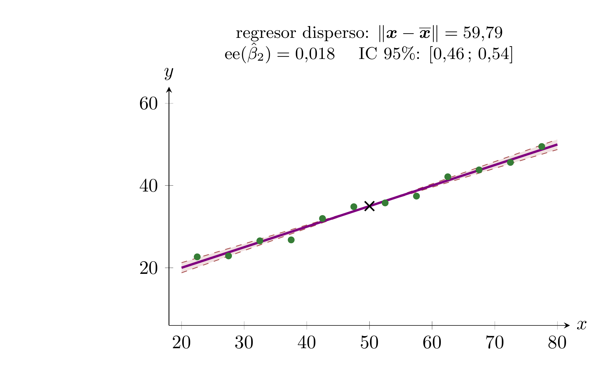

#+title: Código de las figuras de la lección 12
#+author: Marcos Bujosa Brun

#+latex_header: \usepackage{nacal}
#+LATEX_HEADER: \usepackage{polyglossia}
#+LATEX_HEADER: \setmainlanguage{spanish}

\maketitle

* Nota sobre estas figuras

Las tres primeras familias de figuras de esta lección viven todas en el
mismo sitio: el subespacio $\mathcal{L}(\boldsymbol{1})^\perp$ —el de los
vectores en desviaciones respecto a la media—, visto /de frente/ (como
si fuera un plano). Es la vista ``perpendicular'' que ya se usó en la
lección 3 para el triángulo de Cauchy-Schwarz: no hay tercera
dimensión que dibujar porque el triángulo relevante es plano.

En ese plano, el eje horizontal es la recta generada por el regresor en
desviaciones, $\mathcal{L}(\boldsymbol{x}-\boldsymbol{\mathop{\overline{x}}})$, y
la dirección vertical es la del residuo. Los colores replican los de la
lección 8 (mismo triángulo, otra vista): verde para los datos en
desviaciones, rojo-azul para el ajuste en desviaciones, gris para el
residuo.

1. =TrianguloContraste=: el triángulo rectángulo con los dos catetos
   etiquetados como $\sqrt{\mathrm{SEC}}$ y $\sqrt{\mathrm{SRC}}$. Es la
   figura del estadístico $t$ como razón de catetos.
2. =AngulosContraste[1-3]=: el mismo triángulo con tres aberturas
   distintas del ángulo, con su $R^2$ y su $|t|$ (calculados con $n=5$).
3. =ConoCritico[1-2]=: la región crítica como un cono alrededor de la
   dirección del regresor, con $n=5$ y con $n=1002$. La misma dirección
   de $\boldsymbol{y}-\boldsymbol{\mathop{\overline{y}}}$ (a $45^\circ$)
   cae fuera del cono en el primer caso y dentro en el segundo.

La cuarta familia, =PrecisionRegresor[1-2]=, es la única que NO vive en
$\mathbb R^n$: son dos diagramas de dispersión corrientes, en el plano
$(x,y)$, al servicio de la lectura interpretativa del error estándar.

* Figuras con fuente tikz

** El triángulo del contraste

#+NAME: TrianguloContraste
#+BEGIN_SRC latex :noweb no-export :tangle tex/TrianguloContraste.tex :results discard :exports code :eval no
<<Preambulo comun>>

\begin{document}
  <<Colores>>
  <<Colores de la regresion>>

  % theta = 35 grados, hipotenusa de longitud 4:
  %   cateto explicado = 4*cos(35) = 3.277 ; cateto residual = 4*sin(35) = 2.294
  \begin{tikzpicture}
    [scale=1.15,
     axis/.style={-,gray,very thin},
     vector/.style={-{Stealth[length=3mm, width=2mm]},very thick},
     guide/.style={dashed,thin,gray}]

    \coordinate (O)  at (0    , 0    );  % origen
    \coordinate (A)  at (3.277, 0    );  % ajuste en desviaciones
    \coordinate (B)  at (3.277, 2.294);  % datos en desviaciones
    \coordinate (Ex) at (1.400, 0    );  % el propio regresor en desviaciones
    \coordinate (Fin) at (3.55 , 0    );  % final del eje horizontal

    % la recta generada por el regresor en desviaciones; su etiqueta va al
    % extremo IZQUIERDO para dejar libre la derecha, donde ahora se rotula el
    % cateto explicado (antes ocupaba una fila entera bajo la figura)
    \draw[axis] (-0.55,0) -- (Fin);
    \node[anchor=north east,gray,yshift=-0.5mm] at (-0.55,0)
      {$\mathcal{L}(\boldsymbol{x}-\boldsymbol{\mathop{\overline{x}}})$};

    % el ángulo theta (el mismo de R^2=cos^2(theta) de la lección 8)
    \draw pic[-,draw=black,angle radius=26,\Verde,fill=\VerdeClaro!30] {angle = A--O--B};
    \node[\Verde!60!black,anchor=west,inner sep=1pt] at (17.5:0.95) {$\theta$};

    % ángulo recto entre el cateto explicado y el residuo
    \tkzMarkRightAngle[size=.28,gray,very thin,fill=lightgray!70,opacity=0.5](B,A,O)

    % el regresor en desviaciones, medido aparte bajo el eje: el cateto
    % explicado es un múltiplo suyo, y su longitud es la que divide a s
    \draw[guide] (O)  -- (0    ,-0.72);
    \draw[guide] (Ex) -- (1.400,-0.72);
    \draw[{Stealth[length=2mm,width=1.4mm]}-{Stealth[length=2mm,width=1.4mm]},\Regresor,thick]
      (0,-0.55) -- (1.400,-0.55);
    \node[\Regresor!70!black,anchor=west,xshift=1mm] at (1.400,-0.55)
      {$\boldsymbol{x}-\boldsymbol{\mathop{\overline{x}}}$};

    % los tres lados del triángulo
    \draw[vector,\Ajuste] (O) -- (A);
    \node[\Ajuste,anchor=north west,xshift=1.5mm,yshift=-0.5mm] at (A)
      {$\boldsymbol{\mathop{\widehat{y}}}-\boldsymbol{\mathop{\overline{y}}}
        =\hat\beta_2(\boldsymbol{x}-\boldsymbol{\mathop{\overline{x}}})$};
    \draw[vector,\Residuo] (A) -- (B)
      node[anchor=west,xshift=0.8mm]{$\boldsymbol{\mathop{\widehat{e}}}$};
    \draw[vector,\Datos] (O) -- (B)
      node[anchor=south east,xshift=-0.5mm,yshift=0.5mm]
      {$\boldsymbol{y}-\boldsymbol{\mathop{\overline{y}}}$};

    % las longitudes de los tres lados
    \node[\Ajuste,anchor=south,yshift=0.6mm] at (2.25,0) {$\sqrt{\mathrm{SEC}}$};
    \node[\Residuo!70!black,anchor=east,xshift=-0.8mm] at (3.277,1.147) {$\sqrt{\mathrm{SRC}}$};
    \node[\Datos!80!black,anchor=south east,xshift=-1mm,yshift=1mm] at (1.64,1.147) {$\sqrt{\mathrm{STC}}$};

  \end{tikzpicture}
\end{document}
#+END_SRC

#+ATTR_ORG: :width 600
#+ATTR_LATEX: :width .6\textwidth :caption \caption{El estadístico $t$ como razón entre los dos catetos}

*** Ajuste de la figura

#+BEGIN_SRC bash :build yes
convert TrianguloContraste.png -gravity center -background white -extent 2900x TrianguloContraste_ancho.png
#+END_SRC

** Tres aberturas del ángulo

Los tres paneles comparten el mismo recuadro delimitador (=use as
bounding box=) para que, al unirlos en fila, queden a la misma escala y
alineados. El recuadro es deliberadamente ancho y bajo, y el rótulo de
cada panel va en una sola línea: así la fila resultante es más apaisada
y, al escalarla al ancho de la transparencia, ocupa menos altura —que es
el recurso escaso en las transparencias (§6 del Plan)—. La hipotenusa mide 3 en los tres casos; lo único que cambia
es el ángulo. Los valores de $|t|$ están calculados con $n=5$ (es decir,
$n-k=3$ grados de libertad, cuyo valor crítico al 95\,\% es $3{,}18$):
$|t|=\sqrt{n-k}\cdot\sqrt{\mathrm{SEC}/\mathrm{SRC}}$.

#+NAME: Panel de angulo
#+BEGIN_SRC tex :noweb no-export :results discard :export code :eval no
  \begin{tikzpicture}
    [scale=1.15,
     axis/.style={-,gray,very thin},
     vector/.style={-{Stealth[length=2.6mm, width=1.8mm]},very thick}]

    \path[use as bounding box] (-1.00,-1.05) rectangle (4.10,3.35);

    % el triángulo se centra horizontalmente dentro del recuadro fijo,
    % para que los tres paneles queden alineados al unirlos en fila
    \pgfmathsetmacro{\Desplaza}{1.55-\CatetoSEC/2}
    \begin{scope}[xshift=\Desplaza cm]

    \coordinate (O) at (0,0);
    \coordinate (A) at (\CatetoSEC, 0);
    \coordinate (B) at (\CatetoSEC, \CatetoSRC);

    \draw[axis] (-0.45,0) -- (\CatetoSEC+0.45,0);

    \draw pic[-,draw=black,angle radius=20,angle eccentricity=1.45,
              \Verde,fill=\VerdeClaro!30] {angle = A--O--B};

    \tkzMarkRightAngle[size=.22,gray,very thin,fill=lightgray!70,opacity=0.5](B,A,O)

    \draw[vector,\Ajuste]  (O) -- (A);
    \draw[vector,\Residuo] (A) -- (B);
    \draw[vector,\Datos]   (O) -- (B);

    \end{scope}

    \node[anchor=north,font=\small] at (1.55,-0.40) {\Rotulo};
  \end{tikzpicture}
#+END_SRC

*** Ángulo pequeño: relación fuerte

#+NAME: AngulosContraste1
#+BEGIN_SRC latex :noweb no-export :tangle tex/AngulosContraste1.tex :results discard :exports code :eval no
<<Preambulo comun>>

\begin{document}
  <<Colores>>
  <<Colores de la regresion>>

  % theta = 15 grados, hipotenusa 3
  \def\CatetoSEC{2.898}
  \def\CatetoSRC{0.776}
  \def\Rotulo{$\theta=15^\circ$ \quad $R^2=0{,}93$ \quad $\vert t\vert=6{,}46$}

  <<Panel de angulo>>
\end{document}
#+END_SRC

#+ATTR_ORG: :width 300

*** Ángulo intermedio

#+NAME: AngulosContraste2
#+BEGIN_SRC latex :noweb no-export :tangle tex/AngulosContraste2.tex :results discard :exports code :eval no
<<Preambulo comun>>

\begin{document}
  <<Colores>>
  <<Colores de la regresion>>

  % theta = 45 grados, hipotenusa 3
  \def\CatetoSEC{2.121}
  \def\CatetoSRC{2.121}
  \def\Rotulo{$\theta=45^\circ$ \quad $R^2=0{,}50$ \quad $\vert t\vert=1{,}73$}

  <<Panel de angulo>>
\end{document}
#+END_SRC

#+ATTR_ORG: :width 300

*** Ángulo casi recto: $H_0$ compatible con los datos

#+NAME: AngulosContraste3
#+BEGIN_SRC latex :noweb no-export :tangle tex/AngulosContraste3.tex :results discard :exports code :eval no
<<Preambulo comun>>

\begin{document}
  <<Colores>>
  <<Colores de la regresion>>

  % theta = 80 grados, hipotenusa 3
  \def\CatetoSEC{0.521}
  \def\CatetoSRC{2.954}
  \def\Rotulo{$\theta=80^\circ$ \quad $R^2=0{,}03$ \quad $\vert t\vert=0{,}31$}

  <<Panel de angulo>>
\end{document}
#+END_SRC

#+ATTR_ORG: :width 300

*** Ajuste de las figuras

#+BEGIN_SRC bash :build yes
convert AngulosContraste[1-3].png -gravity center +append -background white -gravity center -extent 4900x AngulosContraste_fila.png
#+END_SRC

** La región crítica como un cono

El valor crítico del contraste se lee aquí como la /abertura/ de un cono
alrededor de la recta generada por el regresor en desviaciones: se
rechaza $H_0\!:\beta_2=0$ cuando el vector de datos en desviaciones cae
/dentro/ del cono (ángulo pequeño, $|t|$ grande). La abertura se obtiene
de $\cot\theta_c=t_c/\sqrt{n-k}$, y crece con el número de
observaciones: con $n=5$ vale $28{,}6^\circ$; con $n=1002$,
$86{,}5^\circ$ —casi todo el espacio—. En ambos paneles el vector de
datos forma el mismo ángulo de $45^\circ$ con el regresor, y el
veredicto es opuesto.

#+NAME: Panel de cono
#+BEGIN_SRC tex :noweb no-export :results discard :export code :eval no
  \begin{tikzpicture}
    [scale=1.15,
     axis/.style={-,gray,very thin},
     vector/.style={-{Stealth[length=2.6mm, width=1.8mm]},very thick},
     guide/.style={dashed,thin,gray}]

    \path[use as bounding box] (-2.85,-3.75) rectangle (2.85,2.75);

    \coordinate (O) at (0,0);

    % región crítica: cono doble de semiabertura \ThetaC
    \fill[\Rojo!12] (O) -- ({-\ThetaC}:2) arc[start angle={-\ThetaC}, end angle={\ThetaC}, radius=2] -- cycle;
    \fill[\Rojo!12] (O) -- ({180-\ThetaC}:2) arc[start angle={180-\ThetaC}, end angle={180+\ThetaC}, radius=2] -- cycle;
    \draw[\Rojo!60,very thin] (O) -- ({\ThetaC}:2);
    \draw[\Rojo!60,very thin] (O) -- ({-\ThetaC}:2);
    \draw[\Rojo!60,very thin] (O) -- ({180-\ThetaC}:2);
    \draw[\Rojo!60,very thin] (O) -- ({180+\ThetaC}:2);

    \draw[gray!50,very thin] (O) circle (2);

    % los dos ejes del plano de desviaciones
    \draw[axis] (-2.35,0) -- (2.35,0);
    \node[anchor=north west,gray,yshift=-0.5mm] at (-2.35,0)
      {$\mathcal{L}(\boldsymbol{x}-\boldsymbol{\mathop{\overline{x}}})$};
    \draw[guide] (0,-2.3) -- (0,2.3);

    % abertura del cono (dibujada hacia abajo, donde no hay nada más)
    \draw[\Rojo,thin] (0.95,0) arc[start angle=0, end angle={-\ThetaC}, radius=0.95];
    \node[\Rojo,font=\small,inner sep=1pt] at ({-\ThetaC/2}:1.2) {$\theta_c$};

    % el vector de datos en desviaciones, siempre a 45 grados
    \draw[vector,\Datos] (O) -- (45:2)
      node[anchor=south west,xshift=-0.5mm]
      {$\boldsymbol{y}-\boldsymbol{\mathop{\overline{y}}}$};
    \draw[\Verde,thin] (1.55,0) arc[start angle=0, end angle=45, radius=1.55];
    \node[\Verde,font=\small,anchor=south west,inner sep=1pt] at (22.5:1.6) {$45^\circ$};

    \node[anchor=north,align=center,font=\small] at (0,-2.45) {\Rotulo};
  \end{tikzpicture}
#+END_SRC

*** Pocas observaciones: cono estrecho

#+NAME: ConoCritico1
#+BEGIN_SRC latex :noweb no-export :tangle tex/ConoCritico1.tex :results discard :exports code :eval no
<<Preambulo comun>>

\begin{document}
  <<Colores>>
  <<Colores de la regresion>>

  % n=5 (n-k=3): t_c = 3,18  =>  theta_c = 28,56 grados
  \def\ThetaC{28.56}
  \def\Rotulo{$n=5$ \quad ($n-k=3$), \quad $t_c=3{,}18$\\[2pt]
    abertura $\theta_c=28{,}6^\circ$\\[3pt]
    $|t|=1{,}73$: \textbf{no se rechaza} $H_0$}

  <<Panel de cono>>
\end{document}
#+END_SRC

#+ATTR_ORG: :width 400

*** Muchas observaciones: cono muy abierto

#+NAME: ConoCritico2
#+BEGIN_SRC latex :noweb no-export :tangle tex/ConoCritico2.tex :results discard :exports code :eval no
<<Preambulo comun>>

\begin{document}
  <<Colores>>
  <<Colores de la regresion>>

  % n=1002 (n-k=1000): t_c = 1,96  =>  theta_c = 86,45 grados
  \def\ThetaC{86.45}
  \def\Rotulo{$n=1002$ \quad ($n-k=1000$), \quad $t_c=1{,}96$\\[2pt]
    abertura $\theta_c=86{,}5^\circ$\\[3pt]
    $|t|=31{,}6$: \textbf{se rechaza} $H_0$}

  <<Panel de cono>>
\end{document}
#+END_SRC

#+ATTR_ORG: :width 400

*** Ajuste de las figuras

#+BEGIN_SRC bash :build yes
convert ConoCritico[1-2].png -gravity center +append -background white -gravity center -extent 3600x ConoCritico_fila.png
#+END_SRC

** Precisión y dispersión del regresor

Los dos paneles usan /la misma/ muestra de perturbaciones, los mismos
$\beta_1=10$ y $\beta_2=0{,}5$, el mismo $n=12$ y, en consecuencia, casi
exactamente la misma dispersión residual ($\mathfrak s=1{,}10$ en ambos).
Lo único que cambia es cuánto se separan los valores del regresor: en el
panel izquierdo van de $47{,}25$ a $52{,}75$ (paso $0{,}5$); en el derecho,
de $22{,}5$ a $77{,}5$ (paso $5$). Eso multiplica por diez la longitud del
regresor en desviaciones —$5{,}98$ frente a $59{,}79$— y, por tanto, divide
por diez el error estándar: $0{,}184$ frente a $0{,}018$.

La zona sombreada es el haz de rectas cuyas pendientes caen en el
intervalo de confianza al 95\,\% ($t_c=2{,}228$ con $n-k=10$), dibujadas
pivotando sobre el centroide $(\mu_{\boldsymbol x},\mu_{\boldsymbol y})=(50,35)$,
por el que pasa siempre la recta de regresión. Es la lectura geométrica
directa de la semiamplitud
$t_c\,\mathfrak s/\Vert\boldsymbol x-\boldsymbol{\mathop{\overline x}}\Vert$:
el mismo ruido, repartido sobre un regresor más corto, deja mucha más
pendiente compatible con los datos.

Los datos están calculados (no puestos a ojo) y las coordenadas van
escritas literalmente en el fuente, sin fichero =.dat= externo, para que
la figura sea autocontenida.

#+NAME: Panel de precision
#+BEGIN_SRC tex :noweb no-export :results discard :export code :eval no
  \begin{tikzpicture}
    \begin{axis}[
      width=9cm, height=6.0cm,
      xlabel=$x$, ylabel=$y$,
      axis lines=left,
      xmin=18, xmax=82,
      ymin=6,  ymax=64,
      title=\Rotulo,
      title style={align=center,font=\small,yshift=1mm},
      every axis y label/.style={at={(ticklabel* cs:1.0)},anchor=south},
      every axis x label/.style={at={(ticklabel* cs:1.0)},anchor=west},
      ]

      % haz de pendientes compatibles (IC al 95%), pivotando en el centroide
      \path[fill=\Rojo!12] (axis cs:20,\ExtIzqA) -- (axis cs:50,35) -- (axis cs:20,\ExtIzqB) -- cycle;
      \path[fill=\Rojo!12] (axis cs:80,\ExtDchA) -- (axis cs:50,35) -- (axis cs:80,\ExtDchB) -- cycle;
      \addplot[no markers,\Rojo!70,dashed,thin] coordinates {(20,\ExtIzqA) (80,\ExtDchA)};
      \addplot[no markers,\Rojo!70,dashed,thin] coordinates {(20,\ExtIzqB) (80,\ExtDchB)};

      % recta de regresión ajustada
      \addplot[no markers,\Ajuste,very thick] coordinates {(20,\AjusIzq) (80,\AjusDch)};

      % los datos
      \addplot[only marks,mark=*,mark size=1.6,\Datos!70!black] coordinates {\Puntos};

      % el centroide, por el que pasa siempre la recta
      \addplot[only marks,mark=x,mark size=3.5,thick,black] coordinates {(50,35)};

    \end{axis}
  \end{tikzpicture}
#+END_SRC

*** Regresor concentrado: coeficiente impreciso

#+NAME: PrecisionRegresor1
#+BEGIN_SRC latex :noweb no-export :tangle tex/PrecisionRegresor1.tex :results discard :exports code :eval no
<<Preambulo comun>>

\pgfplotsset{compat=newest}

\begin{document}
  <<Colores>>
  <<Colores de la regresion>>

  % x de 47,25 a 52,75 (paso 0,5):  ||x-xbar|| = 5,979
  % beta2^ = 0,4931   ee = 0,1840   t = 2,68   IC 95%: [0,083 ; 0,903]
  \def\Puntos{(47.25,35.045) (47.75,33.025) (48.25,34.435) (48.75,32.415)
    (49.25,35.365) (49.75,35.975) (50.25,34.655) (50.75,34.055)
    (51.25,36.505) (51.75,35.925) (52.25,35.495) (52.75,37.105)}
  \def\ExtIzqA{32.504}\def\ExtDchA{37.496}   % pendiente 0,0832
  \def\ExtIzqB{7.907} \def\ExtDchB{62.093}   % pendiente 0,9031
  \def\AjusIzq{20.206}\def\AjusDch{49.794}   % pendiente 0,4931
  \def\Rotulo{regresor concentrado:
    $\Vert\boldsymbol x-\boldsymbol{\mathop{\overline x}}\Vert=5{,}98$\\
    $\mathrm{ee}(\hat\beta_2)=0{,}184$ \quad
    IC 95\%: $[0{,}08\,;\,0{,}90]$}

  <<Panel de precision>>
\end{document}
#+END_SRC

#+ATTR_ORG: :width 450

*** Regresor disperso: coeficiente preciso

#+NAME: PrecisionRegresor2
#+BEGIN_SRC latex :noweb no-export :tangle tex/PrecisionRegresor2.tex :results discard :exports code :eval no
<<Preambulo comun>>

\pgfplotsset{compat=newest}

\begin{document}
  <<Colores>>
  <<Colores de la regresion>>

  % x de 22,5 a 77,5 (paso 5):  ||x-xbar|| = 59,791
  % beta2^ = 0,4993   ee = 0,0184   t = 27,14   IC 95%: [0,458 ; 0,540]
  \def\Puntos{(22.50,22.670) (27.50,22.900) (32.50,26.560) (37.50,26.790)
    (42.50,31.990) (47.50,34.850) (52.50,35.780) (57.50,37.430)
    (62.50,42.130) (67.50,43.800) (72.50,45.620) (77.50,49.480)}
  \def\ExtIzqA{21.250}\def\ExtDchA{48.750}   % pendiente 0,4583
  \def\ExtIzqB{18.791}\def\ExtDchB{51.209}   % pendiente 0,5403
  \def\AjusIzq{20.021}\def\AjusDch{49.979}   % pendiente 0,4993
  \def\Rotulo{regresor disperso:
    $\Vert\boldsymbol x-\boldsymbol{\mathop{\overline x}}\Vert=59{,}79$\\
    $\mathrm{ee}(\hat\beta_2)=0{,}018$ \quad
    IC 95\%: $[0{,}46\,;\,0{,}54]$}

  <<Panel de precision>>
\end{document}
#+END_SRC

#+ATTR_ORG: :width 450

*** Ajuste de las figuras

#+BEGIN_SRC bash :build yes
convert PrecisionRegresor[1-2].png -gravity center +append -background white -gravity center -extent 4700x PrecisionRegresor_fila.png
#+END_SRC

* Trozos de código

#+NAME: Preambulo comun
#+BEGIN_SRC tex :noweb no-export :results discard :export code :eval no
\documentclass[border=10pt]{standalone}
\usepackage[utf8]{inputenc}
\usepackage{nacal}
\usepackage{pgfplots}
\usepackage{tikz-3dplot}
\usepackage{tikz}
\usetikzlibrary{matrix,decorations.pathreplacing}
\usetikzlibrary{calc,angles,positioning,intersections,quotes,decorations.markings,arrows.meta}
\usepackage{tkz-euclide}
#+END_SRC

#+NAME: Colores
#+BEGIN_SRC tex :noweb no-export :results discard :export code :eval no
\def\Rojo{red!50!black}
\def\RojoOscuro{red!20!black}
\def\RojoClaro{red!90!black}
\def\Verde{green!50!black}
\def\VerdeOscuro{green!30!black}
\def\VerdeClaro{green!50!gray}
\def\Azul{blue!50!black}
\def\AzulOscuro{blue!35!black}
\def\AzulClaro{blue!60!gray}
#+END_SRC

Los colores de los tres vectores de la regresión son los mismos que en
la lección 8 (figuras =OLS-A= y =OLS-B=), para que el alumno reconozca
el mismo triángulo visto desde otro sitio.

#+NAME: Colores de la regresion
#+BEGIN_SRC tex :noweb no-export :results discard :export code :eval no
\def\Datos{green!40!gray}
\def\Ajuste{blue!50!red}
\def\Residuo{black!25!gray}
\def\Regresor{blue!75!white}
#+END_SRC
