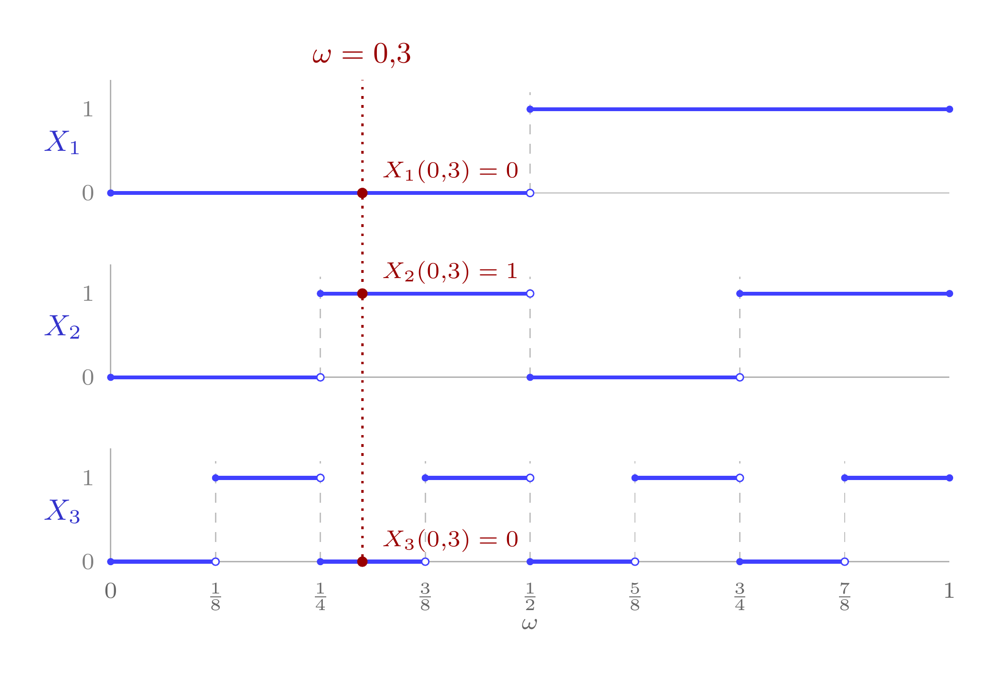

#+TITLE: Lanzar una moneda infinitas veces: de dónde salen las muestras aleatorias
#+DATE: 2026-09-28
#+LANGUAGE: es
# +OPTIONS: toc:nil

# Cabecera de exportación: la misma cadena que las prácticas (xelatex con
# Latin Modern y polyglossia), para que «», ¿ y las cursivas salgan bien.
#+begin_src emacs-lisp :exports none :tangle no :results silent :eval yes
(setq org-latex-pdf-process
      '("latexmk -shell-escape -pdf -xelatex -interaction=nonstopmode -output-directory=%o %f"))
#+end_src

#+LATEX_HEADER: \usepackage{fontspec}
#+LATEX_HEADER: \usepackage{lmodern}
#+LATEX_HEADER: \setmainfont{Latin Modern Roman}
#+LATEX_HEADER: \usepackage{polyglossia}
#+LATEX_HEADER: \setmainlanguage{spanish}
#+LATEX_HEADER: \usepackage{amsmath}
#+LATEX_HEADER: \usepackage[indent]{parskip}
#+LATEX_HEADER: \usepackage{fullpage}

# Borrador de apéndice, EN MADURACIÓN (decisión del usuario, 28-09-2026): no
# se incluye en el material hasta nuevo aviso.
#
# Decisiones ya tomadas sobre el borrador (28-09):
# - Destino previsto: apéndice de la lección 11 (S15-Lecc11), junto a la nota
#   al pie de «El marco: muestra aleatoria» sobre copias idénticas e
#   independientes, que es donde el curso usa la independencia y la
#   caracterización por ortogonalidad.
# - Se mantiene el cierre general (F^{-1}(U) y reparto de cifras binarias).
# - Se mantiene la precisión sobre independencia conjunta frente a dos a dos.
# - Rigor de la medida: la probabilidad como «longitud» y la nota sobre los
#   extremos de intervalos bastan para el nivel del curso.
# - Figura: las tres funciones escalonadas X_1, X_2, X_3 con el suceso
#   elemental omega = 0,3 marcado; fuente tikz en
#   Ensayo-copias-iid/tex/Monedas.tex, compilada con latexmk y pdftoppm -r 500
#   como las figuras de las lecciones.
#
# Notación del curso: variables aleatorias en mayúscula, $\mathit1$ y
# $\mathit0$ las constantes, $\langle X,Y\rangle_P=\mathrm{E}(XY)$,
# $\mathcal L(\cdot)$ para subespacios. Forma de usted.

#+latex: \maketitle

* La pregunta

La lección 9 dijo que interpretamos los $n$ datos como la realización de $n$
copias idénticas e independientes de una variable aleatoria. La lección 11
convirtió esa frase en el marco de la muestra aleatoria y la usó de dos
maneras: para elevar la exogeneidad al condicionamiento en toda la matriz
$\boldsymbol X$ y para anular las covarianzas entre perturbaciones de
observaciones distintas. En ningún momento se dijo de dónde salen esas
copias. ¿Cabe en un mismo espacio de sucesos $\Omega$ un número ilimitado de
variables aleatorias con la misma distribución e independientes entre sí?
¿Y qué significa, en el lenguaje geométrico del curso, que sean
independientes?

Este apéndice responde a las dos preguntas con el ejemplo más sencillo, el
lanzamiento de una moneda, y deja enunciada la generalización.

* El espacio: el intervalo $[0,1]$

Tomemos como conjunto de sucesos elementales el intervalo $\Omega=[0,1]$.
Un suceso elemental $\omega$ es un número entre $0$ y $1$; un suceso es un
subconjunto del intervalo; y la probabilidad de un suceso es su /longitud/:
el intervalo $[a,b]$ tiene probabilidad $b-a$. Con esa regla, $\Omega$ entero
tiene probabilidad $1$, un punto aislado tiene probabilidad $0$, y la
probabilidad de una unión de intervalos disjuntos es la suma de sus
longitudes.[fn::Es la probabilidad /uniforme/ sobre $[0,1]$. No hace falta
definirla para subconjuntos arbitrarios: en todo lo que sigue solo aparecen
uniones finitas de intervalos.]

Una variable aleatoria es, como en la lección 9, una función definida sobre
$\Omega$. Aquí son funciones del intervalo $[0,1]$ en los números reales, y
la constante $\mathit1$ es la función que vale $1$ en todo el intervalo.

* La primera moneda

La moneda que sale cara ($1$) o cruz ($0$) con la misma probabilidad es la
función que vale $0$ en la primera mitad del intervalo y $1$ en la segunda:
\[
X_1(\omega)=\begin{cases}0 & \text{si } 0\leq\omega<\tfrac12,\\[2pt] 1 & \text{si } \tfrac12\leq\omega\leq1.\end{cases}
\]
Los dos sucesos $\{X_1=0\}$ y $\{X_1=1\}$ son intervalos de longitud
$\tfrac12$, así que cada resultado tiene probabilidad $\tfrac12$. Y
$\mathrm{E}(X_1)=\langle X_1,\mathit1\rangle_P=0\cdot\tfrac12+1\cdot\tfrac12=\tfrac12$.

* La segunda moneda: repetir la operación dentro de cada mitad

Para la segunda copia dividimos cada mitad en dos y volvemos a alternar:
\[
X_2(\omega)=\begin{cases}0 & \text{si } \omega\in[0,\tfrac14)\cup[\tfrac12,\tfrac34),\\[2pt] 1 & \text{si } \omega\in[\tfrac14,\tfrac12)\cup[\tfrac34,1].\end{cases}
\]
Es decir, $X_2$ vale $0$ en los cuartos primero y tercero y $1$ en los
cuartos segundo y cuarto. Dos comprobaciones.

/Idéntica distribución./ El suceso $\{X_2=0\}$ es la unión de dos cuartos,
de longitud total $\tfrac12$; lo mismo $\{X_2=1\}$. La segunda moneda tiene la
misma distribución que la primera.

/Independencia./ Los cuatro resultados posibles del par $(X_1,X_2)$
corresponden a los cuatro cuartos del intervalo, cada uno de longitud
$\tfrac14$:

| $(X_1,X_2)$ | suceso                    | probabilidad  |
|-------------+---------------------------+---------------|
| $(0,0)$     | $[0,\tfrac14)$            | $\tfrac14$    |
| $(0,1)$     | $[\tfrac14,\tfrac12)$     | $\tfrac14$    |
| $(1,0)$     | $[\tfrac12,\tfrac34)$     | $\tfrac14$    |
| $(1,1)$     | $[\tfrac34,1]$            | $\tfrac14$    |

En los cuatro casos $\mathrm P(X_1=a,\,X_2=b)=\tfrac14=\mathrm P(X_1=a)\,\mathrm P(X_2=b)$.
Eso es, por definición, que $X_1$ y $X_2$ sean independientes: saber cómo ha
salido la primera moneda no cambia las probabilidades de la segunda.

Fíjese en que $X_1$ y $X_2$ /no son la misma función/: en $\omega=0{,}3$ la
primera vale $0$ y la segunda vale $1$. Son dos funciones distintas sobre el
mismo $\Omega$ con la misma distribución. Es lo que la lección 11 advertía en
una nota al pie: dos copias independientes suelen asignar valores distintos
al mismo suceso elemental.

* La moneda número \(n\): la cifra \(n\)-ésima

El procedimiento no se agota. La tercera moneda divide cada cuarto en dos
octavos y asigna $0$ a los octavos impares y $1$ a los pares; la cuarta hace
lo mismo con los dieciseisavos; y así indefinidamente. La moneda número $n$
es la función que vale $0$ en los intervalos de longitud $2^{-n}$ de orden
impar y $1$ en los de orden par.

Hay una manera de decirlo de una vez. Escriba $\omega$ en base dos,
$\omega=0{,}a_1a_2a_3\ldots$ con cada $a_j$ igual a $0$ o a $1$. Entonces
\[
X_n(\omega)=a_n:\quad\text{la moneda \(n\)-ésima es la cifra binaria \(n\)-ésima de \(\omega\).}
\]
En efecto, la primera cifra es $0$ exactamente cuando $\omega<\tfrac12$; la
segunda es $0$ en los cuartos primero y tercero; y en general la cifra $n$
alterna entre $0$ y $1$ cada $2^{-n}$.[fn::Los números con dos desarrollos
binarios, como $\tfrac12=0{,}1000\ldots=0{,}0111\ldots$, son los extremos de
los intervalos: un conjunto numerable, de probabilidad cero. Da igual qué
convenio se tome para ellos, y este es el mismo «casi seguro» de la lección
9.]

#+attr_latex: :width \textwidth
#+attr_html: :width 700px
#+NAME: FiguraMonedas
#+CAPTION: Las tres primeras monedas como funciones sobre $\Omega=[0,1]$. Cada una vale $0$ en los intervalos impares de longitud $2^{-n}$ y $1$ en los pares; el punto relleno marca el extremo que pertenece al intervalo. La línea de puntos es el suceso elemental $\omega=0{,}3$, que en base dos empieza $0{,}010\ldots$: la primera moneda sale cruz, la segunda cara y la tercera cruz. Un $\omega$ es una tirada infinita.

Con esa descripción las dos propiedades se ven de golpe para cualquier
número de copias. Fijados $n$ resultados $(a_1,\ldots,a_n)$, el suceso
$\{X_1=a_1,\ldots,X_n=a_n\}$ es el conjunto de los $\omega$ cuyas $n$
primeras cifras son esas: un intervalo de longitud $2^{-n}$. Luego
\[
\mathrm P(X_1=a_1,\ldots,X_n=a_n)=2^{-n}=\mathrm P(X_1=a_1)\cdots\mathrm P(X_n=a_n),
\]
que es la independencia de las $n$ monedas a la vez, no solo dos a dos; y
cada $X_n$ por separado vale $0$ con probabilidad $\tfrac12$. En el intervalo
$[0,1]$ caben, por tanto, infinitas copias idénticas e independientes de la
moneda.

Merece la pena leer la construcción al revés. Un $\omega$ es una sucesión
infinita de cifras binarias, es decir, el resultado de lanzar la moneda
infinitas veces. Elegir un suceso elemental al azar en $[0,1]$ es lo mismo
que lanzar la moneda una y otra vez sin parar. El espacio de sucesos que
parecía demasiado pequeño para una muestra contiene, de hecho, todas las
muestras posibles de todos los tamaños.

* Lectura geométrica: independientes es «a escuadra»

La lección 9 dio a las variables aleatorias un producto escalar,
$\langle X,Y\rangle_P=\mathrm E(XY)$, y con él la ortogonalidad y la
proyección. ¿Cómo se lee la independencia en ese lenguaje?

Empecemos por las dos primeras monedas. Sus versiones centradas son
$X_1-\tfrac12\mathit1$ y $X_2-\tfrac12\mathit1$, que valen $-\tfrac12$ o
$+\tfrac12$. Su producto escalar se calcula cuarto a cuarto:
\[
\Big\langle X_1-\tfrac12\mathit1,\;X_2-\tfrac12\mathit1\Big\rangle_P
=\tfrac14\Big[(-\tfrac12)(-\tfrac12)+(-\tfrac12)(+\tfrac12)+(+\tfrac12)(-\tfrac12)+(+\tfrac12)(+\tfrac12)\Big]=0.
\]
Las dos monedas centradas son ortogonales. Y no solo la primera y la
segunda: el mismo cálculo, intervalo a intervalo, da cero para cualquier par
$X_i-\tfrac12\mathit1$ y $X_j-\tfrac12\mathit1$ con $i\neq j$, porque dentro de
cada intervalo donde $X_i$ es constante, $X_j$ vale $0$ en la mitad y $1$ en
la otra mitad.

Ese cero es una covarianza nula, y para variables que solo toman dos valores
la covarianza nula equivale a la independencia: de
$\mathrm E(X_1X_2)=\mathrm E(X_1)\,\mathrm E(X_2)$ sale
$\mathrm P(X_1=1,X_2=1)=\tfrac14$, y los otros tres casos se obtienen
restando de las probabilidades marginales. Para variables con más de dos
valores la covarianza no basta, y la caracterización correcta es la
siguiente, que enunciamos sin demostrar:

#+begin_quote
/Independencia como ortogonalidad./ Dos variables aleatorias $X$ e $Y$ son
independientes si y solo si toda función centrada de $X$ es ortogonal a toda
función de $Y$:
\[
\big\langle f(X)-\mathrm E\big(f(X)\big)\,\mathit1,\;g(Y)\big\rangle_P=0
\qquad\text{para todas las funciones $f$ y $g$.}
\]
#+end_quote

Dicho con los subespacios de la lección 9: las funciones de $X$ forman un
subespacio, y las funciones de $Y$ otro. Los dos contienen la recta
$\mathcal L(\mathit1)$ de las constantes, así que no pueden ser
perpendiculares del todo. Lo que dice la independencia es que, quitada esa
recta común, lo que queda de cada uno es perpendicular a todo el otro: los
dos subespacios están /a escuadra/ sobre la recta de las constantes. Con
las monedas la imagen es exacta. Las funciones de $X_1$ son las
combinaciones $a\,\mathit1+b\,X_1$, un plano que contiene la recta de las
constantes; su parte centrada es la recta $\mathcal L(X_1-\tfrac12\mathit1)$;
y las rectas centradas de dos monedas distintas son ortogonales, como se ha
calculado.

Esta es exactamente la traducción que la lección 11 usó, en una nota al pie,
para obtener $E[U_i\mid\boldsymbol X]=\mathit0$ a partir del muestreo
aleatorio: «la parte centrada de cualquier función de $X_{-i}$ es ortogonal a
cualquier función de $(X_i,U_i)$». Allí se apeló al hecho de que variables
independientes están incorreladas; aquí se ve que la incorrelación de
/todas/ las funciones es la independencia misma, y que en el ejemplo de la
moneda se puede comprobar con una suma de cuatro términos.

Una precisión, para no leer de más. Que las rectas centradas de las monedas
sean ortogonales dos a dos dice que las monedas son independientes dos a
dos. Que sean independientes /todas a la vez/ se ha comprobado en la sección
anterior con los intervalos de longitud $2^{-n}$; en el lenguaje geométrico
corresponde a que cada $X_n$ centrada sea ortogonal a todas las funciones de
$(X_1,\ldots,X_{n-1})$, y no solo a cada $X_j$ por separado. Con la moneda
también se cumple, porque las funciones de las $n-1$ primeras cifras son
constantes en cada intervalo de longitud $2^{-(n-1)}$, y $X_n$ vale $0$ en
una mitad de cada uno de esos intervalos y $1$ en la otra.

* Más allá de la moneda

La construcción anterior parece atada a la moneda, pero da mucho más, y lo
enunciamos sin demostrar. Si $F$ es la función de distribución de una
variable cualquiera $Y$ y $U$ es una variable uniforme en $[0,1]$, entonces
$F^{-1}(U)$ tiene la distribución de $Y$.[fn::Con $F^{-1}(u)$ definida como
el menor $y$ tal que $F(y)\geq u$; para distribuciones continuas es la
inversa habitual.] Y en el intervalo $[0,1]$ hay infinitas uniformes
independientes: basta repartir las cifras binarias de $\omega$ en infinitas
listas infinitas (las cifras de lugar impar, las de lugar par que no son
múltiplo de cuatro, y así sucesivamente) y leer cada lista como un número de
$[0,1]$. Cada uno de esos números es una uniforme, son independientes entre
sí porque usan cifras distintas, y aplicando $F^{-1}$ a cada uno se obtienen
infinitas copias idénticas e independientes de $Y$.

Así que la frase de la lección 9, «$n$ copias idénticas e independientes de
$Y$», no es un supuesto sobre el mundo, sino una construcción: dado
cualquier $Y$, existe un espacio $\Omega$, el intervalo $[0,1]$ con la
longitud como probabilidad, en el que caben tantas copias como se quiera. Lo
que sí es un supuesto es que /nuestros datos/ sean una realización de esas
copias. Ese supuesto es el muestreo aleatorio de la lección 11.

/Para profundizar/: Williams, D. (1991), /Probability with Martingales/,
cap. 4 (la construcción de sucesiones independientes en $[0,1]$ a partir de
las cifras binarias); Wooldridge, J. M. (2020), apéndice B.1 (variables
aleatorias e independencia).
