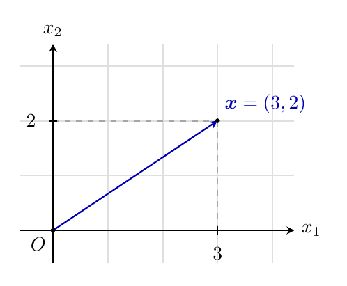
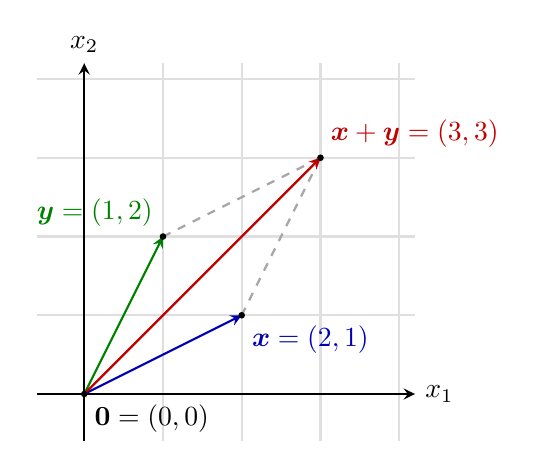
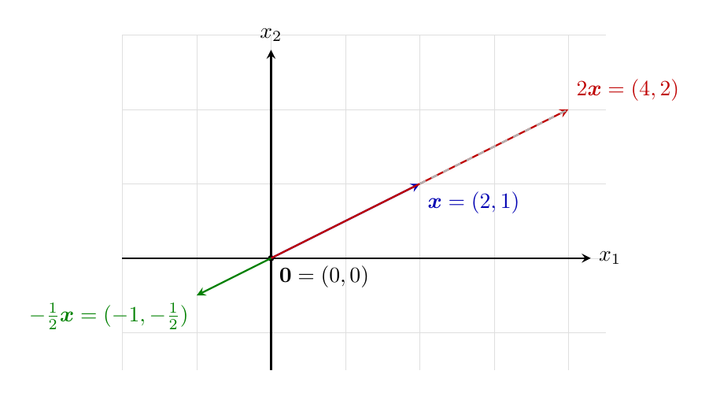
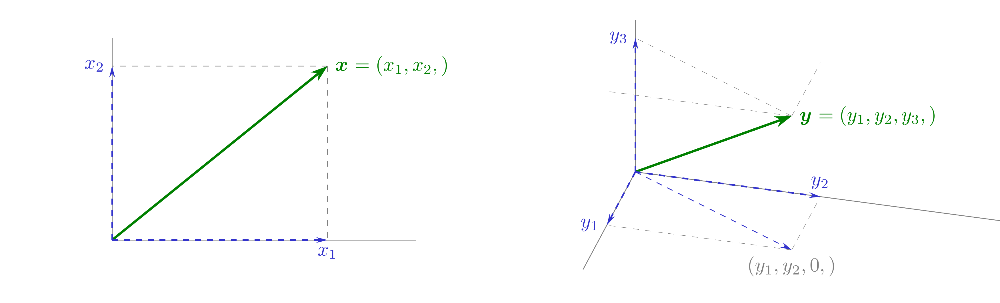

#    -*- mode: org -*-

#+TITLE: Lección 2. El lenguaje geométrico del curso (parte I)
#+author: Marcos Bujosa
#+LANGUAGE: es

# +OPTIONS: toc:nil

#+include: 00preambulo_lecciones.txt

# +LATEX_HEADER: \usepackage{tikz}
# +LATEX_HEADER: \usepackage{amsmath}

#+BEGIN_SRC emacs-lisp :exports none :results silent
(use-package ox-ipynb
  :load-path (lambda () (expand-file-name "ox-ipynb" scimax-dir)))
(use-package htmlize)
#+END_SRC

#+LATEX: \maketitle

#+LATEX: \blfootnote{Licencia: Creative Commons Attribution-ShareAlike 4.0 International (CC BY-SA 4.0).}

#+begin_abstract
Vectores en $\mathbb{R}^n$, producto escalar y norma
#+end_abstract

- ([[https://mbujosab.github.io/PEconometria/Transparencias/S02-Lecc02.slides.html][slides]]) --- ([[https://mbujosab.github.io/PEconometria/Lecciones-html/S02-Lecc02.html][html]]) --- ([[https://mbujosab.github.io/PEconometria/Lecciones-pdf/S02-Lecc02.pdf][pdf]]) --- ([[https://mybinder.org/v2/gh/mbujosab/PEconometria/gh-pages?labpath=CuadernosElectronicos/S02-Lecc02.ipynb][mybinder]])

* Qué haremos en la lección de hoy y por qué
:PROPERTIES:
:metadata: (slideshow . ((slide_type . slide)))
:END:

- Lección enteramente matemática: ni datos, ni regresión, ni econometría.
- Objetivo: fijar el lenguaje en el que se formulará todo el curso.
- Tres ideas a fijar:
  1. Vector $=$ /lista ordenada/ de números reales.
  2. Operaciones /componente a componente/.
  3. Producto escalar $\to$ norma $\to$ ``longitud'' del vector.
- Los dibujos serán esquemáticos, en $\mathbb{R}^2$ o $\mathbb{R}^3$; los cálculos valen en $\mathbb{R}^n$ para cualquier $n$.

*** Qué haremos en la lección de hoy y por qué
:PROPERTIES:
:metadata: (slideshow . ((slide_type . skip)))
:UNNUMBERED: notoc
:END:

#+attr_ipynb: (slideshow . ((slide_type . skip)))
En la lección anterior quedó establecido que los datos económicos con los que vamos a trabajar pueden representarse como /listas ordenadas de $n$ números reales/, es decir, como vectores de $\mathbb{R}^n$. Toda la econometría del curso consistirá en hacer operaciones con estos vectores y en interpretar geométricamente esas operaciones. Por eso, antes de seguir, necesitamos asentar el lenguaje en el que vamos a trabajar.

La lección de hoy es enteramente matemática. No veremos econometría, no veremos datos, no veremos regresión. Veremos vectores como /listas de números/ y las operaciones que se hacen con ellos componente a componente. La recompensa de esta inversión inicial llegará pronto: a partir de la lección 4, las fórmulas de la estadística y de la regresión empezarán a aparecer como consecuencias naturales — casi inevitables — de la geometría que hoy introducimos.

Una advertencia sobre el método. A lo largo del curso recurriré con frecuencia a /dibujos/. Los dibujos serán esquemáticos y necesariamente en $\mathbb{R}^2$ o $\mathbb{R}^3$, porque son los únicos espacios que podemos representar fielmente sobre un papel. Pero todo lo que hagamos con ellos seguirá siendo válido en $\mathbb{R}^n$ para cualquier $n$, simplemente porque las definiciones y fórmulas en $\mathbb{R}^n$ son las mismas que en $\mathbb{R}^2$ y $\mathbb{R}^3$. El dibujo es una ayuda para fijar la intuición; el cálculo es lo que sostiene el rigor.

* Vectores como listas de números
:PROPERTIES:
:metadata: (slideshow . ((slide_type . slide)))
:END:

Un /vector de $\mathbb{R}^n$/ es una lista ordenada de $n$ números reales:
\[
\boldsymbol{x} = (x_1, x_2, \dots, x_n).
\]

- Cada $x_i$ es su /i-ésima componente/.
- Dos vectores son iguales si y solo sus listas son idénticas.
- En los dibujos: flecha desde el origen al punto de coordenadas $(x_1, \dots, x_n)$.

*Recuerde*: El vector /es/ la lista de números. La flecha es solo un modo de representar el vector como un punto en el espacio.

*** Vectores como listas
:PROPERTIES:
:metadata: (slideshow . ((slide_type . skip)))
:UNNUMBERED: notoc
:END:

#+attr_ipynb: (slideshow . ((slide_type . skip)))
Un /vector de $\mathbb{R}^n$/ es una lista ordenada de $n$ números reales. Lo escribiremos en negrita:
\[
\boldsymbol{x} = (x_1, x_2, \dots, x_n),
\]
donde cada $x_i$ es un número real llamado /componente i-ésima/ del vector. Dos vectores son iguales si y solo si tienen la misma dimensión y coinciden componente a componente.

Geométricamente, podemos pensar en $\boldsymbol{x}$ como un /punto del espacio $\mathbb{R}^n$/ cuyas coordenadas son precisamente $x_1, \dots, x_n$. En los dibujos lo señalaremos mediante una flecha que parte del origen de coordenadas y termina en ese punto. La flecha es una /convención visual/ para identificar el punto, no una entidad con ``módulo'' y ``dirección'' preexistentes: el vector /es/ la lista de números; la flecha es solo el modo cómodo de señalar el punto en su representación gráfica.

Esta visión es importante mantenerla. Quizá os habrán contado en bachillerato que un vector es un ``segmento orientado con módulo, dirección y sentido''. Para nuestros propósitos, esa imagen es poco útil y a veces engañosa. Trabajaremos con vectores como /listas/ de números sobre las que se hacen operaciones /componente a componente/, y la geometría aparecerá como una manera de visualizar esas operaciones, no como la definición de lo que el vector es.

#+caption: Ejemplo. El vector $\boldsymbol{x} = (3, 2) \in \mathbb{R}^2$ es la lista $(3, 2)$, que corresponde al punto del plano con primera coordenada $3$ y segunda coordenada $2$. 
#+attr_latex: :width 210px
#+attr_html: :width 320px

El vector $\boldsymbol{y} = (1, 4, 2, 5, 7) \in \mathbb{R}^5$ es la lista $(1, 4, 2, 5, 7)$. No podemos dibujar $\boldsymbol{y}$ porque no tenemos cómo representar visualmente $\mathbb{R}^5$ (con sus cinco ejes perpendiculares de coordenadas), pero podemos operar con él /exactamente igual/ que con $\boldsymbol{x}$.

- Strang, G. (2016). /Introduction to Linear Algebra/ (5ª ed.), sección 1.1. Lectura amable.
- Vídeo: [[https://www.youtube.com/watch?v=fNk_zzaMoSs][Vectors, what even are they?]] de 3Blue1Brown (capítulo 1 de /Essence of Linear Algebra/). Diez minutos.
- Bujosa, M. /Curso de Álgebra Lineal/: [[https://www.youtube.com/playlist?list=PLA94O6zqDj0VREglVLepuCd0d8F0d-rnL][lista de reproducción]]. Vídeos introductorios sobre vectores y operaciones.

* Suma y producto por escalar
:PROPERTIES:
:metadata: (slideshow . ((slide_type . slide)))
:END:

Para $\boldsymbol{x}, \boldsymbol{y} \in \mathbb{R}^n$ y $\alpha \in \mathbb{R}$:

\[
\boldsymbol{x} + \boldsymbol{y} = (x_1 + y_1,\ \dots,\ x_n + y_n),
\qquad
\alpha \boldsymbol{x} = (\alpha x_1,\ \dots,\ \alpha x_n).
\]

- Solo se suman vectores con la /misma cantidad de componentes/.
- Propiedades: conmutativa, asociativa, neutro $\boldsymbol{0}$, opuesto $-\boldsymbol{x}$.
- Visualización en $\mathbb{R}^2$:
  - suma $\to$ regla del paralelogramo (truco visual);
  - producto por escalar $\to$ alargar/acortar/invertir la flecha.

*** Operaciones componente a componente: suma y producto por escalar
:PROPERTIES:
:metadata: (slideshow . ((slide_type . skip)))
:UNNUMBERED: notoc
:END:

#+attr_ipynb: (slideshow . ((slide_type . skip)))
Sobre los vectores de $\mathbb{R}^n$ se definen dos operaciones básicas, ambas /componente a componente/. Son las únicas operaciones algebraicas que vamos a necesitar de momento.

**** 3.1 Suma de vectores
:PROPERTIES:
:metadata: (slideshow . ((slide_type . skip)))
:UNNUMBERED: notoc
:END:

#+attr_ipynb: (slideshow . ((slide_type . skip)))
Dados dos vectores con la /misma cantidad de componentes/, $\boldsymbol{x} = (x_1, \dots, x_n)$ e $\boldsymbol{y} = (y_1, \dots, y_n)$, su suma es el vector cuyas componentes son las sumas de las componentes correspondientes:
\[
\boldsymbol{x} + \boldsymbol{y} = (x_1 + y_1,\ x_2 + y_2,\ \dots,\ x_n + y_n).
\]
La suma solo está definida entre vectores con la misma cantidad de componentes: no tiene sentido sumar un vector de $\mathbb{R}^3$ con uno de $\mathbb{R}^5$.

La suma de vectores hereda las propiedades de la suma de números reales:
- Es /conmutativa/: $\boldsymbol{x} + \boldsymbol{y} = \boldsymbol{y} + \boldsymbol{x}$.
- Es /asociativa/: $(\boldsymbol{x} + \boldsymbol{y}) + \boldsymbol{z} = \boldsymbol{x} + (\boldsymbol{y} + \boldsymbol{z})$.
- Tiene /elemento neutro/, el vector cero $\boldsymbol{0} = (0, \dots, 0)$.
- Cada vector $\boldsymbol{x}$ tiene un /opuesto/ $-\boldsymbol{x} = (-x_1, \dots, -x_n)$ tal que $\boldsymbol{x} + (-\boldsymbol{x}) = \boldsymbol{0}$.

Estas propiedades no las demostraremos: son consecuencia inmediata de las propiedades análogas para los números reales aplicadas componente a componente.

Visualmente, en $\mathbb{R}^2$ o $\mathbb{R}^3$, la suma admite una representación cómoda mediante la /regla del paralelogramo/. Si dibujamos los dos vectores como flechas desde el origen y completamos el paralelogramo que tienen por lados, la diagonal desde el origen señala el punto correspondiente a $\boldsymbol{x} + \boldsymbol{y}$. Esta representación es un truco visual: la flecha del segundo vector se traslada hasta la cabeza del primero, vulnerando momentáneamente la regla de que las flechas parten del origen. Es un atajo cómodo, no la definición.

#+caption: Ejemplo con \(\boldsymbol{x}=(2,1), \qquad \boldsymbol{y}=(1,2), \qquad \boldsymbol{x}+\boldsymbol{y}=(3,3)\).
#+attr_latex: :width 200px
#+attr_html: :width 320px

**** 3.2 Producto de un vector por un escalar
:PROPERTIES:
:metadata: (slideshow . ((slide_type . skip)))
:UNNUMBERED: notoc
:END:

#+attr_ipynb: (slideshow . ((slide_type . skip)))
Dado un vector $\boldsymbol{x} = (x_1, \dots, x_n)$ y un número real $\alpha$ (llamado /escalar/), su producto es el vector cuyas componentes son las de $\boldsymbol{x}$ multiplicadas por $\alpha$:
\[
\alpha \boldsymbol{x} = (\alpha x_1,\ \alpha x_2,\ \dots,\ \alpha x_n).
\]
Si $\alpha > 1$, el vector resultante apunta al mismo punto en una dirección ``más lejana'' desde el origen; si $0 < \alpha < 1$, a un punto ``más cercano''; si $\alpha = 0$, obtenemos el vector cero; si $\alpha < 0$, el vector resultante apunta en sentido contrario.

#+caption: Ejemplo con \(\boldsymbol{x}=(2,1), \quad 2\boldsymbol{x}=(4,2), \quad -\tfrac12 \boldsymbol{x}=(-1,-\tfrac12)\).
#+attr_latex: :width 350px
#+attr_html: :width 430px

Las propiedades del producto por escalar son las habituales:
- /Es distributivo respecto de la suma de vectores/: $\alpha (\boldsymbol{x} + \boldsymbol{y}) = \alpha \boldsymbol{x} + \alpha \boldsymbol{y}$.
- /Es distributivo respecto de la suma de escalares/: $(\alpha + \beta) \boldsymbol{x} = \alpha \boldsymbol{x} + \beta \boldsymbol{x}$.
- /Es asociativo/: $\alpha(\beta \boldsymbol{x}) = (\alpha \beta) \boldsymbol{x}$.
- Tiene /elemento neutro/, el número uno: $1 \cdot \boldsymbol{x} = \boldsymbol{x}$.

De nuevo, son consecuencia directa de las propiedades análogas en $\mathbb{R}$.

* Combinación lineal
:PROPERTIES:
:metadata: (slideshow . ((slide_type . slide)))
:END:

Para vectores $\boldsymbol{v}_1, \dots, \boldsymbol{v}_k \in \mathbb{R}^n$ y escalares $\alpha_1, \dots, \alpha_k \in \mathbb{R}$:

\[
\alpha_1 \boldsymbol{v}_1 + \alpha_2 \boldsymbol{v}_2 + \cdots + \alpha_k \boldsymbol{v}_k.
\]

- Es el objeto central del curso.
- /Avance/: el ajuste por regresión será una combinación lineal de los regresores; los $\alpha_j$ serán los coeficientes estimados por MCO.

#+attr_ipynb: (slideshow . ((slide_type . fragment)))
Usaremos $\mathcal{L}(\boldsymbol{v}_1, \dots, \boldsymbol{v}_k)$ para denotar el conjunto de todas las posibles combinaciones lineales que se pueden formar con los $k$ vectores $\boldsymbol{v}_1, \dots, \boldsymbol{v}_k$. En general, dicho conjunto es /infinito/.

*** Combinación lineal
:PROPERTIES:
:metadata: (slideshow . ((slide_type . skip)))
:UNNUMBERED: notoc
:END:

#+attr_ipynb: (slideshow . ((slide_type . skip)))
Usaremos la notación $\mathcal{L}(\boldsymbol{v}_1, \dots, \boldsymbol{v}_k)$ para designar el conjunto de /todas/ las posibles combinaciones lineales que se pueden formar con los vectores $\boldsymbol{v}_1, \dots, \boldsymbol{v}_k$:
\[
\mathcal{L}(\boldsymbol{v}_1, \dots, \boldsymbol{v}_k) = \{\alpha_1\boldsymbol{v}_1 + \cdots + \alpha_k\boldsymbol{v}_k : \alpha_1, \dots, \alpha_k \in \mathbb{R}\}.
\]
En general, este conjunto es /infinito/ (hay infinitas elecciones posibles de los escalares). Por ejemplo, $\mathcal{L}(\boldsymbol{v})$, el conjunto de todos los múltiplos de un único vector $\boldsymbol{v}$, es geométricamente una recta en $\mathbb{R}^n$ que pasa por el origen. En la lección 4 veremos que la media aritmética se obtiene proyectando sobre $\mathcal{L}(\boldsymbol{1})$, la recta de los vectores constantes.

- Strang, G. (2016), sección 1.1.
- Vídeo: [[https://www.youtube.com/watch?v=k7RM-ot2NWY][Linear combinations, span, and basis vectors]] de 3Blue1Brown (capítulo 2). Doce minutos.
- Bujosa, M. /Curso de Álgebra Lineal/: vídeos sobre operaciones con vectores y combinaciones lineales en la [[https://www.youtube.com/playlist?list=PLA94O6zqDj0VREglVLepuCd0d8F0d-rnL][lista de reproducción]].

* Producto escalar: \(\langle\boldsymbol{x}, \boldsymbol{y}\rangle\)
:PROPERTIES:
:metadata: (slideshow . ((slide_type . slide)))
:END:

Para $\boldsymbol{x}, \boldsymbol{y} \in \mathbb{R}^n$ el producto escalar _usual_ es:
\[
{\langle\boldsymbol{x}, \boldsymbol{y}\rangle}_e 
\; = \;
\boldsymbol{x} \cdot \boldsymbol{y}
\; = \;
\sum_{i=1}^n x_i y_i.
\]

- Entrada: /dos vectores, $\boldsymbol{x}$ e $\boldsymbol{y}.\quad$/ Salida: /un número real/.
- Propiedades:
  - Simetría: $\boldsymbol{x} \cdot \boldsymbol{y} = \boldsymbol{y} \cdot \boldsymbol{x}$.
  - Linealidad en cada argumento.
  - Definido positivo: $\boldsymbol{x} \cdot \boldsymbol{x} \geq 0$, con igualdad solo si $\boldsymbol{x} = \boldsymbol{0}$.

Ejemplo: $\boldsymbol{x} = (3, -1, 2),\; \boldsymbol{y} = (1, 2, \frac{1}{2})$ $\implies$ $\boldsymbol{x} \cdot \boldsymbol{y} = 2$.

*** Producto escalar
:PROPERTIES:
:metadata: (slideshow . ((slide_type . skip)))
:UNNUMBERED: notoc
:END:

#+attr_ipynb: (slideshow . ((slide_type . skip)))
Las operaciones que acabamos de ver — suma y producto por escalar — permiten /combinar/ vectores, pero no nos dicen nada sobre /las relaciones geométricas/ entre ellos: cuánto miden, qué ángulo forman, si son perpendiculares. Para abordar estas cuestiones necesitamos una operación nueva, el /producto escalar/.

El producto escalar usual[fn::más adelante veremos que hay otros productos escalares; por ejemplo, en estadística se usa: ${\langle\boldsymbol{x}, \boldsymbol{y}\rangle}_s=\frac{1}{n}(\boldsymbol{x} \cdot \boldsymbol{y})$.], ${\langle\boldsymbol{x}, \boldsymbol{y}\rangle}_e$,  de dos vectores $\boldsymbol{x}, \boldsymbol{y} \in \mathbb{R}^n$ (también llamado /producto punto/, /producto interior/ estándar o, en inglés, /dot product/) es el número real que se obtiene multiplicando sus componentes correspondientes y sumando todos los productos:
\[
\boldsymbol{x} \cdot \boldsymbol{y} = x_1 y_1 + x_2 y_2 + \cdots + x_n y_n = \sum_{i=1}^n x_i y_i.
\]
Atención a un punto importante de notación: aunque el símbolo ``$\cdot$'' se parece al de la multiplicación de números, /el producto escalar de dos vectores es un número real, no un vector/. Toma como entrada dos listas de números y devuelve un único número. Por eso se llama ``escalar'' (de /escala/, número): el resultado vive en $\mathbb{R}$, no en $\mathbb{R}^n$.

**** Propiedades
:PROPERTIES:
:metadata: (slideshow . ((slide_type . skip)))
:UNNUMBERED: notoc
:END:

#+attr_ipynb: (slideshow . ((slide_type . skip)))
El producto escalar tiene tres propiedades fundamentales, todas ellas demostrables aplicando componente a componente las propiedades de la suma y el producto en $\mathbb{R}$:

1. /Simetría/: $\boldsymbol{x} \cdot \boldsymbol{y} = \boldsymbol{y} \cdot \boldsymbol{x}$. El orden no importa.
2. /Linealidad/ en cada argumento: para todo $\alpha, \beta \in \mathbb{R}$ y todos $\boldsymbol{x}, \boldsymbol{y}, \boldsymbol{z} \in \mathbb{R}^n$,
   \[
   (\alpha \boldsymbol{x} + \beta \boldsymbol{y}) \cdot \boldsymbol{z} = \alpha (\boldsymbol{x} \cdot \boldsymbol{z}) + \beta (\boldsymbol{y} \cdot \boldsymbol{z}).
   \]
   Por simetría, lo mismo vale en el segundo argumento. Esta propiedad es la que permitirá, más adelante, manipular expresiones como $(\boldsymbol{y} - \hat{\boldsymbol{y}}) \cdot \boldsymbol{x}$ y separarlas en sumandos manejables.
3. /Definido positivo/: $\boldsymbol{x} \cdot \boldsymbol{x} = \sum_{i=1}^n x_i^2 \geq 0$, con igualdad si y solo si $\boldsymbol{x} = \boldsymbol{0}$. Es decir, el producto escalar de un vector consigo mismo es siempre no negativo, y solo se anula para el vector cero.

La tercera propiedad es la que nos permite definir una /norma/ a partir del producto escalar, como veremos en la sección siguiente.

**** Ejemplo numérico
:PROPERTIES:
:metadata: (slideshow . ((slide_type . skip)))
:UNNUMBERED: notoc
:END:

#+attr_ipynb: (slideshow . ((slide_type . skip)))
Sean $\boldsymbol{x} = (3, -1, 2, 4) \in \mathbb{R}^4$ y $\boldsymbol{y} = (1, 2, 0, -1) \in \mathbb{R}^4$. Su producto escalar es:
\[
\boldsymbol{x} \cdot \boldsymbol{y} = 3 \cdot 1 + (-1) \cdot 2 + 2 \cdot 0 + 4 \cdot (-1) = 3 - 2 + 0 - 4 = -3.
\]
El número $-3$ no tiene, /por sí solo/, una interpretación geométrica inmediata. Su signo y magnitud cobrarán sentido en la próxima lección, cuando lo conectemos con el ángulo entre vectores. De momento basta con saber calcularlo.

- Strang, G. (2016), sección 1.2.
- Vídeo: [[https://www.youtube.com/watch?v=LyGKycYT2v0][Dot products and duality]] de 3Blue1Brown (capítulo 9). Catorce minutos, especialmente recomendable para entender por qué el producto escalar mide ``proyección''.
- Bujosa, M. /Curso de Álgebra Lineal/: vídeos sobre el producto escalar en la [[https://www.youtube.com/playlist?list=PLA94O6zqDj0VREglVLepuCd0d8F0d-rnL][lista de reproducción]].

* Norma de un vector: \(\|\boldsymbol{x}\|=\sqrt{\langle\boldsymbol{x}, \boldsymbol{x}\rangle}\)
:PROPERTIES:
:metadata: (slideshow . ((slide_type . slide)))
:END:

\(
\|\boldsymbol{x}\|_e = \sqrt{\boldsymbol{x} \cdot \boldsymbol{x}} = \sqrt{\sum x_i^2}.\quad
\)
Tma. de Pitágoras justifica la fórmula en $\mathbb{R}^2$ y $\mathbb{R}^3$:

#+attr_latex: :width 475px
#+attr_html: :width 700px

En $\mathbb{R}^3$: Pitágoras dos veces (plano + altura) $\;\Rightarrow\;$ $\|\boldsymbol{y}\|^2 = y_1^2 + y_2^2 + y_3^2$.

En $\mathbb{R}^n$: /la misma expresión, extendida por analogía/ (sin posibilidad de dibujo).

/Ejemplo/: $\|(1, -2, 2, 4)\| = \sqrt{25} = 5$.

# - En la *lección 3* /demostraremos/ el teorema de Pitágoras en $\mathbb{R}^n$.

*** Norma o longitud de un vector
:PROPERTIES:
:metadata: (slideshow . ((slide_type . skip)))
:UNNUMBERED: notoc
:END:

#+attr_ipynb: (slideshow . ((slide_type . skip)))

/Definición a partir del producto escalar/.[fn:: /Nota sobre la notación/. El título de la transparencia escribe la norma de
forma genérica, $\|\boldsymbol{x}\|=\sqrt{\langle\boldsymbol{x},\boldsymbol{x}\rangle}$,
para subrayar que la propia noción de norma no depende de qué producto escalar
concreto se use, sino solo de sus propiedades abstractas (simetría, linealidad,
positividad). El producto escalar euclídeo $\boldsymbol{x}\cdot\boldsymbol{y}$
que empleamos en esta lección es solo /un caso particular/ —el más habitual—
de esa noción general; por eso, en cuanto pasamos al cálculo explícito,
escribimos $\|\boldsymbol{x}\|_e=\sqrt{\boldsymbol{x}\cdot\boldsymbol{x}}$, con
el subíndice $e$ de ``euclídeo''. Esta alternancia entre notación genérica (sin
subíndice) y casos particulares (con subíndice) se mantendrá durante todo el
curso: el subíndice $s$ del producto escalar ``estadístico'' aparecerá ya en
la próxima sección de esta misma lección, y se formalizará con todo detalle
en la lección 4.]

#+attr_ipynb: (slideshow . ((slide_type . skip)))
La /norma/ (o /longitud/) de un vector $\boldsymbol{x} \in \mathbb{R}^n$ se define como la raíz cuadrada del producto escalar de $\boldsymbol{x}$ consigo mismo:
\[
\|\boldsymbol{x}\| = \sqrt{\boldsymbol{x} \cdot \boldsymbol{x}} = \sqrt{x_1^2 + x_2^2 + \cdots + x_n^2}.
\]
La raíz cuadrada está bien definida porque, por la propiedad de positividad, $\boldsymbol{x} \cdot \boldsymbol{x} \geq 0$.

¿Por qué llamamos a esto ``longitud''? La razón es el teorema de Pitágoras, que usted conoce tanto para $\mathbb{R}^2$ como para $\mathbb{R}^3$.

En $\mathbb{R}^2$, un vector $\boldsymbol{x} = (x_1, x_2)$ corresponde al punto del plano cuyas coordenadas son $(x_1, x_2)$. Sus componentes son los catetos del triángulo rectángulo cuya hipotenusa va del origen a ese punto. Por Pitágoras:
\[
\|\boldsymbol{x}\|^2 = x_1^2 + x_2^2 \quad\Longrightarrow\quad \|\boldsymbol{x}\| = \sqrt{x_1^2 + x_2^2} = \sqrt{\boldsymbol{x}\cdot\boldsymbol{x}}.
\]

En $\mathbb{R}^3$, el vector $\boldsymbol{y} = (y_1, y_2, y_3)$ se proyecta primero sobre el plano horizontal: esa proyección tiene longitud $\sqrt{y_1^2 + y_2^2}$. La proyección de $\boldsymbol{y}$ en el plano horizontal y la componente vertical $y_3$ forman un nuevo triángulo rectángulo cuya hipotenusa es $\boldsymbol{y}$. Aplicando Pitágoras dos veces:
\[
\|\boldsymbol{y}\|^2 = \Big(\sqrt{y_1^2 + y_2^2}\Big)^2 + y_3^2 = y_1^2 + y_2^2 + y_3^2 \quad\Longrightarrow\quad \|\boldsymbol{y}\| = \sqrt{y_1^2 + y_2^2 + y_3^2} = \sqrt{\boldsymbol{y}\cdot\boldsymbol{y}}.
\]

Para $n > 3$ no podemos dibujar, pero /extendemos la definición por analogía/: la misma expresión $\sqrt{\boldsymbol{x}\cdot\boldsymbol{x}}=\sqrt{\sum x_i^2}$ vale en cualquier dimensión. Esta extensión no es arbitraria: es la única que preserva las propiedades de la longitud en $\mathbb{R}^2$ y $\mathbb{R}^3$ (positividad, escalado, desigualdad triangular).

Una nota sobre el rigor. En la lección 3, una vez introducida la /ortogonalidad/, demostraremos el teorema de Pitágoras en $\mathbb{R}^n$ sin necesidad de ningún dibujo. Aquí lo usamos como andamio intuitivo —dado por conocido en bajas dimensiones—; allí lo probaremos con plena generalidad.

/Propiedades de la norma/

#+attr_ipynb: (slideshow . ((slide_type . skip)))
A partir de las propiedades del producto escalar se deducen las propiedades fundamentales de la norma:

1. /No negatividad/: $\|\boldsymbol{x}\| \geq 0$, con igualdad si y solo si $\boldsymbol{x} = \boldsymbol{0}$.
2. /Homogeneidad/: $\|\alpha \boldsymbol{x}\| = |\alpha| \cdot \|\boldsymbol{x}\|$ para todo $\alpha \in \mathbb{R}$. Multiplicar un vector por un escalar multiplica su longitud por el valor absoluto del escalar.
3. /Desigualdad triangular/: $\|\boldsymbol{x} + \boldsymbol{y}\| \leq \|\boldsymbol{x}\| + \|\boldsymbol{y}\|$. La longitud de la suma no supera la suma de las longitudes. La demostraremos cuando dispongamos de la desigualdad de Cauchy–Schwarz, en la lección 3.

/Ejemplo numérico/

#+attr_ipynb: (slideshow . ((slide_type . skip)))
Para el vector $\boldsymbol{x} = (3, -1, 2, 4)$ del ejemplo anterior:
\[
\|\boldsymbol{x}\| = \sqrt{3^2 + (-1)^2 + 2^2 + 4^2} = \sqrt{9 + 1 + 4 + 16} = \sqrt{30} \approx 5{,}48.
\]
La longitud de este vector de $\mathbb{R}^4$ es aproximadamente $5{,}48$. No podemos visualizarla, pero podemos calcularla con la misma soltura que en $\mathbb{R}^2$.

- Strang, G. (2016), sección 1.2.
- Bujosa, M. /Curso de Álgebra Lineal/, capítulo 11, sección ``Longitud de un vector en $\mathbb{R}^2$ y en $\mathbb{R}^3$'': [[https://mbujosab.github.io/CursoDeAlgebraLineal/][libro online]].
  

* Hay más de una forma de medir
:PROPERTIES:
:metadata: (slideshow . ((slide_type . slide)))
:END:

¿Cómo medir la distancia entre dos ciudades? $\to$ ¿km en línea recta? ¿km carretera? ¿duración del viaje? ¿coste?\dots

#+attr_ipynb: (slideshow . ((slide_type . fragment)))
En matemáticas:
- Productos escalares distintos dan medidas diferentes, pues: \(\quad\|\boldsymbol{x}\|_t=\sqrt{{\langle\boldsymbol{x}, \boldsymbol{x}\rangle}_t}\)
 
#+attr_ipynb: (slideshow . ((slide_type . fragment)))
En estadística: ${\langle\boldsymbol{x}, \boldsymbol{y}\rangle}_s=\frac{1}{n}{\langle\boldsymbol{x}, \boldsymbol{y}\rangle}_e$:
- /Norma euclídea/: $\|\boldsymbol{x}\|_e = \sqrt{\boldsymbol{x}\cdot\boldsymbol{x}} = \sqrt{\sum x_i^2}\;$ (la norma más habitual).
- /Norma ``estadística''/: $\|\boldsymbol{x}\|_{s} = \sqrt{\frac{1}{n}(\boldsymbol{x}\cdot\boldsymbol{x})} = \sqrt{\frac{1}{n}\sum x_i^2}$.

#+attr_ipynb: (slideshow . ((slide_type . fragment)))
¿Por qué dos normas? Llamaremos $\boldsymbol{1} = (1, 1, \dots, 1) \in \mathbb{R}^n$ al vector cuyas $n$ componentes son todas iguales a $1$. Con la norma euclídea, $\|\boldsymbol{1}\|_e = \sqrt{n}$, /depende de $n$/. En estadística querremos que $\|\boldsymbol{1}\|_{s} = 1$ siempre.

- Volveremos sobre esto en la lección 4.
# - Esto explica por qué el $R^2$ se escribe a veces como cociente de sumas y a veces como cociente de varianzas.

*** Hay más de una forma de medir
:PROPERTIES:
:metadata: (slideshow . ((slide_type . skip)))
:UNNUMBERED: notoc
:END:

#+attr_ipynb: (slideshow . ((slide_type . skip)))
Conviene, ya en esta lección, plantar una idea que reaparecerá más adelante: /la longitud que acabamos de definir no es la única forma sensata de medir un vector/.

Para entenderlo, pensad por un momento en cómo medimos /distancias/ en la vida real. Entre dos puntos de una ciudad podemos hablar de:
- la distancia /en línea recta/, que un pájaro recorrería volando;
- la distancia /por carretera/, sumando los tramos de la ruta más corta;
- el /tiempo/ necesario para ir andando, en coche o en transporte público;
- el /coste económico/ del trayecto.

Todas son maneras legítimas de medir ``cuán separados'' están dos puntos, y cada una es apropiada para un propósito distinto. En $\mathbb{R}^n$ ocurre algo análogo: existen varias /normas/, todas con las mismas propiedades formales (no negatividad, homogeneidad, desigualdad triangular), y la elección depende de lo que se quiera enfatizar.

La norma que hemos definido — la /norma euclídea/, derivada del producto escalar usual — es la elección por defecto. Pero en estadística aparece de manera natural otra forma de medir, que difiere de la euclídea por un factor de $1/n$:
\[
\|\boldsymbol{x}\|_s= \sqrt{\frac{1}{n} (\boldsymbol{x} \cdot \boldsymbol{x}) } = \sqrt{\frac{1}{n} \sum_{i=1}^n x_i^2}.
\]
La motivación es importante. Si tomamos el vector constante $\boldsymbol{1} = (1, 1, \dots, 1) \in \mathbb{R}^n$, su norma euclídea es $\sqrt{n}$, que /depende del tamaño de la muestra/. Esto es un inconveniente en estadística, donde queremos que magnitudes como la media o la varianza tengan un valor independiente de cuántas observaciones tengamos. Con la norma ``estadística'' anterior, el vector $\boldsymbol{1}$ tiene siempre norma $1$, sea cual sea $n$.

No vamos a usar esta segunda norma de manera sistemática hasta la lección 4, cuando hagamos el puente entre la geometría y los conceptos estadísticos (media, varianza, covarianza). Pero conviene saber, desde ahora, que la dualidad existe. Explica, por ejemplo, una rareza que algún día os llamará la atención: en los textos de econometría, el coeficiente $R^2$ se escribe a veces como un cociente de /sumas de cuadrados/ ($\mathrm{SCE}/\mathrm{SCT}$) y otras veces como un cociente de /varianzas/. La equivalencia entre ambas formulaciones se debe precisamente a que las dos normas (la euclídea y la estadística) difieren solo en un factor multiplicativo que /se cancela al hacer el cociente/.

Quedaos con la idea de fondo: /medir/ no es algo único; es una elección que se hace en función del problema. La euclídea es la opción natural en geometría; la estadística, con su factor $1/n$, es la opción natural cuando los componentes del vector son observaciones que queremos resumir en promedio.

- Strang, G. (2016), sección 1.2, ejercicios sobre normas alternativas.
- Sobre normas en general, una introducción accesible: [[https://en.wikipedia.org/wiki/Norm_(mathematics)][artículo de Wikipedia]] (en inglés; el equivalente en castellano es menos completo).

* Recapitulación
:PROPERTIES:
:metadata: (slideshow . ((slide_type . slide)))
:END:

/Conceptos de espacio vectorial/
| Idea                            | Fórmula matemática / expresión algebraica                                                                                     |
|---------------------------------+-------------------------------------------------------------------------------------------------------------------------------|
| Vector                          | $\boldsymbol{x}=(x_1,\dots,x_n)\in\mathbb{R}^n$                                                                               |
| Suma                            | \((\boldsymbol{x}+\boldsymbol{y})_i=x_i+y_i\)                                                                                 |
| Producto por escalar            | \((\alpha\boldsymbol{x})_i=\alpha{x_i}\)                                                                                      |

#+attr_ipynb: (slideshow . ((slide_type . fragment)))
/Conceptos de espacio euclídeo/
| Idea                            | Fórmula matemática / expresión algebraica                                                                                     |
|---------------------------------+-------------------------------------------------------------------------------------------------------------------------------|
| Producto escalar usual          | \({\langle\boldsymbol{x}, \boldsymbol{y}\rangle}_e = \boldsymbol{x}\cdot\boldsymbol{y}=\sum{x_i}{y_i}\)                       |
| Producto escalar en estadística | \({\langle\boldsymbol{x}, \boldsymbol{y}\rangle}_s = \frac{1}{n}\boldsymbol{x}\cdot\boldsymbol{y}=\frac{1}{n}\sum{x_i}{y_i}\) |
| Norma euclídea                  | \(\Vert\boldsymbol{x}\Vert_e=\sqrt{\boldsymbol{x}\cdot\boldsymbol{x}}\)                                                       |
| Norma en estadística            | \(\Vert\boldsymbol{x}\Vert_s=\sqrt{\frac{1}{n}\boldsymbol{x}\cdot\boldsymbol{x}}\)                                            |

Próxima lección: /ángulo/ entre vectores, /ortogonalidad/ y —con demostración— el teorema de Pitágoras en $\mathbb{R}^n$. Con esto quedará completo el lenguaje geométrico del curso.

*** Recapitulación
:PROPERTIES:
:metadata: (slideshow . ((slide_type . skip)))
:UNNUMBERED: notoc
:END:

#+attr_ipynb: (slideshow . ((slide_type . skip)))
Lo que conviene retener de esta lección es modesto pero esencial:

1. Un /vector de $\mathbb{R}^n$/ es una lista ordenada de $n$ números reales. Lo escribimos en negrita y lo identificamos geométricamente con el punto del espacio cuyas coordenadas son los números de la lista.
2. Sobre vectores se opera /componente a componente/: la suma y el producto por escalar se definen sumando o multiplicando componente a componente. Una combinación lineal es la mezcla de ambas operaciones.
3. El /producto escalar/ de dos vectores es el número que resulta de multiplicar componente a componente y luego sumar dichos productos. Es simétrico, lineal en cada argumento y no negativo cuando se aplica a un vector consigo mismo.
4. La /norma euclídea/ de un vector es la raíz cuadrada del producto escalar del vector consigo mismo. Coincide en $\mathbb{R}^2$ y $\mathbb{R}^3$ con la longitud que da el teorema de Pitágoras —dado aquí por conocido— y la extiende, por la misma fórmula, a $\mathbb{R}^n$. En la lección 3 demostraremos ese teorema en $\mathbb{R}^n$ con rigor.
5. Existen /otras normas/ además de la euclídea. En estadística usaremos una norma con un factor $1/n$ que hace que el vector constante $\boldsymbol{1}$ tenga siempre norma $1$. Las dos normas son equivalentes para los cocientes (como el $R^2$), pero difieren en la magnitud de los valores.

En la próxima lección añadiremos a este aparato dos conceptos nuevos — el /ángulo/ entre vectores y la /ortogonalidad/ — y demostraremos el /teorema de Pitágoras/ en $\mathbb{R}^n$. Con ellos quedará completo el lenguaje geométrico que necesitamos para empezar a hablar de regresión.

* COMMENT build                                                    :noexport:

See the org version. 

# #+BEGIN_SRC emacs-lisp :results silent
# (require 'org-ref-natbib-bbl-citeproc)
# (let ((org-export-before-parsing-hook '(org-ref-bbl-preprocess)))
#   (org-org-export-as-org))
# #+END_SRC

# [[./bbl-authoryear.bbl]]

# [[./S02-Lecc02.bbl]]

# #+BEGIN_SRC emacs-lisp :results silent
# (let ((org-export-before-parsing-hook '(org-ref-bbl-preprocess)))
#   (org-open-file (org-html-export-to-html)))
# #+END_SRC

* COMMENT Banco de preguntas tipo test (lección 2)

Te propongo 12 preguntas. Para una prueba de 15-20 min, seleccionar 6-8. Nivel orientativo: [B] básica, [M] media, [D] discriminadora.

** Pregunta 1 [B] — Qué es un vector

¿Cuál de las siguientes afirmaciones describe mejor un vector de $\mathbb{R}^n$ tal como lo usamos en este curso?

a) Un segmento orientado con módulo, dirección y sentido.
b) Una lista ordenada de $n$ números reales.
c) Una matriz cuadrada de orden $n$.
d) Una función definida en $\{1, 2, \dots, n\}$ con valores complejos.

/Respuesta correcta: b./
/Evalúa/: definición computacional de vector.

** Pregunta 2 [B] — Suma componente a componente

Sean $\boldsymbol{x} = (2, -1, 3)$ y $\boldsymbol{y} = (0, 4, -2)$. La suma $\boldsymbol{x} + \boldsymbol{y}$ es:

a) $(2, 3, 1)$.
b) $(0, -4, -6)$.
c) $(2, -5, 5)$.
d) $-2$.

/Respuesta correcta: a./
/Evalúa/: cálculo elemental de suma.

** Pregunta 3 [B] — Producto por escalar

Si $\boldsymbol{x} = (1, -2, 4)$ y $\alpha = -3$, entonces $\alpha \boldsymbol{x}$ es:

a) $(-3, 6, -12)$.
b) $(-3, -6, -12)$.
c) $(3, -6, 12)$.
d) $-3$.

/Respuesta correcta: a./
/Evalúa/: cálculo elemental de producto por escalar.

** Pregunta 4 [M] — Compatibilidad dimensional

¿Cuál de las siguientes operaciones /no/ está definida?

a) Sumar dos vectores de $\mathbb{R}^5$.
b) Multiplicar un vector de $\mathbb{R}^7$ por el escalar $\sqrt{2}$.
c) Sumar un vector de $\mathbb{R}^3$ con uno de $\mathbb{R}^4$.
d) Calcular el producto escalar de dos vectores de $\mathbb{R}^{100}$.

/Respuesta correcta: c./
/Evalúa/: comprensión de que las operaciones binarias exigen igual dimensión.

** Pregunta 5 [B] — Producto escalar

Sean $\boldsymbol{x} = (1, 2, 3)$ e $\boldsymbol{y} = (4, 0, -1)$. Su producto escalar es:

a) $7$.
b) $1$.
c) $0$.
d) $-4$.

/Respuesta correcta: b./
/Evalúa/: cálculo de producto escalar. $1 \cdot 4 + 2 \cdot 0 + 3 \cdot (-1) = 1$.

** Pregunta 6 [M] — Tipo del resultado

El producto escalar de dos vectores de $\mathbb{R}^n$ es:

a) Un vector de $\mathbb{R}^n$.
b) Un vector de $\mathbb{R}^{2n}$.
c) Un número real.
d) Una matriz $n \times n$.

/Respuesta correcta: c./
/Evalúa/: comprensión de qué objeto devuelve la operación. El nombre ``escalar'' no es accidental.

** Pregunta 7 [B] — Norma

La norma euclídea del vector $\boldsymbol{x} = (3, 4)$ es:

a) $7$.
b) $5$.
c) $25$.
d) $\sqrt{7}$.

/Respuesta correcta: b./
/Evalúa/: cálculo elemental de norma; Pitágoras en $\mathbb{R}^2$.

** Pregunta 8 [M] — Norma del vector constante

Sea $\boldsymbol{1} = (1, 1, \dots, 1) \in \mathbb{R}^n$. Su norma euclídea es:

a) $1$ siempre, independientemente de $n$.
b) $n$.
c) $\sqrt{n}$.
d) $n^2$.

/Respuesta correcta: c./
/Evalúa/: aplicación de la fórmula al vector constante. Idea importante: la norma euclídea /depende de $n$/, y por eso conviene introducir la norma estadística.

** Pregunta 9 [M] — Propiedad de la norma

Si $\boldsymbol{x} \in \mathbb{R}^n$ y $\|\boldsymbol{x}\| = 5$, ¿cuánto vale $\|-2 \boldsymbol{x}\|$?

a) $-10$.
b) $10$.
c) $25$.
d) Depende de la dimensión $n$.

/Respuesta correcta: b./
/Evalúa/: propiedad de homogeneidad $\|\alpha \boldsymbol{x}\| = |\alpha| \|\boldsymbol{x}\|$. Una norma nunca es negativa: por eso $|-2| = 2$.

** Pregunta 10 [D] — Norma y producto escalar

¿Cuál de las siguientes igualdades es /siempre/ cierta para $\boldsymbol{x} \in \mathbb{R}^n$?

a) $\|\boldsymbol{x}\| = \boldsymbol{x} \cdot \boldsymbol{x}$.
b) $\|\boldsymbol{x}\|^2 = \boldsymbol{x} \cdot \boldsymbol{x}$.
c) $\|\boldsymbol{x}\| = \sum x_i$.
d) $\|\boldsymbol{x}\|^2 = \sum |x_i|$.

/Respuesta correcta: b./
/Evalúa/: relación entre norma y producto escalar. Confusión típica: olvidar el cuadrado.

** Pregunta 11 [D] — Norma estadística

Para el vector constante $\boldsymbol{1} = (1, 1, \dots, 1) \in \mathbb{R}^n$, ¿cuál de las siguientes afirmaciones es correcta?

a) Su norma euclídea vale $1$ y su norma estadística depende de $n$.
b) Su norma euclídea vale $\sqrt{n}$ y su norma estadística vale $1$, independientemente de $n$.
c) Ambas normas valen $n$.
d) Ambas normas valen $1$.

/Respuesta correcta: b./
/Evalúa/: motivación de la norma estadística. Discrimina porque exige entender /por qué/ se introduce el factor $1/n$.

** Pregunta 12 [D] — Combinación lineal

Sean $\boldsymbol{v}_1 = (1, 0, 2)$ y $\boldsymbol{v}_2 = (0, 1, -1)$. El vector $\boldsymbol{w} = 3 \boldsymbol{v}_1 - 2 \boldsymbol{v}_2$ es:

a) $(3, -2, 4)$.
b) $(3, -2, 8)$.
c) $(1, -1, 1)$.
d) $(3, 2, 4)$.

/Respuesta correcta: b./
/Evalúa/: dominio operativo de la combinación lineal. $3(1,0,2) - 2(0,1,-1) = (3,0,6) - (0,2,-2) = (3,-2,8)$.

* COMMENT Sugerencia de selección de preguntas lección 2

Para un test de 8 preguntas equilibrado:

- 3 básicas: 1, 5, 7.
- 3 medias: 4, 8, 9.
- 2 discriminadoras: 11, 12.

Para uno de 6 preguntas: 1, 5, 7, 8, 11, 12.

** Comentario final

Las preguntas más valiosas pedagógicamente son la 6 (forzar a recordar que el producto escalar /no/ es un vector), la 8 (norma del vector $\boldsymbol{1}$, que prepara la lección 4), la 11 (justificación de la doble norma) y la 12 (combinación lineal, que se usará constantemente a partir de la lección 6). Conviene comentarlas en clase tras corregir, especialmente la 11, que conecta la matemática con la motivación estadística que veremos más adelante.

* COMMENT ipynb y slides                                           :noexport:

#+BEGIN_SRC emacs-lisp :results silent
(require 'ox-ipynb)
(ox-ipynb-export-org-file-to-ipynb-file "S02-Lecc02.org")
#+END_SRC

#+BEGIN_SRC sh :results silent
#jupyter nbconvert --execute --inplace S02-Lecc02.ipynb
#+END_SRC

#+BEGIN_SRC sh :results silent
#jupyter nbconvert --config ../mycfg-GitHubPages.py --to slides --reveal-prefix "https://unpkg.com/reveal.js@5.2.1" --execute S02-Lecc02.ipynb
#+END_SRC

