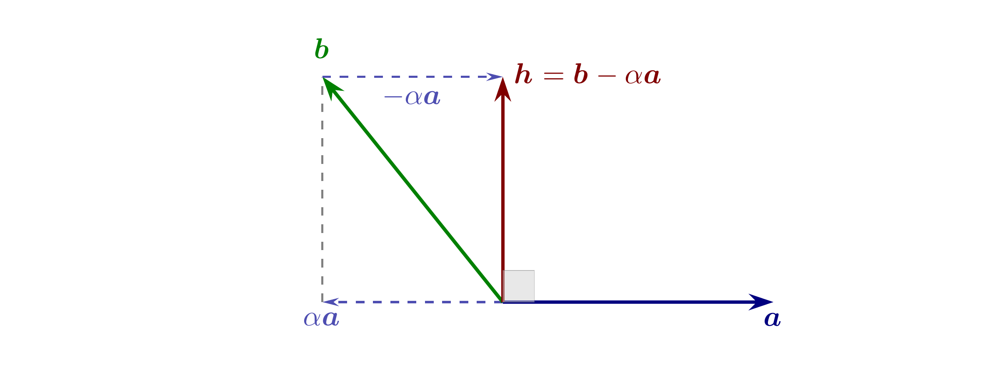

#    -*- mode: org -*-

#+TITLE: Lección 3. El lenguaje geométrico del curso (parte II)
#+author: Marcos Bujosa
#+LANGUAGE: es

# +OPTIONS: toc:nil

#+include: 00preambulo_lecciones.txt

#+LATEX_HEADER: \setkeys{Gin}{width=0.35\linewidth}

# +LATEX_HEADER: \usepackage{tikz}
# +LATEX_HEADER: \usepackage{amsmath}

#+BEGIN_SRC emacs-lisp :exports none :results silent
(use-package ox-ipynb
  :load-path (lambda () (expand-file-name "ox-ipynb" scimax-dir)))
(use-package htmlize)
#+END_SRC

#+LATEX: \maketitle

#+LATEX: \blfootnote{Licencia: Creative Commons Attribution-ShareAlike 4.0 International (CC BY-SA 4.0).}

#+begin_abstract
Ángulo, ortogonalidad y teorema de Pitágoras en $\mathbb{R}^n$.

/“La ortogonalidad es la piedra angular de la regresión.”/
#+end_abstract

- ([[https://mbujosab.github.io/PEconometria/Transparencias/S03-Lecc03.slides.html][slides]]) --- ([[https://mbujosab.github.io/PEconometria/Lecciones-html/S03-Lecc03.html][html]]) --- ([[https://mbujosab.github.io/PEconometria/Lecciones-pdf/S03-Lecc03.pdf][pdf]])

# --- ([[https://mybinder.org/v2/gh/mbujosab/PEconometria/gh-pages?labpath=CuadernosElectronicos/S03-Lecc03.ipynb][mybinder]]) # comentado porque no estoy exportando las lecciones a .ipynb

* De dónde venimos y qué añadimos hoy
:PROPERTIES:
:metadata: (slideshow . ((slide_type . slide)))
:END:

- En la lección 2: vectores, producto escalar, norma —justificada con Pitágoras en $\mathbb{R}^2$ y $\mathbb{R}^3$ (dado por conocido).
- Hoy añadimos la otra magnitud geométrica: el /ángulo/.
- Y su caso estrella para nosotros: la /ortogonalidad/ (ángulo recto).
- Programa:
  1. El coseno del ángulo: $\cos\theta = \frac{\langle\boldsymbol{a},\boldsymbol{b}\rangle}{\|\boldsymbol{a}\|\|\boldsymbol{b}\|}$.
  2. Ortogonalidad: $\langle\boldsymbol{a},\boldsymbol{b}\rangle = 0$.
  3. /Teorema de Pitágoras en $\mathbb{R}^n$/ —demostración seria; con rigor y sin dibujo.
  4. Cauchy–Schwarz y desigualdad triangular.

*** De dónde venimos y qué añadimos hoy
:PROPERTIES:
:metadata: (slideshow . ((slide_type . skip)))
:UNNUMBERED: notoc
:END:

#+attr_ipynb: (slideshow . ((slide_type . skip)))
En la lección 2, se definieron los vectores en $\mathbb{R}^n$ como listas ordenadas de números reales y se presentaron sus operaciones básicas: suma y multiplicación por escalares. Además, se introdujeron el producto escalar ($\boldsymbol{x}\cdot\boldsymbol{y} = \sum_i x_i y_i$) y la norma ($\|\boldsymbol{x}\|_e = \sqrt{\boldsymbol{x}\cdot\boldsymbol{x}}$). Se explicó que esta última mide la ``longitud'' de un vector; su justificación en $\mathbb{R}^2$ y $\mathbb{R}^3$ se basa en el teorema de Pitágoras (dado por conocido), extendiéndose por analogía a $\mathbb{R}^n$.

Hoy añadimos la otra magnitud geométrica fundamental: el /ángulo/ entre dos vectores. Y con el ángulo aparece su caso particular más importante para el curso, la /ortogonalidad/ (ángulo recto), que es la piedra angular de toda la regresión. Además, la ortogonalidad nos permitirá por fin /demostrar/ el teorema de Pitágoras en $\mathbb{R}^n$ —la primera demostración seria del curso, imposible en la lección 2 porque requería precisamente este concepto—. Cerraremos con un par de desigualdades (Cauchy–Schwarz y la triangular) que completan el aparato geométrico y dan sentido a la distancia entre vectores.

Todo el contenido de esta lección está desarrollado, con más detalle y figuras, en el capítulo 11 de mi /Curso de Álgebra Lineal/: [[https://mbujosab.github.io/CursoDeAlgebraLineal/][libro online]]. Os remitiré a él en los puntos donde convenga ver los detalles completos.

* El coseno mide la abertura del ángulo
:PROPERTIES:
:metadata: (slideshow . ((slide_type . slide)))
:END:

#+attr_latex: :width 475px
#+attr_html: :width 700px
file:img/S03-Lecc03/CosenoCirculoRadioUnidad_fila.png

- $\cos\theta = 1$: ángulo nulo (misma dirección y sentido).
- $\cos\theta = 0$: ángulo recto.
- $\cos\theta = -1$: ángulo de $180^o$ (sentidos opuestos).
- El coseno /decrece/ de $1$ a $-1$ a medida que el ángulo se abre.

#+attr_ipynb: (slideshow . ((slide_type . fragment)))
¿Cómo medimos el ángulo entre dos vectores a partir de sus componentes? 

#+attr_ipynb: (slideshow . ((slide_type . fragment)))
La respuesta es una de las fórmulas más bellas y útiles del curso:
\[
\cos\theta = \frac{\langle\boldsymbol{a}, \boldsymbol{b}\rangle}{\|\boldsymbol{a}\|\,\|\boldsymbol{b}\|}.
\]

#+attr_ipynb: (slideshow . ((slide_type . subslide)))
/Veámoslo primero con dibujos en $\mathbb{R}^2$ o $\mathbb{R}^3$/:

Caso unitario ($\|\boldsymbol{a}\| = \|\boldsymbol{b}\| = 1$):
aplicando Pitágoras en los dos triángulos rectángulos:

#+attr_latex: :width 475px
#+attr_html: :width 700px
file:img/S03-Lecc03/Triangulo_fila.png

\[
x^2 + h^2 = 1 \quad\text{ y }\quad (1-x)^2 + h^2 = c^2 
\quad\implies\quad x = \frac{2-c^2}{2}.
\]
Y como $\quad c^2 = \|\boldsymbol{a}-\boldsymbol{b}\|^2 = 2 - 2\,(\boldsymbol{a}\cdot\boldsymbol{b}),\quad$
tenemos que:
\(
\quad
\cos\theta = x = \boldsymbol{a}\cdot\boldsymbol{b}.
\)

#+attr_ipynb: (slideshow . ((slide_type . fragment)))
Caso general: normalizando $\boldsymbol{a}$ y $\boldsymbol{b}$ tenemos:
\(
\quad
\boxed{\;\cos\theta = \dfrac{\boldsymbol{a}\cdot\boldsymbol{b}}{\|\boldsymbol{a}\|\,\|\boldsymbol{b}\|}\;}
\)

#+begin_center
¡La fórmula es consecuencia de T. de Pitágoras!
#+end_center

*** Cálculo del coseno del ángulo entre dos vectores
:PROPERTIES:
:metadata: (slideshow . ((slide_type . skip)))
:UNNUMBERED: notoc
:END:

#+attr_ipynb: (slideshow . ((slide_type . skip)))
El /coseno/ es una función que mide el grado de abertura de un ángulo: vale $1$ cuando el ángulo es nulo (vectores que apuntan en la misma dirección), $0$ cuando el ángulo es recto (vectores perpendiculares) y $-1$ cuando el ángulo es de 180° (vectores opuestos).

El coseno del ángulo entre dos vectores $\boldsymbol{a}$ y $\boldsymbol{b}$ se puede calcular a partir de la siguiente fórmula:
\[
\cos\theta = \frac{\boldsymbol{a}\cdot\boldsymbol{b}}{\|\boldsymbol{a}\|\,\|\boldsymbol{b}\|}.
\]
Para deducir la fórmula, formamos un triángulo con dos vectores $\boldsymbol{a}$ y $\boldsymbol{b}$ y dividimos el problema con Pitágoras.

/Caso unitario/ (cuando $\|\boldsymbol{a}\| = \|\boldsymbol{b}\| = 1$). Sea $x$ la longitud de la proyección de $\boldsymbol{b}$ sobre la dirección de $\boldsymbol{a}$ (el segmento $X$ de la figura de la derecha). Por definición de coseno en el triángulo rectángulo, $\cos\theta = x$. Llamando $h$ a la altura del segmento $H$ y $c$ a la longitud del lado opuesto del triángulo (es decir, a la longitud del segmento $C$, que coincide con la norma del vector diferencia  $C = \|\boldsymbol{b}-\boldsymbol{a}\|$); aplicando Pitágoras en los dos triángulos rectángulos obtenemos las ecuaciones:
\[
x^2 + h^2 = 1, \qquad (1-x)^2 + h^2 = c^2.
\]
Restando la primera de la segunda:
\[
(1 - 2x + x^2) - x^2 = c^2 - 1 \;\Longrightarrow\; 2 - 2x = c^2 \;\Longrightarrow\; x = \frac{2 - c^2}{2}.
\]
Ahora desarrollamos $c^2$ con las propiedades del producto escalar:
\[
c^2 = \|\boldsymbol{a}-\boldsymbol{b}\|^2 = \boldsymbol{a}\cdot\boldsymbol{a} - 2\,\boldsymbol{a}\cdot\boldsymbol{b} + \boldsymbol{b}\cdot\boldsymbol{b} = 2 - 2\,\boldsymbol{a}\cdot\boldsymbol{b},
\]
donde hemos usado $\|\boldsymbol{a}\| = \|\boldsymbol{b}\| = 1$. Sustituyendo:
\[
\cos\theta = x = \frac{2 - (2 - 2\,\boldsymbol{a}\cdot\boldsymbol{b})}{2} = \boldsymbol{a}\cdot\boldsymbol{b}.
\]
Es decir, para vectores unitarios, /el coseno del ángulo es directamente su producto escalar/.

/Caso general/ (vectores no nulos cualesquiera). Basta normalizar: los vectores $\frac{\boldsymbol{a}}{\|\boldsymbol{a}\|}$ y $\frac{\boldsymbol{b}}{\|\boldsymbol{b}\|}$ son unitarios, así que
\[
\cos\theta = \frac{\boldsymbol{a}}{\|\boldsymbol{a}\|}\cdot\frac{\boldsymbol{b}}{\|\boldsymbol{b}\|} = \frac{\boldsymbol{a}\cdot\boldsymbol{b}}{\|\boldsymbol{a}\|\,\|\boldsymbol{b}\|}.
\]

Esta demostración está sacada del capítulo 11 del libro. Lo importante es que la fórmula /no sale de la nada/: es consecuencia del Teorema de Pitágoras.

- Bujosa, M. /Curso de Álgebra Lineal/, capítulo 11, sección ``Ángulo formado por dos vectores'': [[https://mbujosab.github.io/CursoDeAlgebraLineal/][libro online]].
- Vídeo: [[https://www.youtube.com/watch?v=LyGKycYT2v0][Dot products and duality]] de 3Blue1Brown (capítulo 9 de /Essence of Linear Algebra/).

* Ortogonalidad en $\mathbb{R}^n$
:PROPERTIES:
:metadata: (slideshow . ((slide_type . slide)))
:END:

El ángulo es recto cuando $\cos\theta = 0$, es decir, cuando el numerador $\boldsymbol{a}\cdot\boldsymbol{b}$ se anula:

#+begin_quote
/Definición/. $\boldsymbol{a}, \boldsymbol{b} \in \mathbb{R}^n$ son /ortogonales/ (perpendiculares) si
\[
\boldsymbol{a}\cdot\boldsymbol{b} = 0.
\]
#+end_quote
Entonces se escribe: $\quad\boldsymbol{a}\perp\boldsymbol{b}$.

- El vector $\boldsymbol{0}$ es ortogonal a /todos/ los vectores.

- /La ortogonalidad es una noción central del curso/: en la regresión, los residuos (la diferencia entre los datos originales y el ajuste del modelo) serán ortogonales a los regresores (las variables explicativas del modelo; ya lo veremos).

*** Ortogonalidad en $\mathbb{R}^n$
:PROPERTIES:
:metadata: (slideshow . ((slide_type . skip)))
:UNNUMBERED: notoc
:END:

#+attr_ipynb: (slideshow . ((slide_type . skip)))
De la fórmula del coseno extraemos el caso particular más importante del curso. El ángulo es recto cuando $\cos\theta = 0$, y como $\cos\theta = \frac{\boldsymbol{a}\cdot\boldsymbol{b}}{\|\boldsymbol{a}\|\|\boldsymbol{b}\|}$, esto ocurre exactamente cuando el numerador se anula. Esto sugiere la definición:

#+begin_quote
/Definición/. Dos vectores $\boldsymbol{a}, \boldsymbol{b} \in \mathbb{R}^n$ son /ortogonales/ (o /perpendiculares/; usaremos ambos términos indistintamente, aunque preferiremos "ortogonal") cuando $\boldsymbol{a}\cdot\boldsymbol{b} = 0$. Se escribe $\boldsymbol{a}\perp\boldsymbol{b}$.
#+end_quote

Obsérvese una consecuencia inmediata: el vector $\boldsymbol{0}$ es ortogonal a /todos/ los vectores, incluido él mismo, porque $\boldsymbol{0}\cdot\boldsymbol{b} = 0$ siempre.

La ortogonalidad es la noción que vertebra el curso. Cuando lleguemos a la regresión, la condición que define el ajuste por mínimos cuadrados será precisamente una condición de ortogonalidad: el vector de residuos[fn::La diferencia entre los datos originales objeto de estudio y el ajuste que el modelo logra para dichos datos.] será ortogonal a los regresores[fn::Las variables explicativas que se combinan para construir el ajuste; se definirán con precisión al llegar a la regresión simple.]. Por eso conviene fijar bien esta definición ahora.

- Bujosa, M. /Curso de Álgebra Lineal/, capítulo 11, sección "Generalizando al espacio euclídeo $\mathbb{R}^n$": [[https://mbujosab.github.io/CursoDeAlgebraLineal/][libro online]].

* Teorema de Pitágoras en $\mathbb{R}^n$
:PROPERTIES:
:metadata: (slideshow . ((slide_type . slide)))
:END:

/Teorema/:
\(
\quad
\boldsymbol{x}\perp\boldsymbol{y} \;\iff\; \|\boldsymbol{x}+\boldsymbol{y}\|^2 = \|\boldsymbol{x}\|^2 + \|\boldsymbol{y}\|^2.
\)

#+attr_ipynb: (slideshow . ((slide_type . fragment)))
/Demostración/:
\begin{multline*}
\|\boldsymbol{x}+\boldsymbol{y}\|^2 = 
(\boldsymbol{x}+\boldsymbol{y})\cdot(\boldsymbol{x}+\boldsymbol{y}) = 
\boldsymbol{x}\cdot\boldsymbol{x} + 2\,(\boldsymbol{x}\cdot\boldsymbol{y}) + \boldsymbol{y}\cdot\boldsymbol{y} \\
=
\|\boldsymbol{x}\|^2 + 2\,(\boldsymbol{x}\cdot\boldsymbol{y}) + \|\boldsymbol{y}\|^2.
\end{multline*}
La igualdad pitagórica se cumple $\Leftrightarrow$ el término central $2\,(\boldsymbol{x}\cdot\boldsymbol{y}) = 0$ $\Leftrightarrow$ $\boldsymbol{x}\perp\boldsymbol{y}$. $\blacksquare$

#+attr_ipynb: (slideshow . ((slide_type . fragment)))
# +begin_center
/El cuadrado del binomio vectorial/: 
\[\|\boldsymbol{x}+\boldsymbol{y}\|^2 = \|\boldsymbol{x}\|^2 + 2(\boldsymbol{x}\cdot\boldsymbol{y}) + \|\boldsymbol{y}\|^2\] aparecerá más veces en el curso.
# +end_center

*** Teorema de Pitágoras en $\mathbb{R}^n$
:PROPERTIES:
:metadata: (slideshow . ((slide_type . skip)))
:UNNUMBERED: notoc
:END:

#+attr_ipynb: (slideshow . ((slide_type . skip)))
Esta es la primera demostración seria del curso. Conviene seguirla paso a paso, porque ilustra cómo las propiedades del producto escalar (simetría, linealidad) se usan para demostrar resultados geométricos.

En la lección 2 justificamos —con Pitágoras clásico en $\mathbb{R}^2$ y $\mathbb{R}^3$— que la norma mide la longitud. Ahora, con la noción de ortogonalidad que acabamos de definir, podemos ir más lejos: demostrar el teorema en $\mathbb{R}^n$ sin recurrir a ningún dibujo.

#+begin_quote
/Teorema (Pitágoras en $\mathbb{R}^n$)/. Dos vectores $\boldsymbol{x}, \boldsymbol{y} \in \mathbb{R}^n$ son ortogonales si y solo si
\[
\|\boldsymbol{x} + \boldsymbol{y}\|^2 = \|\boldsymbol{x}\|^2 + \|\boldsymbol{y}\|^2.
\]
#+end_quote

/Demostración/. Partimos de la norma al cuadrado de la suma y la desarrollamos usando que $\|\boldsymbol{v}\|^2 = \boldsymbol{v}\cdot\boldsymbol{v}$ y la linealidad del producto escalar:

\begin{aligned}
\|\boldsymbol{x}+\boldsymbol{y}\|^2 &= (\boldsymbol{x}+\boldsymbol{y})\cdot(\boldsymbol{x}+\boldsymbol{y}) && \text{(definición de norma)}\\
&= \boldsymbol{x}\cdot\boldsymbol{x} + \boldsymbol{x}\cdot\boldsymbol{y} + \boldsymbol{y}\cdot\boldsymbol{x} + \boldsymbol{y}\cdot\boldsymbol{y} && \text{(linealidad en ambos argumentos)}\\
&= \boldsymbol{x}\cdot\boldsymbol{x} + 2\,(\boldsymbol{x}\cdot\boldsymbol{y}) + \boldsymbol{y}\cdot\boldsymbol{y} && \text{(simetría: } \boldsymbol{x}\cdot\boldsymbol{y} = \boldsymbol{y}\cdot\boldsymbol{x})\\
&= \|\boldsymbol{x}\|^2 + 2\,(\boldsymbol{x}\cdot\boldsymbol{y}) + \|\boldsymbol{y}\|^2. && \text{(definición de norma)}
\end{aligned}

De esta igualdad —que es válida /siempre/, sean o no ortogonales los vectores— se lee directamente el teorema: la igualdad $\|\boldsymbol{x}+\boldsymbol{y}\|^2 = \|\boldsymbol{x}\|^2 + \|\boldsymbol{y}\|^2$ se cumple si y solo si el término central se anula, es decir, si y solo si $\boldsymbol{x}\cdot\boldsymbol{y} = 0$, esto es, si y solo si $\boldsymbol{x}\perp\boldsymbol{y}$. $\blacksquare$

Aquí $\boldsymbol{x}$ e $\boldsymbol{y}$ son los catetos y $\boldsymbol{x}+\boldsymbol{y}$ la hipotenusa. La igualdad intermedia
\[
\|\boldsymbol{x}+\boldsymbol{y}\|^2 = \|\boldsymbol{x}\|^2 + 2\,(\boldsymbol{x}\cdot\boldsymbol{y}) + \|\boldsymbol{y}\|^2
\]
conviene recordarla por sí misma: es el análogo vectorial del cuadrado del binomio, y la usaremos repetidamente (en Cauchy–Schwarz, en la desigualdad triangular y en la descomposición de la varianza en la regresión).

- Bujosa, M. /Curso de Álgebra Lineal/, capítulo 11, "Teorema de Pitágoras en $\mathbb{R}^n$": [[https://mbujosab.github.io/CursoDeAlgebraLineal/][libro online]].

* Desigualdad de Cauchy–Schwarz
:PROPERTIES:
:metadata: (slideshow . ((slide_type . slide)))
:END:

¿Qué asegura que $\cos\theta = \frac{\boldsymbol{a}\cdot\boldsymbol{b}}{\|\boldsymbol{a}\|\|\boldsymbol{b}\|} \in [-1,1]$ en $\mathbb{R}^n$?

Lo hace la desigualdad de /Cauchy–Schwarz/: $\quad|\boldsymbol{a}\cdot\boldsymbol{b}| \leq \|\boldsymbol{a}\|\,\|\boldsymbol{b}\|$.

#+attr_ipynb: (slideshow . ((slide_type . subslide)))
#+attr_latex: :width 350px
#+attr_html: :width 450px
file:./img/S03-Lecc03/ProyeccionOrtogonal1_ancho.png

/Idea de la demostración/: construir $\boldsymbol{h} = \boldsymbol{b} - \alpha\boldsymbol{a}$ ortogonal a $\boldsymbol{a}$:
\[
\boldsymbol{a}\cdot\boldsymbol{h} = 0 \;\Longrightarrow\; \boxed{\alpha = \frac{\boldsymbol{a}\cdot\boldsymbol{b}}{\boldsymbol{a}\cdot\boldsymbol{a}}}.
\]
Por Pitágoras, $\|\boldsymbol{b}\|^2 = \|\boldsymbol{h}\|^2 + \alpha^2\|\boldsymbol{a}\|^2 \geq \alpha^2\|\boldsymbol{a}\|^2$, de donde sale la desigualdad.

- Igualdad $\Leftrightarrow$ vectores alineados; ortogonales $\Leftrightarrow$ $\boldsymbol{a}\cdot\boldsymbol{b}=0$.

*** Desigualdad de Cauchy–Schwarz
:PROPERTIES:
:metadata: (slideshow . ((slide_type . skip)))
:UNNUMBERED: notoc
:END:

#+attr_ipynb: (slideshow . ((slide_type . skip)))
Hay un detalle que hemos pasado por alto. Hemos /definido/ el coseno del ángulo en $\mathbb{R}^n$ como $\cos\theta = \frac{\boldsymbol{a}\cdot\boldsymbol{b}}{\|\boldsymbol{a}\|\|\boldsymbol{b}\|}$. Pero un coseno solo puede tomar valores entre $-1$ y $1$. ¿Qué nos garantiza que ese cociente nunca se sale de ese intervalo en $\mathbb{R}^n$? La respuesta es un resultado clásico:

#+begin_quote
/Proposición (desigualdad de Cauchy–Schwarz)/. Para todo $\boldsymbol{a}, \boldsymbol{b} \in \mathbb{R}^n$ se cumple
$$|\boldsymbol{a}\cdot\boldsymbol{b}| \leq \|\boldsymbol{a}\|\,\|\boldsymbol{b}\|.$$
#+end_quote

La demostración es bonita y, sobre todo, /siembra una idea que reaprovecharemos en la lección 4/: la de descomponer un vector en dos partes; donde la primera está alineada con otro vector y la segunda es ortogonal a la primera.

/Demostración (caso en que $\boldsymbol{a}$ y $\boldsymbol{b}$ son linealmente independientes, es decir, no están alineados)/. Construimos un vector $\boldsymbol{h}$ que sea ortogonal a $\boldsymbol{a}$ restando a $\boldsymbol{b}$ un múltiplo adecuado de $\boldsymbol{a}$:
\[
\boldsymbol{h} = \boldsymbol{b} - \alpha\,\boldsymbol{a}.
\]
Es decir, elegimos $\alpha$ para forzar la ortogonalidad $\boldsymbol{a}\perp\boldsymbol{h}$:
\[
0 = \boldsymbol{a}\cdot\boldsymbol{h} = \boldsymbol{a}\cdot(\boldsymbol{b}-\alpha\boldsymbol{a}) = \boldsymbol{a}\cdot\boldsymbol{b} - \alpha\,(\boldsymbol{a}\cdot\boldsymbol{a}) \;\Longrightarrow\; \boxed{\alpha = \frac{\boldsymbol{a}\cdot\boldsymbol{b}}{\boldsymbol{a}\cdot\boldsymbol{a}}}.
\]

# #+CAPTION: $\boldsymbol{h} = \boldsymbol{b} - \alpha\boldsymbol{a}$ es ortogonal a $\boldsymbol{a}$; los catetos $\boldsymbol{h}$ y $\alpha\boldsymbol{a}$, hipotenusa $\boldsymbol{b}$
# #+attr_latex: :width 300px
# #+attr_html: :width 450px
# 
 
Como $\boldsymbol{b} = \boldsymbol{h} + \alpha\boldsymbol{a}$ con $\boldsymbol{h}\perp\alpha\boldsymbol{a}$, aplicamos Pitágoras:
\[
\|\boldsymbol{b}\|^2 = \|\boldsymbol{h}\|^2 + \alpha^2\|\boldsymbol{a}\|^2.
\]
Como $\boldsymbol{a}$ y $\boldsymbol{b}$ son linealmente independientes, $\boldsymbol{h}\neq\boldsymbol{0}$, luego $\|\boldsymbol{h}\|^2 > 0$ y por tanto
\[
\|\boldsymbol{b}\|^2 > \alpha^2\|\boldsymbol{a}\|^2 = \frac{(\boldsymbol{a}\cdot\boldsymbol{b})^2}{(\boldsymbol{a}\cdot\boldsymbol{a})^2}\,\|\boldsymbol{a}\|^2 = \frac{(\boldsymbol{a}\cdot\boldsymbol{b})^2}{\Big(\|\boldsymbol{a}\|^2\Big)^2}\,\|\boldsymbol{a}\|^2 = \frac{(\boldsymbol{a}\cdot\boldsymbol{b})^2}{\|\boldsymbol{a}\|^2}.
\]
Multiplicando por $\|\boldsymbol{a}\|^2$ obtenemos $\|\boldsymbol{a}\|^2\|\boldsymbol{b}\|^2 > (\boldsymbol{a}\cdot\boldsymbol{b})^2$, y tomando raíces, $\|\boldsymbol{a}\|\|\boldsymbol{b}\| > |\boldsymbol{a}\cdot\boldsymbol{b}|$.

En un extremo tenemos $\boldsymbol{a}\cdot\boldsymbol{b} = 0$ cuando $\boldsymbol{a}\perp\boldsymbol{b}$. 

En el otro, si $\boldsymbol{b}=\lambda\boldsymbol{a}$ (si ambos vectores están alineados) entonces
$\boldsymbol{h}=\boldsymbol{0}$, es decir, $\|\boldsymbol{h}\|^2 = 0$; y entonces $\|\boldsymbol{b}\|^2 = \alpha^2\|\boldsymbol{a}\|^2$. Consecuentemente $|\boldsymbol{a}\cdot\boldsymbol{b}| = \|\boldsymbol{a}\|\|\boldsymbol{b}\|$.
Así, la desigualdad es estricta cuando los vectores *no* están alineados, y se convierte en igualdad cuando lo están. 

#+begin_quote
/Idea para recordar/. El vector $\alpha\boldsymbol{a}$, con $\alpha = \frac{\boldsymbol{a}\cdot\boldsymbol{b}}{\boldsymbol{a}\cdot\boldsymbol{a}}$, es la ``sombra'' de $\boldsymbol{b}$ sobre la dirección de $\boldsymbol{a}$. 
En la lección 4 reconoceremos en esta construcción la /proyección ortogonal/, y ese $\alpha$ resultará ser la media (cuando $\boldsymbol{a}=\boldsymbol{1}$); 
más adelante será también la pendiente de la regresión lineal simple (cuando $\boldsymbol{a}$ son los datos centrados de la variable explicativa).
#+end_quote

- Bujosa, M. /Curso de Álgebra Lineal/, capítulo 11, "Desigualdad de Cauchy–Schwarz": [[https://mbujosab.github.io/CursoDeAlgebraLineal/][libro online]].
- Para quien quiera otra demostración (la del parámetro $t$): cualquier manual de álgebra lineal; es la versión que considera $\|\boldsymbol{b}-t\boldsymbol{a}\|^2 \geq 0$ como polinomio en $t$.

* Ángulo, alineación, normalización
:PROPERTIES:
:metadata: (slideshow . ((slide_type . slide)))
:END:

Dado que se verifica Cauchy–Schwarz en $\mathbb{R}^n$, es legítima la definición:
\[
\cos\theta = \frac{\boldsymbol{a}\cdot\boldsymbol{b}}{\|\boldsymbol{a}\|\,\|\boldsymbol{b}\|}, \qquad -1 \leq \cos\theta \leq 1.
\]

#+attr_ipynb: (slideshow . ((slide_type . fragment)))
- /Vector unitario/: norma $1$. 
  - Un vector $\boldsymbol{a}$, no nulo, se /normaliza/ dividiendo por su longitud: $\frac{1}{\|\boldsymbol{a}\|}\boldsymbol{a}$.
- /Vectores alineados/ ($\boldsymbol{b} = \lambda\boldsymbol{a}$): $\cos\theta = \frac{\lambda}{|\lambda|} = \pm 1$.
  - Caso opuesto a la ortogonalidad.
  - /Avance Tema 5/: regresores muy correlacionados $\approx$ vectores casi alineados $\Rightarrow$ colinealidad.

*** El ángulo en $\mathbb{R}^n$, vectores alineados, normalización
:PROPERTIES:
:metadata: (slideshow . ((slide_type . skip)))
:UNNUMBERED: notoc
:END:

#+attr_ipynb: (slideshow . ((slide_type . skip)))
Ahora que Cauchy–Schwarz nos garantiza que el cociente está en $[-1,1]$, podemos definir con todo rigor:

#+begin_quote
/Definición/. El /coseno del ángulo/ $\theta$ formado por dos vectores no nulos $\boldsymbol{a}, \boldsymbol{b} \in \mathbb{R}^n$ es
\[
\cos\theta = \frac{\boldsymbol{a}\cdot\boldsymbol{b}}{\|\boldsymbol{a}\|\,\|\boldsymbol{b}\|}, \qquad -1 \leq \cos\theta \leq 1.
\]
#+end_quote

Dos conceptos auxiliares que reaparecerán:

- /Vector unitario/: un vector de norma $1$. Para obtener un vector unitario en la dirección de $\boldsymbol{a}\neq\boldsymbol{0}$, se /normaliza/ dividiéndolo por su longitud: $\frac{1}{\|\boldsymbol{a}\|}\boldsymbol{a}$ tiene norma $1$, porque $\left\|\frac{1}{\|\boldsymbol{a}\|}\boldsymbol{a}\right\| = \frac{1}{\|\boldsymbol{a}\|}\|\boldsymbol{a}\| = 1$ (por la homogeneidad de la norma vista en la lección 2).

  Ejemplo: si $\boldsymbol{x} = (1,1,1,1)$, entonces $\|\boldsymbol{x}\| = \sqrt{4} = 2$, y el vector normalizado $\frac{1}{2}\boldsymbol{x} = \left(\tfrac12, \tfrac12, \tfrac12, \tfrac12\right)$ es unitario.

- /Vectores alineados/: cuando $\boldsymbol{b} = \lambda\boldsymbol{a}$ con $\lambda\neq 0$. En ese caso el ángulo es $0$ (si $\lambda > 0$, "apuntan" en el mismo sentido) o $180^o$ (si $\lambda < 0$), porque
  \[
  \cos\theta = \frac{\lambda\,\|\boldsymbol{a}\|^2}{|\lambda|\,\|\boldsymbol{a}\|^2} = \frac{\lambda}{|\lambda|} = \pm 1.
  \]
  Los vectores alineados son el caso opuesto a los ortogonales: máxima dependencia frente a máxima independencia direccional. Esta imagen será útil en el Tema 5, cuando hablemos de /colinealidad/: dos regresores muy correlacionados son vectores /casi/ alineados (ángulo pequeño, coseno cercano a $\pm 1$), y eso hará inestable la regresión.

- Bujosa, M. /Curso de Álgebra Lineal/, capítulo 11, secciones sobre el coseno del ángulo y vectores alineados: [[https://mbujosab.github.io/CursoDeAlgebraLineal/][libro online]].

* Desigualdad triangular y distancia
:PROPERTIES:
:metadata: (slideshow . ((slide_type . slide)))
:END:

/Desigualdad triangular/ (aplicación de Cauchy–Schwarz):
\[
\|\boldsymbol{a}+\boldsymbol{b}\|^2 = \|\boldsymbol{a}\|^2 + 2(\boldsymbol{a}\cdot\boldsymbol{b}) + \|\boldsymbol{b}\|^2 \leq \big(\|\boldsymbol{a}\| + \|\boldsymbol{b}\|\big)^2.
\]

\[
\Longrightarrow \quad \|\boldsymbol{a}+\boldsymbol{b}\| \leq \|\boldsymbol{a}\| + \|\boldsymbol{b}\|.
\]

/Distancia entre vectores/:
\[
d(\boldsymbol{x}, \boldsymbol{y}) = \|\boldsymbol{x} - \boldsymbol{y}\|.
\]

# Ajustar por mínimos cuadrados *es* minimizar la distancia $\|\boldsymbol{y} - \boldsymbol{\mathop{\widehat{y}}}\|$.

*** La desigualdad triangular y la distancia entre vectores
:PROPERTIES:
:metadata: (slideshow . ((slide_type . skip)))
:UNNUMBERED: notoc
:END:

#+attr_ipynb: (slideshow . ((slide_type . skip)))
Como aplicación inmediata de Cauchy–Schwarz, demostramos un resultado intuitivo: el camino directo nunca es más largo que el indirecto.

#+begin_quote
/Proposición (desigualdad triangular)/. Para todo $\boldsymbol{a}, \boldsymbol{b} \in \mathbb{R}^n$,
\[
\|\boldsymbol{a}+\boldsymbol{b}\| \leq \|\boldsymbol{a}\| + \|\boldsymbol{b}\|.
\]
#+end_quote

/Demostración/. Partimos del cuadrado del binomio vectorial (la identidad que destacamos en la sección 5):

\begin{aligned}
\|\boldsymbol{a}+\boldsymbol{b}\|^2 &= \|\boldsymbol{a}\|^2 + 2\,(\boldsymbol{a}\cdot\boldsymbol{b}) + \|\boldsymbol{b}\|^2 \\
&\leq \|\boldsymbol{a}\|^2 + 2\,\|\boldsymbol{a}\|\,\|\boldsymbol{b}\| + \|\boldsymbol{b}\|^2 && \text{(por Cauchy–Schwarz: } \boldsymbol{a}\cdot\boldsymbol{b} \leq |\boldsymbol{a}\cdot\boldsymbol{b}| \leq \|\boldsymbol{a}\|\|\boldsymbol{b}\|)\\
&= \big(\|\boldsymbol{a}\| + \|\boldsymbol{b}\|\big)^2.
\end{aligned}

Tomando raíces cuadradas (pues ambos lados son no negativos), $\|\boldsymbol{a}+\boldsymbol{b}\| \leq \|\boldsymbol{a}\| + \|\boldsymbol{b}\|$. $\blacksquare$

Esta desigualdad permite definir la /distancia/ entre dos vectores como la longitud de su diferencia:
\[
d(\boldsymbol{x}, \boldsymbol{y}) = \|\boldsymbol{x} - \boldsymbol{y}\|.
\]
Es simétrica ($d(\boldsymbol{x},\boldsymbol{y}) = d(\boldsymbol{y},\boldsymbol{x})$, porque $\|\boldsymbol{x}-\boldsymbol{y}\| = \|\boldsymbol{y}-\boldsymbol{x}\|$), se anula solo cuando los vectores coinciden ($d(\boldsymbol{x},\boldsymbol{y}) = 0 \Leftrightarrow \boldsymbol{x}=\boldsymbol{y}$), y verifica su propia desigualdad triangular:
\[
d(\boldsymbol{a},\boldsymbol{c}) = \|\boldsymbol{a}-\boldsymbol{c}\| = \|(\boldsymbol{a}-\boldsymbol{b}) + (\boldsymbol{b}-\boldsymbol{c})\| \leq \|\boldsymbol{a}-\boldsymbol{b}\| + \|\boldsymbol{b}-\boldsymbol{c}\| = d(\boldsymbol{a},\boldsymbol{b}) + d(\boldsymbol{b},\boldsymbol{c}).
\]

Esta noción de distancia es, literalmente, el corazón de la regresión: en la lección 6 buscaremos el vector $\boldsymbol{\mathop{\widehat{y}}}$ —de entre todos los de un subespacio— que /minimiza la distancia/ $\|\boldsymbol{y} - \boldsymbol{\mathop{\widehat{y}}}\|$ al vector de datos $\boldsymbol{y}$. Ajustar por mínimos cuadrados será, exactamente, minimizar una distancia $\|\boldsymbol{y}-\boldsymbol{\mathop{\widehat{y}}}\|$, donde $\boldsymbol{\mathop{\widehat{y}}}$ es el vector ajustado (aún no definido formalmente; lo haremos en la lección 6).

- Bujosa, M. /Curso de Álgebra Lineal/, capítulo 11, "Desigualdad triangular" y "distancia entre vectores": [[https://mbujosab.github.io/CursoDeAlgebraLineal/][libro online]].

* Recapitulación y guiño a la lección 4
:PROPERTIES:
:metadata: (slideshow . ((slide_type . slide)))
:END:

#+begin_export html

#+end_export
| Concepto          | Fórmula matemática / definición algebráica                                                                      |
|-------------------+-----------------------------------------------------------------------------------------------------------------|
| Coseno del ángulo | $\cos\theta = \frac{\boldsymbol{a}\cdot\boldsymbol{b}}{\Vert \boldsymbol{a}\Vert \Vert\boldsymbol{b}\Vert}$                     |
| Ortogonalidad     | $\boldsymbol{a}\cdot\boldsymbol{b} = 0$                                                                                 |
| Pitágoras         | $\boldsymbol{x}\perp\boldsymbol{y}\iff\mbox{\(\Vert\boldsymbol{x}+\boldsymbol{y}\Vert^2=\Vert\boldsymbol{x}\Vert^2+\Vert\boldsymbol{y}\Vert^2\)}$ |
| Cauchy–Schwarz    | $\lvert\boldsymbol{a}\cdot\boldsymbol{b}\rvert \leq \Vert\boldsymbol{a}\Vert \Vert\boldsymbol{b}\Vert$                     |
| Distancia         | $d(\boldsymbol{x},\boldsymbol{y}) = \Vert \boldsymbol{x}-\boldsymbol{y}\Vert$                                                   |

Hoy, $\alpha=\frac{\boldsymbol{a}\cdot\boldsymbol{b}}{\boldsymbol{a}\cdot\boldsymbol{a}}$ fue un truco auxiliar; pero en la lección 4 será la /proyección ortogonal/ que, con $\boldsymbol{a}=\boldsymbol{1}$, dará lugar a la /media aritmética/.

*** Recapitulación y guiño a la lección 4
:PROPERTIES:
:metadata: (slideshow . ((slide_type . skip)))
:UNNUMBERED: notoc
:END:

#+attr_ipynb: (slideshow . ((slide_type . skip)))
Lo esencial de hoy:

1. La /longitud/, justificada en la lección 2 con Pitágoras clásico en $\mathbb{R}^2$ y $\mathbb{R}^3$, se extiende por analogía a $\mathbb{R}^n$. Hoy hemos demostrado el /teorema de Pitágoras en $\mathbb{R}^n$/ con rigor: $\boldsymbol{x}\perp\boldsymbol{y} \Leftrightarrow \|\boldsymbol{x}+\boldsymbol{y}\|^2 = \|\boldsymbol{x}\|^2 + \|\boldsymbol{y}\|^2$.
2. El /coseno del ángulo/ es $\cos\theta = \frac{\boldsymbol{a}\cdot\boldsymbol{b}}{\|\boldsymbol{a}\|\|\boldsymbol{b}\|}$; se deduce en $\mathbb{R}^2$ con Pitágoras y se extiende a $\mathbb{R}^n$ como definición.
3. Dos vectores son /ortogonales/ cuando $\boldsymbol{a}\cdot\boldsymbol{b} = 0$. Esta noción es central en el curso.
4. /Teorema de Pitágoras/ en $\mathbb{R}^n$: $\boldsymbol{x}\perp\boldsymbol{y} \Leftrightarrow \|\boldsymbol{x}+\boldsymbol{y}\|^2 = \|\boldsymbol{x}\|^2 + \|\boldsymbol{y}\|^2$. Demostrado con las propiedades del producto escalar.
5. /Cauchy–Schwarz/ ($|\boldsymbol{a}\cdot\boldsymbol{b}| \leq \|\boldsymbol{a}\|\|\boldsymbol{b}\|$) garantiza que el coseno está en $[-1,1]$. Su demostración construye la "sombra" (la proyección) $\alpha\boldsymbol{a}$ de $\boldsymbol{b}$ sobre $\boldsymbol{a}$, con $\alpha = \frac{\boldsymbol{a}\cdot\boldsymbol{b}}{\boldsymbol{a}\cdot\boldsymbol{a}}$.
6. La /desigualdad triangular/ da sentido a la /distancia/ $d(\boldsymbol{x},\boldsymbol{y}) = \|\boldsymbol{x}-\boldsymbol{y}\|$.

#+begin_quote
/Guiño a la lección 4/. Dos piezas de hoy son la semilla de toda la econometría que viene. Primero, la /distancia/: la regresión consistirá en encontrar el vector de un subespacio más /cercano/ a los datos, es decir, en minimizar $\|\boldsymbol{y}-\boldsymbol{\mathop{\widehat{y}}}\|$. Segundo, la /construcción $\boldsymbol{h} = \boldsymbol{b} - \alpha\boldsymbol{a}$/ de la demostración de Cauchy–Schwarz: ese $\alpha = \frac{\boldsymbol{a}\cdot\boldsymbol{b}}{\boldsymbol{a}\cdot\boldsymbol{a}}$, que hoy ha aparecido como truco auxiliar, resultará ser la /proyección ortogonal/. Cuando $\boldsymbol{a} = \boldsymbol{1}$ (el vector de unos), $\alpha$ será la /media/ de los datos. No es casualidad: es el primer indicio de que la media, la regresión y la geometría son la misma cosa vista desde ángulos distintos.
#+end_quote

* COMMENT Banco de preguntas tipo test (lección 3)

12 preguntas. Para una prueba de 15-20 min, seleccionar 6-8. Nivel orientativo: [B] básica, [M] media, [D] discriminadora.

** Pregunta 1 [B] — Definición de ortogonalidad

Dos vectores $\boldsymbol{a}, \boldsymbol{b} \in \mathbb{R}^n$ son ortogonales si y solo si:

a) $\|\boldsymbol{a}\| = \|\boldsymbol{b}\|$.
b) $\boldsymbol{a}\cdot\boldsymbol{b} = 1$.
c) $\boldsymbol{a}\cdot\boldsymbol{b} = 0$.
d) $\boldsymbol{a} + \boldsymbol{b} = \boldsymbol{0}$.

/Respuesta correcta: c./
/Evalúa/: definición de ortogonalidad. La opción d) confunde ortogonalidad con opuesto.

** Pregunta 2 [B] — Coseno nulo

El coseno del ángulo entre dos vectores vale $0$. ¿Qué significa eso geométricamente?

a) Los vectores apuntan en el mismo sentido.
b) Uno de los vectores tiene norma cero.
c) Los vectores son paralelos.
d) Los vectores son ortogonales (perpendiculares).

/Respuesta correcta: d./
/Evalúa/: interpretación del coseno nulo como ortogonalidad.

** Pregunta 3 [B] — Enunciado del teorema de Pitágoras en $\mathbb{R}^n$

Si $\boldsymbol{x} \perp \boldsymbol{y}$, el teorema de Pitágoras en $\mathbb{R}^n$ afirma que:

a) $\|\boldsymbol{x} + \boldsymbol{y}\| = \|\boldsymbol{x}\| + \|\boldsymbol{y}\|$.
b) $\|\boldsymbol{x} + \boldsymbol{y}\|^2 = \|\boldsymbol{x}\|^2 + \|\boldsymbol{y}\|^2$.
c) $\|\boldsymbol{x} + \boldsymbol{y}\|^2 = (\|\boldsymbol{x}\| + \|\boldsymbol{y}\|)^2$.
d) $\boldsymbol{x}\cdot\boldsymbol{y} = \|\boldsymbol{x}\|\|\boldsymbol{y}\|$.

/Respuesta correcta: b./
/Evalúa/: enunciado del teorema. La opción a) es la desigualdad triangular (válida siempre, más restrictiva). La opción c) es equivalente a a), no a b).

** Pregunta 4 [B] — Validez de la desigualdad triangular

La desigualdad triangular $\|\boldsymbol{a}+\boldsymbol{b}\| \leq \|\boldsymbol{a}\| + \|\boldsymbol{b}\|$ es válida:

a) Solo cuando $\boldsymbol{a}$ y $\boldsymbol{b}$ son ortogonales.
b) Solo cuando $\|\boldsymbol{a}\| = \|\boldsymbol{b}\|$.
c) Solo en $\mathbb{R}^2$ y $\mathbb{R}^3$.
d) Para cualesquiera $\boldsymbol{a}, \boldsymbol{b} \in \mathbb{R}^n$.

/Respuesta correcta: d./
/Evalúa/: comprensión de que la desigualdad triangular es un resultado general, no condicionado a ortogonalidad ni a dimensión baja.

** Pregunta 5 [M] — Cálculo del coseno

Sean $\boldsymbol{a} = (3, 0)$ y $\boldsymbol{b} = (1, 1)$ en $\mathbb{R}^2$. El coseno del ángulo entre ellos es:

a) $\dfrac{3}{\sqrt{2}}$.
b) $\dfrac{1}{\sqrt{2}}$.
c) $\dfrac{\sqrt{2}}{3}$.
d) $3$.

/Respuesta correcta: b./
/Evalúa/: cálculo directo. $\boldsymbol{a}\cdot\boldsymbol{b} = 3$, $\|\boldsymbol{a}\| = 3$, $\|\boldsymbol{b}\| = \sqrt{2}$, luego $\cos\theta = \frac{3}{3\sqrt{2}} = \frac{1}{\sqrt{2}}$.

** Pregunta 6 [M] — Normalización

El vector $\boldsymbol{a} = (1, 1, 1, 1) \in \mathbb{R}^4$ normalizado (de norma $1$) es:

a) $(1, 1, 1, 1)$.
b) $\left(\dfrac{1}{\sqrt{2}}, \dfrac{1}{\sqrt{2}}, \dfrac{1}{\sqrt{2}}, \dfrac{1}{\sqrt{2}}\right)$.
c) $\left(\dfrac{1}{2}, \dfrac{1}{2}, \dfrac{1}{2}, \dfrac{1}{2}\right)$.
d) $\left(\dfrac{1}{4}, \dfrac{1}{4}, \dfrac{1}{4}, \dfrac{1}{4}\right)$.

/Respuesta correcta: c./
/Evalúa/: cálculo de $\|\boldsymbol{a}\| = \sqrt{4} = 2$ y división. La opción b) sería correcta si $\|\boldsymbol{a}\| = \sqrt{2}$, lo que requeriría solo dos componentes iguales a $1$.

** Pregunta 7 [M] — El cuadrado del binomio vectorial

La identidad $\|\boldsymbol{x}+\boldsymbol{y}\|^2 = \|\boldsymbol{x}\|^2 + 2(\boldsymbol{x}\cdot\boldsymbol{y}) + \|\boldsymbol{y}\|^2$ es cierta:

a) Solo si $\boldsymbol{x} \perp \boldsymbol{y}$.
b) Solo en $\mathbb{R}^2$ o $\mathbb{R}^3$.
c) Siempre, para cualesquiera $\boldsymbol{x}, \boldsymbol{y} \in \mathbb{R}^n$.
d) Solo si $\|\boldsymbol{x}\| = \|\boldsymbol{y}\|$.

/Respuesta correcta: c./
/Evalúa/: la identidad es consecuencia de las propiedades del producto escalar y vale siempre. El teorema de Pitágoras es su caso especial: cuando $\boldsymbol{x}\cdot\boldsymbol{y}=0$, el término central desaparece.

** Pregunta 8 [M] — Para qué sirve Cauchy–Schwarz

¿Cuál es el papel de la desigualdad de Cauchy–Schwarz en la definición del ángulo?

a) Demuestra que la norma es siempre positiva.
b) Garantiza que el cociente $\frac{\boldsymbol{a}\cdot\boldsymbol{b}}{\|\boldsymbol{a}\|\|\boldsymbol{b}\|}$ toma valores en $[-1,1]$, donde el coseno está bien definido.
c) Prueba que la suma de dos vectores tiene mayor norma que cada sumando.
d) Permite calcular la norma sin usar el producto escalar.

/Respuesta correcta: b./
/Evalúa/: comprensión del papel de Cauchy–Schwarz: es lo que /legitima/ la definición del coseno en $\mathbb{R}^n$, al garantizar que el cociente nunca se sale de $[-1,1]$.

** Pregunta 9 [D] — Verificación de ortogonalidad

Sean $\boldsymbol{x} = (1, 2)$ e $\boldsymbol{y} = (4, -2)$ en $\mathbb{R}^2$. ¿Satisfacen la igualdad pitagórica $\|\boldsymbol{x}+\boldsymbol{y}\|^2 = \|\boldsymbol{x}\|^2 + \|\boldsymbol{y}\|^2$?

a) No, porque sus normas no son iguales.
b) Sí, porque su producto escalar es cero.
c) No, porque la igualdad pitagórica solo vale en $\mathbb{R}^3$.
d) Sí, porque $\|\boldsymbol{x}+\boldsymbol{y}\| = \|\boldsymbol{x}\| + \|\boldsymbol{y}\|$.

/Respuesta correcta: b./
/Evalúa/: conexión entre el teorema de Pitágoras y la ortogonalidad mediante cálculo. $\boldsymbol{x}\cdot\boldsymbol{y} = 1\cdot4 + 2\cdot(-2) = 0$, luego son ortogonales y se cumple Pitágoras. La opción d) confunde la igualdad de normas (desigualdad triangular con igualdad) con Pitágoras.

** Pregunta 10 [D] — Vectores alineados y coseno

Si $\boldsymbol{b} = -2\boldsymbol{a}$ con $\boldsymbol{a} \neq \boldsymbol{0}$, ¿cuál es el coseno del ángulo entre $\boldsymbol{a}$ y $\boldsymbol{b}$?

a) $2$.
b) $-2$.
c) $1$.
d) $-1$.

/Respuesta correcta: d./
/Evalúa/: vectores alineados con escalar negativo. $\cos\theta = \frac{\boldsymbol{a}\cdot(-2\boldsymbol{a})}{\|\boldsymbol{a}\|\cdot2\|\boldsymbol{a}\|} = \frac{-2\|\boldsymbol{a}\|^2}{2\|\boldsymbol{a}\|^2} = -1$. Discrimina porque la tentación es responder $-2$ (el escalar), confundiendo el escalar con el coseno.

** Pregunta 11 [D] — La proyección en Cauchy–Schwarz como semilla

En la demostración de Cauchy–Schwarz construimos $\alpha = \frac{\boldsymbol{a}\cdot\boldsymbol{b}}{\boldsymbol{a}\cdot\boldsymbol{a}}$ para forzar que $\boldsymbol{h} = \boldsymbol{b} - \alpha\boldsymbol{a}$ sea ortogonal a $\boldsymbol{a}$. El vector $\alpha\boldsymbol{a}$ es la ``sombra'' de $\boldsymbol{b}$ sobre $\boldsymbol{a}$. En la lección 4, cuando $\boldsymbol{a} = \boldsymbol{1}$ (el vector de unos), ¿qué resultará ser $\alpha$?

a) La norma euclídea de $\boldsymbol{b}$.
b) El ángulo entre $\boldsymbol{b}$ y $\boldsymbol{1}$ en radianes.
c) La media aritmética de las componentes de $\boldsymbol{b}$.
d) La varianza de las componentes de $\boldsymbol{b}$.

/Respuesta correcta: c./
/Evalúa/: conexión con las lecciones siguientes. Si $\boldsymbol{a} = \boldsymbol{1}$, entonces $\alpha = \frac{\boldsymbol{1}\cdot\boldsymbol{b}}{\boldsymbol{1}\cdot\boldsymbol{1}} = \frac{\sum b_i}{n} = $\mu_{\boldsymbol{b}}$. Discrimina porque exige haber seguido el hilo del guiño explícito de la lección.

** Pregunta 12 [D] — Distancia y mínimos cuadrados

La distancia entre dos vectores se define como $d(\boldsymbol{x}, \boldsymbol{y}) = \|\boldsymbol{x} - \boldsymbol{y}\|$. ¿Qué implica esto para la regresión por mínimos cuadrados?

a) Que MCO minimiza el producto escalar entre $\boldsymbol{y}$ y $\boldsymbol{\mathop{\widehat{y}}}$.
b) Que MCO encuentra el $\boldsymbol{\mathop{\widehat{y}}}$ (del subespacio de los regresores) que minimiza $\|\boldsymbol{y} - \boldsymbol{\mathop{\widehat{y}}}\|$, es decir, la distancia entre los datos y el ajuste.
c) Que la varianza mide la distancia entre $\boldsymbol{y}$ y el vector cero.
d) Que el $R^2$ es la distancia normalizada entre $\boldsymbol{y}$ y $\boldsymbol{\mathop{\widehat{y}}}$.

/Respuesta correcta: b./
/Evalúa/: conexión entre la noción de distancia y la regresión por MCO (semilla explícita del guiño final de la lección). Discrimina porque exige entender que ``mínimos cuadrados'' equivale a minimizar una distancia en $\mathbb{R}^n$.

* COMMENT Sugerencia de selección de preguntas de la lección 3

Para un test de 8 preguntas equilibrado:

- 3 básicas: 1, 3, 4.
- 3 medias: 5, 7, 8.
- 2 discriminadoras: 10, 11.

Para uno de 6 preguntas: 1, 3, 7, 8, 10, 11.

** Comentario final

Las preguntas más valiosas pedagógicamente son la 7 (el cuadrado del binomio vectorial como identidad general, no solo caso ortogonal: es el corazón de la demostración de Pitágoras en $\mathbb{R}^n$ y reaparecerá en Cauchy–Schwarz, triangular y varianza), la 9 (obliga a calcular el producto escalar y conectarlo con Pitágoras, superando la tentación de comprobar normas), la 11 (fija la semilla de la proyección y de la media, anticipando la lección 4; hay que haberla seguido con atención) y la 12 (conecta la distancia con MCO, cerrando el círculo del guiño). Conviene comentar en clase la 11 y la 12 aunque no entren en el test, pues fijan la narrativa del curso.

* COMMENT ipynb y slides                                           :noexport:

#+BEGIN_SRC emacs-lisp :results silent
(require 'ox-ipynb)
(ox-ipynb-export-org-file-to-ipynb-file "S03-Lecc03.org")
#+END_SRC

#+BEGIN_SRC sh :results silent
#jupyter nbconvert --execute --inplace S03-Lecc03.ipynb
#+END_SRC

#+BEGIN_SRC sh :results silent
jupyter nbconvert --config ../mycfg-GitHubPages.py --to slides --reveal-prefix "https://unpkg.com/reveal.js@5.2.1" --execute --embed-images S03-Lecc03.ipynb 
#+END_SRC

# jupyter nbconvert Lecc02.ipynb --to slides --embed-images --post serve

#+BEGIN_SRC sh :results silent
jupyter nbconvert S03-Lecc03.ipynb --to slides --embed-images 
#+END_SRC

